# CNAS/ISO15189 实验室平台软件分析图谱

## 文档范围与分析口径

- 分析对象 1：`docs/demand/CNAS信息管理系统V2.docx`
- 分析对象 2：`docs/demand/标准化智慧实验室管理平台（软件）V2.0.pdf`
- 建模口径：通用医学实验室平台骨架 + 病理科业务扩展
- 输出原则：只基于文档内容建模；文档未明确的内容统一标注为“文档未明确，需要进一步确认”
- 证据引用规则：PDF 以页码为主，DOCX 以章节标题为主

## 系统整体分析

### 1. 系统建设目标总结

- 建立符合 ISO15189/CNAS 要求的实验室信息化质量管理平台。
- 将文件、记录、人员、设备、试剂耗材、设施环境、检验过程、质量指标和改进活动纳入统一闭环。
- 通过电子化、流程化、自动采集和集成分析提升实验室运作效率、质量控制能力和持续改进能力。
- 支撑初评、监督评审、复评审及日常质量体系运行。
- 在通用实验室平台基础上兼容病理科业务特性，如读片会、术中冰冻、病理报告核查、特殊物品双人双锁等。

### 2. 业务对象清单

- 人员
- 岗位
- 组织/专业组/诊断组
- 授权
- 培训活动
- 能力评估
- 制度文件
- 外部文件
- 电子记录
- 设备
- 设备验收/维护/维修/校准/不良事件记录
- 设施区域
- 设施环境监测记录
- 试剂耗材
- 试剂耗材出入库记录
- 特殊物品出入库记录
- 样本
- 检验方法
- IQC/EQA/比对/方法学评审记录
- 口头结果/报告核查记录
- 条款任务/自查证据
- 内部审核
- 不符合项
- 风险、投诉、反馈
- 质量指标
- 软件修改/巡检/异常记录

### 3. 用户角色清单

- 实验室主任
- 质量主管/质量主任
- 技术主管
- 文件管理员
- 科室管理员
- 内审员
- 自查负责人/自查组员
- 行政科室
- 组织病理科
- 细胞病理科
- 试验病理科
- 病理档案科
- 设备/设施维护人员
- 试剂耗材管理人员
- 普通岗位员工
- 供应商侧人员

### 4. 核心模块清单

- 文档管理/制度文件管理
- 电子记录
- 人员/人事管理
- 认可迎检
- 内审核查
- 不符合管理
- 设备管理
- 试剂耗材管理
- 设施与环境管理
- 检验过程管理
- 评审管理
- 改进管理
- 数据管理分析平台/业务管理/质量指标
- 性能评价
- 信息化系统建设管理

### 5. 模块之间的关系

- 制度文件定义岗位职责、记录要求、检验方法和管理规则。
- 人员档案、培训、能力评估和授权共同约束岗位执行权限。
- 电子记录承载文件执行证据，并关联设备、试剂、样本、方法和环境监测。
- 认可迎检和内审核查都依赖条款证据、电子记录和制度文件。
- 不符合管理、风险应对、投诉反馈和质量指标共同驱动改进闭环。
- 数据分析平台汇总 LIS、业务量、质量指标、环境监测和流程记录，支持管理决策。

### 6. 关键业务闭环

- 文件修订闭环：修订申请 -> 审核 -> 发布 -> 执行 -> 作废归档
- 电子记录闭环：记录触发 -> 岗位填写 -> 流程流转 -> 自动成表 -> 查阅归档
- 人员能力闭环：培训 -> 评估 -> 授权 -> 留痕 -> 复评
- 设备闭环：接收 -> 验收 -> 使用 -> 维护/维修/校准 -> 报废
- 试剂耗材闭环：建档 -> 入库验证 -> 扫码出库 -> 库存预警 -> 采购补充
- 环境闭环：监测 -> 报警 -> 失控处理 -> 原因分析 -> 恢复监测
- 质量改进闭环：指标采集 -> 统计分析 -> 发现问题 -> 整改验证 -> 持续改进
- 内审闭环：条款自查 -> 内审发现 -> 不符合整改 -> 验证关闭 -> 管理评审

### 7. 需要重点建模的流程和状态

- 文档修订与版本状态
- 电子记录流转与归档状态
- 人员培训、评估、授权状态
- 设备生命周期状态
- 试剂耗材库存、临期、过期、停用状态
- 环境监测异常与恢复状态
- 样本检验前、中、后过程节点
- 不符合项整改与验证状态
- 条款自查和内审状态
- 质量指标阈值监测与改进闭环状态

## 模块归并与命名统一

| PDF/通用平台 | DOCX/病理需求 | 统一命名 | 说明 |
| --- | --- | --- | --- |
| 文档管理 | 科室制度文件管理 | 文档与制度文件管理 | 统一覆盖外部文件、内部制度、版本与审批 |
| 电子记录 | 记录式表单、流程式表单 | 电子记录 | 统一覆盖人工录入、导入、系统提取、物联采集 |
| 人事管理 | 病理科人员管理 | 人员与授权管理 | 统一覆盖档案、培训、评估、授权、留痕 |
| 认可迎检 | 条款自查、证据上传 | 认可迎检 | 统一覆盖条款解读、自查任务、证据材料 |
| 内审核查 | 内部审核管理 | 内审核查 | 统一覆盖审查、不符合项发现与闭环 |
| 试剂管理 | 试剂耗材管理 | 试剂耗材管理 | 统一覆盖建档、出入库、预警、不良事件 |
| 设备管理 | 设备管理 | 设备管理 | 统一覆盖验收、维护、维修、校准、报废 |
| 业务管理 | 检验过程管理 | 检验与业务管理 | 统一覆盖检验前/中/后与业务数据分析 |
| 质量指标 | 数据管理分析平台 | 质量指标与数据分析 | 统一覆盖指标采集、趋势分析、风险识别 |
| 性能评价 | 方法验证、MU、参考区间等 | 性能评价与方法学管理 | 统一覆盖方法验证/确认及统计评价 |

## 图谱详情

## G01 系统总体功能模块图

- 图名：系统总体功能模块图
- 图的用途：展示通用实验室平台骨架、病理科扩展模块以及外部集成边界。
- 适用模块：全系统
- Mermaid 代码：

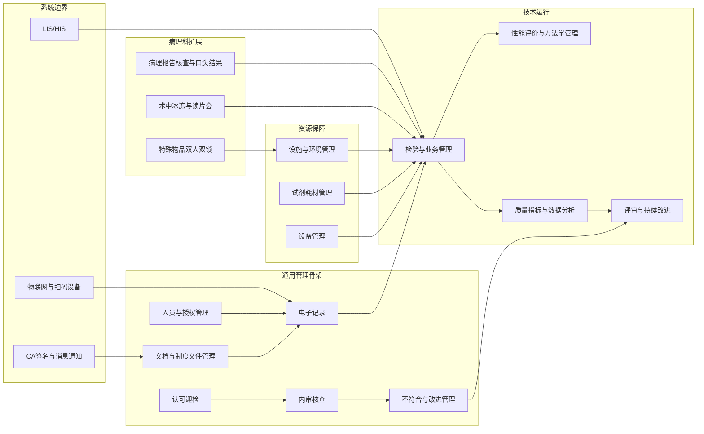

- 关键说明：系统由“管理骨架 + 资源保障 + 技术运行 + 病理扩展 + 集成边界”构成。
- 已明确功能：文档、电子记录、人事、认可迎检、内审核查、试剂、设备、业务、质量指标、性能评价均在 PDF 明确列出。
- 推断出的流程：评审与持续改进对接不符合、质量指标和审核结果，属于文档内容的自然闭环整合。
- 待确认问题：评审管理与性能评价是同一模块还是两个独立子系统，文档未明确，需要进一步确认。
- 可补充设计建议：后续原型可将病理扩展模块独立标识为“病理专属能力包”。
- 文档中依据的功能点：
  - PDF 第 1、25-26 页：十个模块、部署与组合使用场景
  - DOCX `功能设计` 各章节：病理科细化模块和字段范围

## G02 角色与权限关系图

- 图名：角色与权限关系图
- 图的用途：展示核心角色与主要系统权限域的对应关系。
- 适用模块：人员与授权管理、全系统权限设计
- Mermaid 代码：

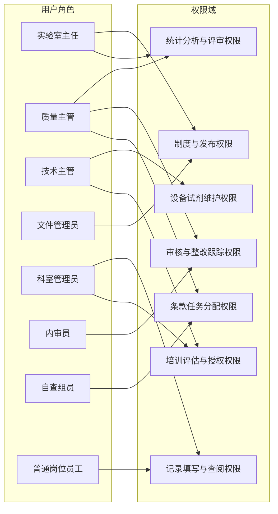

- 关键说明：文档只明确了角色类型和部分职责方向，没有给出完整 RBAC 权限矩阵。
- 已明确功能：实验室主任、质量主任、技术主管、文件管理员、行政科室、各病理科室角色在 DOCX 需求分析中已列出。
- 推断出的流程：角色到权限域的映射依据模块职责推断，属于业务建模需要。
- 待确认问题：是否存在跨角色兼任、数据范围隔离、审批代理和双人复核权限，文档未明确，需要进一步确认。
- 可补充设计建议：后续设计建议拆分为“角色模板 + 数据权限范围 + 流程节点权限”三层。
- 文档中依据的功能点：
  - DOCX `需求分析`：用户角色清单
  - DOCX `人员授权记录`：管理员授权与关键操作留痕
  - PDF 第 8-10 页：人事管理、岗位培训考核、组织架构

## G03 核心业务流程总览图

- 图名：核心业务流程总览图
- 图的用途：展示系统从制度建立到持续改进的全局业务闭环。
- 适用模块：全系统
- Mermaid 代码：

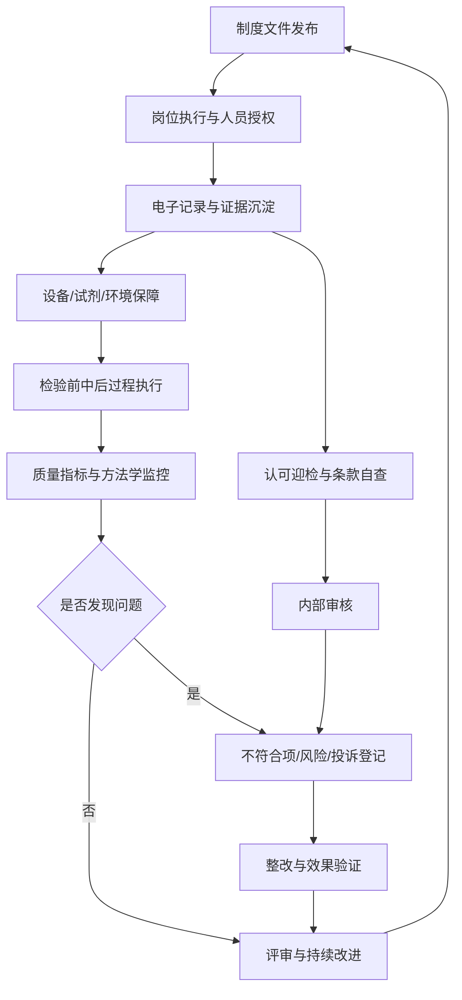

- 关键说明：该图用于统一理解平台主闭环，不等同于单一模块流程。
- 已明确功能：文档、记录、人员、设备、试剂、检验、质量、不符合、内审、评审均在两份文档中出现。
- 推断出的流程：将评审结果回流到制度优化是依据 ISO15189 持续改进逻辑推断。
- 待确认问题：管理评审的正式触发机制和周期文档未明确，需要进一步确认。
- 可补充设计建议：后续可拆成“运行闭环”和“审核改进闭环”两张总览图用于原型导航。
- 文档中依据的功能点：
  - PDF 第 5-24 页：各模块之间的质量管理闭环描述
  - DOCX `改进管理`、`不符合管理`、`内部审核管理`、`评审管理`

## G04 文档/制度文件修订审批流程图

- 图名：文档/制度文件修订审批流程图
- 图的用途：展示制度文件从修订申请到发布、作废和归档的控制流程。
- 适用模块：文档与制度文件管理
- Mermaid 代码：

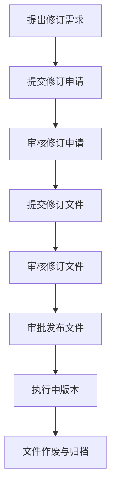

- 关键说明：流程节点直接复用 PDF 已明示环节，未额外增加审批层级。
- 已明确功能：修订申请、审核申请、修订文件、审核修订文件、审批发布、作废归档均在 PDF 明确列出。
- 推断出的流程：起因“提出修订需求”属于对修订申请前置触发的自然补足。
- 待确认问题：申请人、审核人、批准人的具体角色分工，文档未明确，需要进一步确认。
- 可补充设计建议：后续可增加“版本对比”和“历史版本查看”原型交互。
- 文档中依据的功能点：
  - PDF 第 2-4 页：文件修订管理流程
  - DOCX `科室制度文件管理`：制度文件信息字段、状态、启用/废止时间

## G05 电子记录填写与归档流程图

- 图名：电子记录填写与归档流程图
- 图的用途：展示电子记录从分类配置、触发、填写、流转到归档的过程。
- 适用模块：电子记录
- Mermaid 代码：

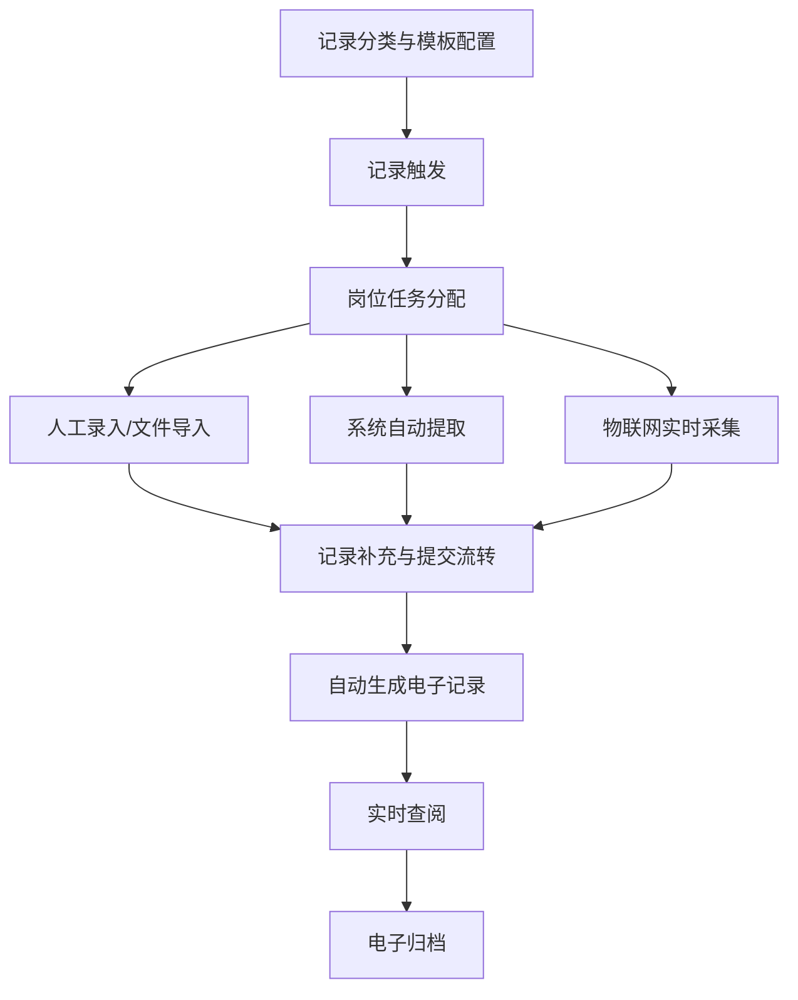

- 关键说明：流程重点体现“多源采集 + 流程流转 + 自动成表”。
- 已明确功能：人工表单录入、文件导入、质控系统自动提取、物联网对接、岗位日志、流程化记录、自动生成记录表格均已明确。
- 推断出的流程：`记录触发 -> 岗位任务分配` 是根据流程式表单和岗位日志描述归纳而来。
- 待确认问题：归档后的修改规则、作废规则、补录规则文档未明确，需要进一步确认。
- 可补充设计建议：原型层面建议区分“简单事件记录”和“流程式记录”入口。
- 文档中依据的功能点：
  - PDF 第 5-7 页：电子记录、岗位日志、流程化记录
  - DOCX `需求分析` 第 21-22 条：多种数据采集方式

## G06 人员档案与培训授权流程图

- 图名：人员档案与培训授权流程图
- 图的用途：展示人员从建档、培训、评估到授权和复评的业务闭环。
- 适用模块：人员与授权管理
- Mermaid 代码：

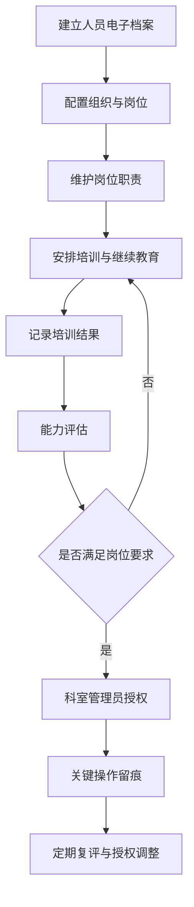

- 关键说明：授权并非孤立动作，而是依赖岗位、培训和能力评估结果。
- 已明确功能：电子档案、岗位职责、培训记录、继续教育、能力评估、人员授权、关键操作留痕均已明确。
- 推断出的流程：能力不足回流培训、复评后调整授权属于文档逻辑下的合理流程推断。
- 待确认问题：授权是否存在有效期、分级授权和撤权审批，文档未明确，需要进一步确认。
- 可补充设计建议：后续可在原型中引入“人员发展时间轴”展示一生一档。
- 文档中依据的功能点：
  - PDF 第 8-9 页：人员电子档案、培训考核、岗位轮转
  - DOCX `病理科人员管理` 全章节

## G07 认可迎检/条款自查流程图

- 图名：认可迎检/条款自查流程图
- 图的用途：展示条款解读、自查任务分配、证据上传、统计分析和转内审的主流程。
- 适用模块：认可迎检
- Mermaid 代码：

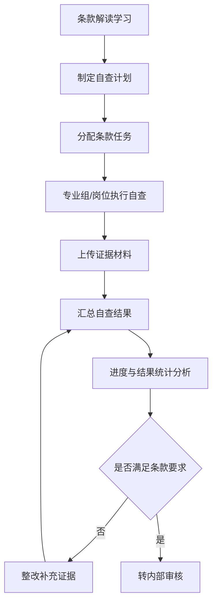

- 关键说明：图中“转内部审核”是 PDF 直接说明的模块联动。
- 已明确功能：条款解读、任务分配、自查、证据上传、进度统计、自查后启动内部审核均已明确。
- 推断出的流程：不满足条款后先整改补充证据再汇总，属于业务自然闭环推断。
- 待确认问题：条款任务的拆分粒度是按章节、岗位还是证据包，文档未明确，需要进一步确认。
- 可补充设计建议：后续可以增加“条款-证据-责任人”三维看板。
- 文档中依据的功能点：
  - PDF 第 10-12 页：条款解读、自查流程、自查进度统计
  - DOCX `需求分析`：满足法规要求与质量体系建设目标

## G08 内审核查与不符合项整改闭环流程图

- 图名：内审核查与不符合项整改闭环流程图
- 图的用途：展示内审、问题发现、整改、验证和关闭的完整闭环。
- 适用模块：内审核查、不符合管理、改进管理
- Mermaid 代码：

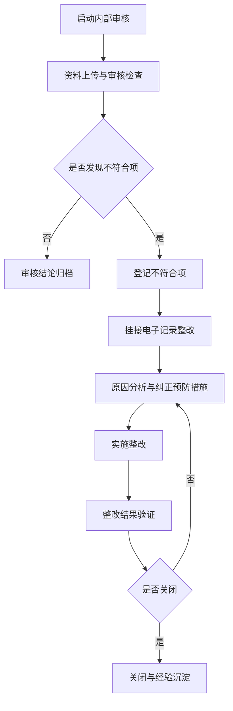

- 关键说明：图中明确体现 PDF 所述“内审不符合项挂接电子记录模块整改”。
- 已明确功能：内审、上传资料、内审表、不符合项管理、整改闭环均已明确。
- 推断出的流程：`验证未通过 -> 回到原因分析` 是 CAPA 闭环的自然推断。
- 待确认问题：验证人、关闭人、复审层级及关闭时限文档未明确，需要进一步确认。
- 可补充设计建议：后续可在原型中加入“不符合项严重度”和“责任到期预警”。
- 文档中依据的功能点：
  - PDF 第 13-14 页：内审核查与不符合项管理
  - DOCX `不符合管理`、`内部审核管理`

## G09 设备全生命周期状态图

- 图名：设备全生命周期状态图
- 图的用途：展示设备从接收到报废的状态变化与关键事件。
- 适用模块：设备管理
- Mermaid 代码：

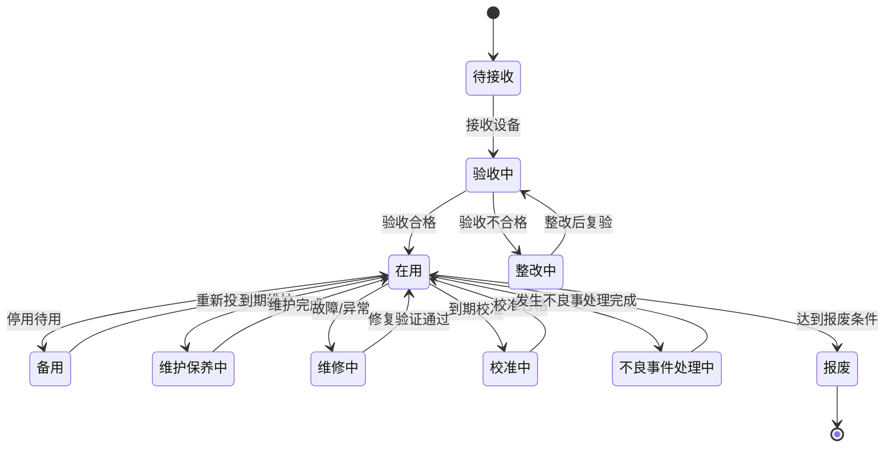

- 关键说明：状态图以文档明确状态为主，并补足必要的事件触发。
- 已明确功能：在用、备用、维修中、接收、验收、维护、校准、不良事件、报废均已明确。
- 推断出的流程：`整改中` 和 `不良事件处理中` 属于由验收不合格/不良事件记录自然引出的业务状态。
- 待确认问题：报废审批、封存、外借、停机验证等中间状态文档未明确，需要进一步确认。
- 可补充设计建议：后续可将设备状态与维护计划、校准计划联动显示。
- 文档中依据的功能点：
  - PDF 第 17 页：设备履历、维护保养、维修、校准记录
  - DOCX `设备管理` 全章节

## G10 试剂耗材出入库与预警流程图

- 图名：试剂耗材出入库与预警流程图
- 图的用途：展示试剂耗材建档、入库验证、扫码出库、库存预警和不良事件处理。
- 适用模块：试剂耗材管理
- Mermaid 代码：

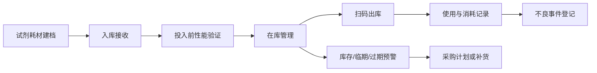

- 关键说明：流程兼顾 PDF 的条码化闭环和 DOCX 的验证要求。
- 已明确功能：条码/二维码管理、证照管理、批量入库、库存预警、临期预警、过期报警、扫码出库、不良事件均已明确。
- 推断出的流程：库存预警后驱动采购计划是结合 PDF 采购单管理进行的流程整合。
- 待确认问题：退库、报损、借用、拆包与批号追溯的精细流程文档未完全明确，需要进一步确认。
- 可补充设计建议：后续可将试剂环境条件校验与在库节点联动展示。
- 文档中依据的功能点：
  - PDF 第 15-16 页：试剂管理、证照、采购单、库存预警
  - DOCX `试剂耗材管理`、`试剂耗材环境条件管理`

## G11 设施环境监测与异常报警处理流程图

- 图名：设施环境监测与异常报警处理流程图
- 图的用途：展示设施区域、环境采集、异常判断、报警和失控处理流程。
- 适用模块：设施与环境管理
- Mermaid 代码：

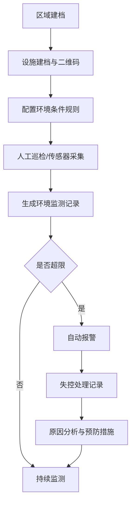

- 关键说明：人工扫码记录和实时传感器采集同时存在。
- 已明确功能：区域管理、设施管理、二维码、人工监测、环境检测服务、自动报警、失控处理记录均已明确。
- 推断出的流程：恢复后回到持续监测是环境管理闭环的自然推断。
- 待确认问题：报警升级规则、值班通知链路、恢复判定标准文档未明确，需要进一步确认。
- 可补充设计建议：后续原型可展示平面图和趋势图联动。
- 文档中依据的功能点：
  - PDF 第 7 页：温湿度监控平面图
  - DOCX `设施与环境管理` 全章节

## G12 检验前、检验中、检验后过程管理流程图

- 图名：检验前、检验中、检验后过程管理流程图
- 图的用途：概览样本在检验前、中、后各阶段的核心控制点。
- 适用模块：检验与业务管理、性能评价与方法学管理
- Mermaid 代码：

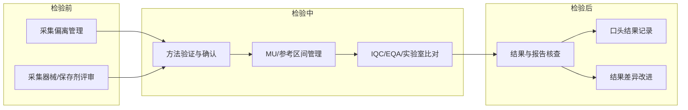

- 关键说明：图中把大量方法学记录归并为中期控制点，避免单图过载。
- 已明确功能：采集偏离、器械/保存剂评审、方法验证/确认、MU、参考区间、IQC、EQA、比对、结果核查、口头结果均已明确。
- 推断出的流程：中期控制点按“方法 -> 指标 -> 质控 -> 后处理”排序，是业务抽象层的推断。
- 待确认问题：检验后正式报告发布、临床沟通与 LIS 回写的详细步骤文档未明确，需要进一步确认。
- 可补充设计建议：后续可拆为三张子图，分别针对检验前、中、后深入建模。
- 文档中依据的功能点：
  - DOCX `检验过程管理` 全章节
  - PDF 第 18-24 页：业务管理、质量指标、性能评价

## G13 质量指标采集、分析、改进闭环图

- 图名：质量指标采集、分析、改进闭环图
- 图的用途：展示指标数据来源、阈值监测、分析决策和持续改进闭环。
- 适用模块：质量指标与数据分析、改进管理
- Mermaid 代码：

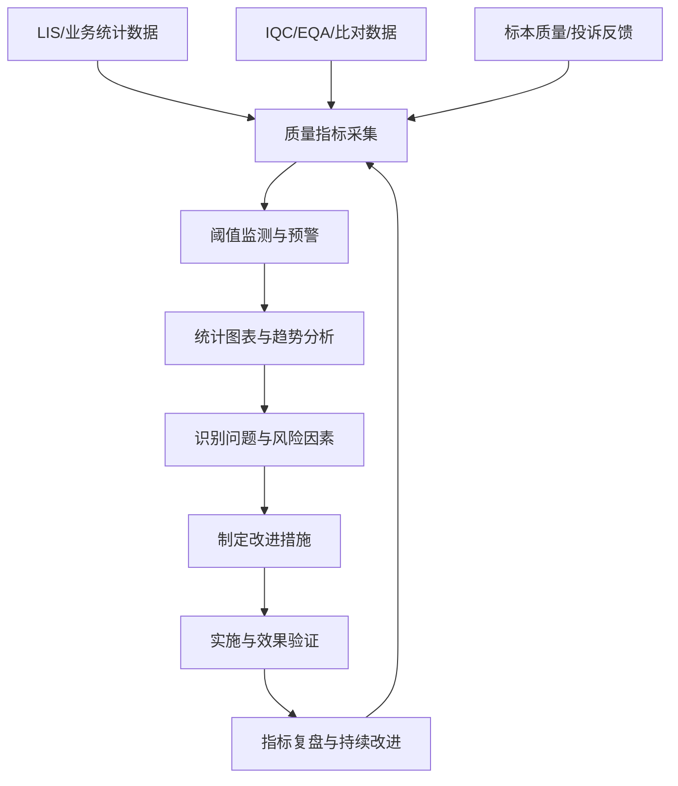

- 关键说明：该图兼顾 PDF 的质量指标模块和 DOCX 的数据分析平台。
- 已明确功能：LIS 数据、业务量分析、TAT、标本不合格率、投诉处理率、趋势分析、阈值预警、持续改进均已明确。
- 推断出的流程：将投诉反馈纳入质量指标采集，是基于 DOCX 改进管理中的反馈投诉信息整合。
- 待确认问题：指标口径、阈值配置主体、预警算法、分析周期文档未明确，需要进一步确认。
- 可补充设计建议：原型中可加入“同比/环比/对标”切换视图。
- 文档中依据的功能点：
  - PDF 第 18-22 页：业务管理、质量指标
  - DOCX `数据管理分析平台`、`反馈与投诉管理`

## G14 核心数据对象关系图

- 图名：核心数据对象关系图
- 图的用途：展示平台核心领域对象及其主要关系。
- 适用模块：领域建模、数据库概要设计
- Mermaid 代码：

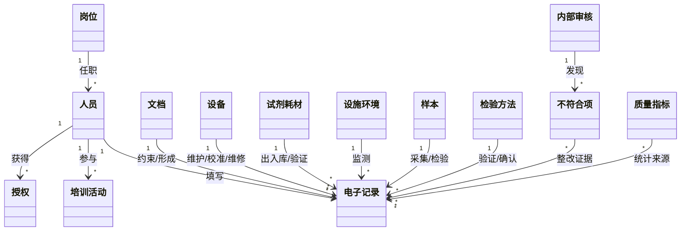

- 关键说明：该图用于领域对象识别，不展开字段级细节。
- 已明确功能：人员、岗位、授权、文件、记录、设备、试剂耗材、样本、方法、不符合项、内审、质量指标均已在文档中出现。
- 推断出的流程：`文档 -> 电子记录` 的“约束/形成”关系是质量体系执行证据的领域抽象。
- 待确认问题：是否需要单独建模“评审”“条款任务”“证据附件”“报告”独立实体，文档未完全明确，需要进一步确认。
- 可补充设计建议：后续数据库设计可补一版 ER 图并区分主数据、事务数据、证据附件。
- 文档中依据的功能点：
  - PDF 第 2-24 页：各模块对象
  - DOCX 各章节：字段和记录明细

## G15 系统上下游集成关系图

- 图名：系统上下游集成关系图
- 图的用途：展示平台与院内外系统、设备和外部参与方的边界关系。
- 适用模块：系统架构、集成设计
- Mermaid 代码：

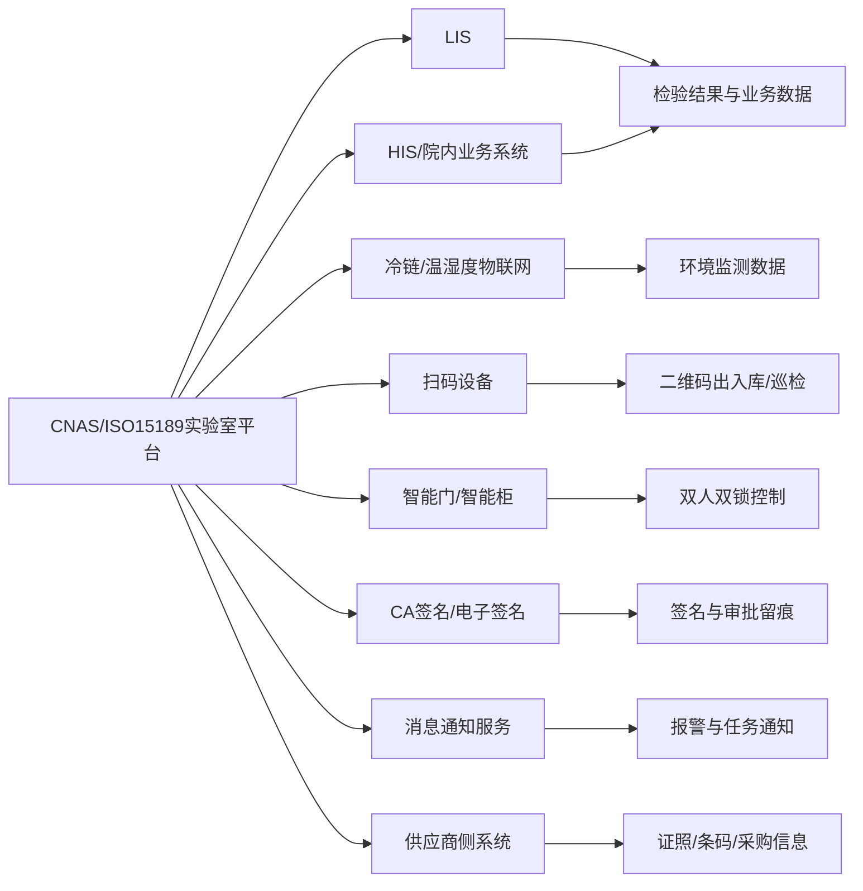

- 关键说明：该图只画文档已提到的外部边界，不引入未出现的新系统。
- 已明确功能：LIS 对接、冷链系统、温湿度传感器、扫码设备、智能门柜、CA 签名、供应商证照维护、报警提醒均已明确。
- 推断出的流程：HIS/院内业务系统作为病人来源系统属于与 LIS 并列的合理边界推断。
- 待确认问题：HIS 是否一定集成、消息通知具体渠道、CA 签名接入模式、供应商协同接口协议文档未明确，需要进一步确认。
- 可补充设计建议：后续可分拆为“业务集成图”和“设备物联图”两张架构图。
- 文档中依据的功能点：
  - PDF 第 15-18、21、25-26 页：供应商、LIS、部署场景
  - DOCX `需求分析`、`储存设施管理`、`设备验收记录`、`软件自动巡检`

## 图谱清单表

| 图编号 | 图名称 | 图类型 | 对应模块 | 复杂度 | 是否建议进入原型设计 | 是否需要业务方确认 |
| --- | --- | --- | --- | --- | --- | --- |
| G01 | 系统总体功能模块图 | flowchart LR | 全系统 | 中 | 是 | 是 |
| G02 | 角色与权限关系图 | flowchart LR | 人员与授权管理 | 中 | 是 | 是 |
| G03 | 核心业务流程总览图 | flowchart TD | 全系统 | 中 | 是 | 是 |
| G04 | 文档/制度文件修订审批流程图 | flowchart TD | 文档与制度文件管理 | 低 | 是 | 是 |
| G05 | 电子记录填写与归档流程图 | flowchart TD | 电子记录 | 中 | 是 | 是 |
| G06 | 人员档案与培训授权流程图 | flowchart TD | 人员与授权管理 | 中 | 是 | 是 |
| G07 | 认可迎检/条款自查流程图 | flowchart TD | 认可迎检 | 中 | 是 | 是 |
| G08 | 内审核查与不符合项整改闭环流程图 | flowchart TD | 内审核查/不符合管理 | 中 | 是 | 是 |
| G09 | 设备全生命周期状态图 | stateDiagram-v2 | 设备管理 | 中 | 是 | 是 |
| G10 | 试剂耗材出入库与预警流程图 | flowchart LR | 试剂耗材管理 | 中 | 是 | 是 |
| G11 | 设施环境监测与异常报警处理流程图 | flowchart TD | 设施与环境管理 | 中 | 是 | 是 |
| G12 | 检验前、检验中、检验后过程管理流程图 | flowchart LR | 检验与业务管理 | 中 | 是 | 是 |
| G13 | 质量指标采集、分析、改进闭环图 | flowchart TD | 质量指标与数据分析 | 中 | 是 | 是 |
| G14 | 核心数据对象关系图 | classDiagram | 领域模型 | 中 | 是 | 是 |
| G15 | 系统上下游集成关系图 | flowchart LR | 系统集成 | 低 | 是 | 是 |

## 总体待确认清单

- 精细权限矩阵和数据范围隔离规则
- 电子签名的触发环节、签名对象和法律合规要求
- 各流程正式状态枚举和值域
- 消息通知渠道、升级策略和值班机制
- 归档保存期限、销毁策略和审计规则
- 供应商协同边界、采购流程和主数据维护归属
- LIS/HIS/冷链/门禁/扫码设备的接口协议与同步机制
