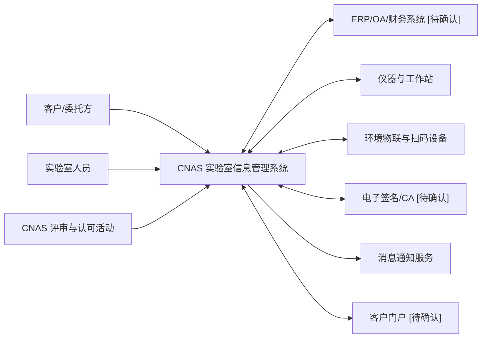
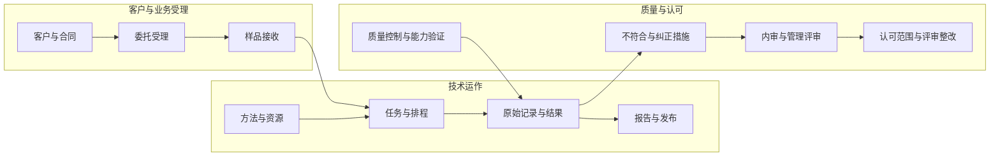
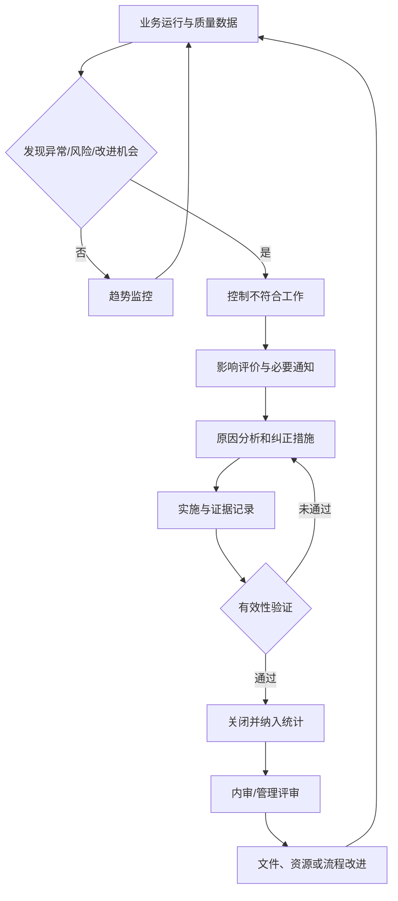
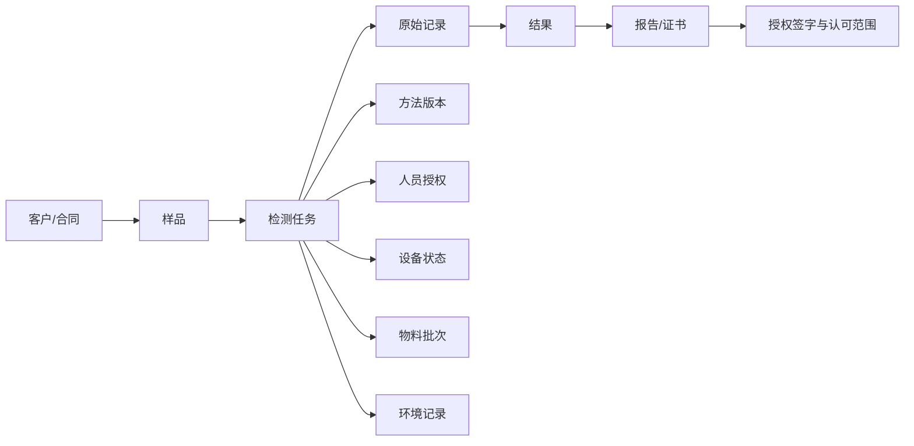
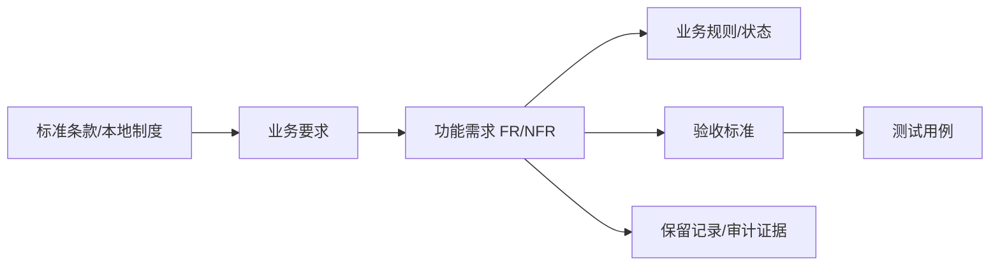

# CNAS 实验室信息管理系统需求规格说明书 - 需求框架初稿

> 文档状态：已冻结为历史调研框架，不是开发或验收基线
> 适用体系：ISO/IEC 17025 检测和校准实验室，CNAS 认可管理  
> 编制日期：2026-07-27  
> 当前阶段边界：只整理业务需求，不进行技术选型、数据库设计、技术架构设计或编码

> 后续受控候选规格见 `docs/requirements/cnas-lims-srs.md`。本框架和现有原型仅作来源与历史分析参考，不得用于反推已批准的流程、状态、字段或权限。

## 0. 编制说明

### 0.1 标记约定

| 标记 | 含义 | 使用规则 |
| --- | --- | --- |
| `[文档需求]` | 来自现有 DOCX、PDF 或历史系统资料 | 尽量注明章节或页码 |
| `[标准要求]` | 来自已核验的 CNAS 文件或相关标准 | 不转述未经核验的条款原文 |
| `[推测]` | 根据已知业务关系推导的流程或控制 | 必须由业务方确认后才能转为正式需求 |
| `[最佳实践建议]` | 成熟 LIMS 的共性能力或产品建议 | 不作为当前业务事实或强制合规要求 |
| `[待确认]` | 资料不足、存在冲突或需要业务决策 | 纳入问题清单，不以假设补齐 |

### 0.2 核心判断

现有两份资料主要面向医学/病理实验室和 ISO 15189 质量管理场景，可复用人员、文件、电子记录、设备、试剂耗材、设施环境、内审、整改、评审和质量分析等能力；但它们没有完整覆盖 ISO/IEC 17025 检测/校准实验室从客户委托、合同评审、样品、检测任务、原始记录到报告签发的业务主链。

因此，本系统需求框架采用以下口径：

1. 以 ISO/IEC 17025 检测/校准业务主链作为系统主干。
2. 将现有资料中可复用的质量管理能力纳入统一平台。
3. `[范围决策]` 病理、医学检验和 ISO 15189 专属能力不纳入本期 17025 基线。
4. 未提供实际检测领域、组织规模和现有系统边界前，不固化领域应用说明、审批层级和数据保存期限。

### 本章范围决策与待确认

- `[范围决策]` 本期同时覆盖检测实验室与校准实验室，采用共享质量核心和两条独立业务变体。
- `[范围决策]` 医学实验室、ISO 15189 和病理科专属能力不属于本期范围。
- `[待确认]` 最终批准版是否需要同时交付 Word/PDF 受控版本。

## 1. 资料盘点

### 1.1 已读取资料清单

| 编号 | 资料 | 主要内容 | 可复用范围 | 局限性 |
| --- | --- | --- | --- | --- |
| D01 | `docs/demand/CNAS信息管理系统V2.docx` | 病理科信息管理需求，包含人员、制度文件、设备、设施、试剂耗材、记录、不符合、内审、评审、改进、软件巡检等字段和记录要求 | 质量体系运行、人员与资源管理、电子记录、整改闭环 | `[文档需求]` 偏医学/病理业务，缺少 17025 客户委托到检测报告主链 |
| D02 | `docs/demand/标准化智慧实验室管理平台（软件）V2.0.pdf` | 通用医学实验室平台白皮书，包含文档、电子记录、人事、认可迎检、内审核查、试剂、设备、业务、质量指标、性能评价等模块 | 平台模块骨架、典型工作流、物联与系统集成思路 | `[文档需求]` 以 ISO 15189 场景为主，不能直接替代 17025 业务需求 |
| D03 | `docs/analysis/cnas-iso15189-graph-analysis.md` | 基于 D01、D02 的 15 张业务分析图及模块归并 | 辅助识别模块关系、状态和闭环 | 结论仍基于医学实验室口径，需要重新映射到 17025 |
| D04 | `docs/analysis/cnas-iso15189-drawio-links.md` | 历史 Mermaid 图的 draw.io 打开链接 | 后续图谱复用 | 不构成新增业务证据 |
| S01 | CNAS 官方网站现行认可规范页面及附件 | 认可准则、认可规则、能力验证、内审、管理评审、公正保密、投诉申诉、认可标识、能力范围表述 | 合规校验、需求追踪 | 具体领域应用说明需在检测领域确定后补充 |
| I01 | LabWare、LabVantage、STARLIMS、Thermo SampleManager、Matrix Gemini 等公开产品资料 | 样品生命周期、工作流、仪器连接、数据管理、审计追踪、报告、库存和质量管理共性能力 | 发现遗漏、形成最佳实践建议 | 厂商功能不等同于本项目需求，不作为业务事实 |

### 1.2 已识别的业务范围

**现有资料已明确覆盖的能力**

- `[文档需求]` 组织岗位、人员档案、培训、能力评价、人员授权和关键操作留痕。
- `[文档需求]` 制度文件修订、审核、发布、作废、归档，以及电子记录分类、填写、流转和归档。
- `[文档需求]` 设备接收、验收、使用、维护、维修、校准、不良事件和报废。
- `[文档需求]` 试剂耗材建档、入库验证、扫码出入库、库存及临期预警。
- `[文档需求]` 设施区域、温湿度等环境监测、异常报警和失控处理。
- `[文档需求]` 条款自查、证据上传、内审核查、不符合项、整改验证、评审和持续改进。
- `[文档需求]` LIS、物联网、扫码、智能门柜、CA/电子签名和消息提醒等集成方向。

**需要按 ISO/IEC 17025 补齐的主业务范围**

- `[标准要求]` 客户、委托、报价/合同、合同评审及变更。
- `[标准要求]` 样品接收、唯一标识、流转、分样、留样、归还、销毁及异常处置。
- `[标准要求]` 检测/校准任务拆分、资源匹配、分配、排程、执行和进度跟踪。
- `[标准要求]` 方法选择、方法验证/确认、方法偏离、抽样、测量不确定度和判定规则。
- `[标准要求]` 原始记录、仪器数据采集、计算、复核、结果审核和技术记录保护。
- `[标准要求]` 报告/证书编制、审核、批准、授权签字、发布、更正、撤回及认可标识控制。
- `[标准要求]` 采购、供应商评价、分包和其他外部提供的产品与服务控制。
- `[标准要求]` 投诉、公正性、保密性、风险与机遇、能力验证和结果有效性监控。
- `[标准要求]` 认可范围、授权签字人、初评、监督、复评、扩项及评审整改管理。

### 1.3 当前流程和现有功能

| 业务领域 | 当前资料可识别流程 | 资料依据 | 结论 |
| --- | --- | --- | --- |
| 文件 | 修订申请 → 审核 → 修订文件 → 审批发布 → 作废归档 | D02 第 2-4 页；D01 `科室制度文件管理` | `[文档需求]` 流程明确，角色与审批层级待确认 |
| 电子记录 | 分类/模板 → 岗位分配 → 填写或自动采集 → 流转 → 自动成表 → 归档 | D02 第 5-7 页；D01 `需求分析` | `[文档需求]` 数据来源明确，归档后更正控制不足 |
| 人员授权 | 档案 → 培训 → 能力评价 → 授权 → 复评/调整 | D02 第 8-10 页；D01 `病理科人员管理` | `[文档需求]` 主闭环可复用，授权范围和值域待确认 |
| 认可自查 | 条款学习 → 自查任务 → 证据上传 → 统计 → 转内审 | D02 第 10-12 页 | `[文档需求]` 可用于认可准备，但需替换为 17025 条款库 |
| 内审整改 | 内审 → 发现问题 → 不符合 → 原因分析/措施 → 验证 → 关闭 | D02 第 13-14 页；D01 `不符合管理`、`内部审核管理` | `[文档需求]` 闭环可复用 |
| 设备 | 接收/验收 → 在用 → 维护/维修/校准 → 报废 | D01 `设备管理`；D02 设备管理模块 | `[文档需求]` 缺少采购论证、期间核查和结果影响评价细节 |
| 试剂耗材 | 建档 → 入库验证 → 扫码出入库 → 库存/临期预警 → 不良事件 | D01 `试剂耗材管理`；D02 试剂管理模块 | `[文档需求]` 可扩展为标准物质和耗材全生命周期 |
| 环境 | 监测 → 异常报警 → 失控处理 → 恢复与预防 | D01 `储存设施管理`；D02 电子记录/物联场景 | `[文档需求]` 监测点、阈值和升级机制待确认 |
| 检测业务 | 医学检验前/中/后、IQC/EQA、结果核查 | D01 检验过程相关章节；D02 业务/性能评价模块 | 只能复用质量控制思想，不能替代 17025 委托-样品-检测-报告流程 |

### 1.4 问题、冲突和资料缺口

| 类别 | 发现 | 影响 | 处理建议 |
| --- | --- | --- | --- |
| 体系冲突 | 两份主资料以 ISO 15189/病理业务为主，目标系统以 ISO/IEC 17025 为主 | 业务对象、角色、样品和报告规则不同 | 以 17025 主链重构，不直接改名复用 |
| 主链缺口 | 客户、合同评审、样品链、检测任务、原始记录、报告签发资料不足 | 无法形成端到端 LIMS | 列为 P0 业务调研主题 |
| 领域缺口 | 未说明检测领域、项目参数、方法体系、多场所情况 | 无法确定领域应用说明和主数据结构 | 立项调研时优先确认 |
| 权限缺口 | 只有角色清单和局部职责，没有权限矩阵、数据范围和职责分离 | 存在越权和自审自批风险 | 建立角色、数据范围、流程权限、签名权限四层模型 |
| 记录缺口 | 归档后补录、更正、作废、版本和保存期限未明确 | 存在无痕修改和证据失效风险 | 详细需求中建立不可覆盖、留痕更正规则 |
| 接口缺口 | 提到 LIS、物联、扫码、CA 等，但无系统清单、数据责任和接口协议 | 无法确定边界和验收 | 形成接口台账并逐项确认主数据归属 |
| 认可缺口 | 缺少认可范围、授权签字人、初评/监督/复评/扩项的详细资料 | CNAS 迎检能力无法落地 | 以 CNAS-RL01、AL01、EL-03 建立专项需求 |

### 本章待确认

- `[待确认]` 请补充现行质量手册、程序文件、作业指导书、受控表单、组织架构和岗位职责。
- `[待确认]` 请补充当前委托单、样品流转单、原始记录、检测报告/校准证书和更正记录样例。
- `[待确认]` 请说明现有 LIMS、ERP、OA、财务、仪器工作站和客户门户的使用现状。
- `[待确认]` 请明确主要检测/校准领域、多场所情况、年业务量和峰值并发场景。

## 2. 标准与行业调研

### 2.1 适用标准和 CNAS 文件

| 编号 | 文件 | 核验来源 | 在本项目中的用途 |
| --- | --- | --- | --- |
| STD-01 | ISO/IEC 17025:2017《检测和校准实验室能力的通用要求》 | CNAS-CL01 前言确认等同采用，条款号完全一致 | 国际标准基线 |
| STD-02 | GB/T 27025-2019《检测和校准实验室能力的通用要求》 | 国家标准全文公开系统，状态为现行，2019-12-10 发布、2020-07-01 实施 | 国内标准基线 |
| CNAS-01 | CNAS-CL01:2018《检测和校准实验室能力认可准则》（2019-2-20 第一次修订） | [CNAS 官方页面](https://www.cnas.org.cn/rkfw/sys/rkyq/rkzz/art/2024/art_130537882.html) | 认可准则主线 |
| CNAS-02 | CNAS-RL01:2025《实验室认可规则》 | [CNAS 官方页面](https://www.cnas.org.cn/rkfw/sys/rkyq/rkgz/art/2024/art_580995811.html) | 初次认可、扩大范围、监督评审、复评审等认可生命周期 |
| CNAS-03 | CNAS-RL02:2023《能力验证规则》 | [CNAS 官方页面](https://www.cnas.org.cn/rkfw/sys/rkyq/rkgz/art/2024/art_311722765.html) | 能力验证计划、实施、结果利用和不满意结果处置 |
| CNAS-04 | CNAS-R01:2023《认可标识使用和认可状态声明规则》 | [CNAS 官方页面](https://www.cnas.org.cn/rkfw/sys/rkyq/rkgz/art/2024/art_81012399.html) | 报告认可标识与认可状态声明控制 |
| CNAS-05 | CNAS-R02:2023《公正性和保密规则》 | [CNAS 官方页面](https://www.cnas.org.cn/rkfw/sys/rkyq/rkgz/art/2024/art_507599612.html) | 公正性风险、客户和检测数据保密 |
| CNAS-06 | CNAS-R03:2019《申诉、投诉和争议处理规则》 | [CNAS 官方页面](https://www.cnas.org.cn/rkfw/sys/rkyq/rkgz/art/2024/art_608915088.html) | 投诉、申诉和争议处置参照 |
| CNAS-07 | CNAS-GL011:2025《实验室和检验机构内部审核指南》 | [CNAS 官方页面](https://www.cnas.org.cn/rkfw/sys/rkyq/rkzn/art/2025/art_286585571.html) | 内审策划、实施、报告、后续措施和记录 |
| CNAS-08 | CNAS-GL012:2025《实验室和检验机构管理评审指南》 | [CNAS 官方页面](https://www.cnas.org.cn/rkfw/sys/rkyq/rkzn/art/2025/art_1229977191.html) | 管理评审输入、输出、措施跟踪和记录 |
| CNAS-09 | CNAS-EL-03:2023《检测和校准实验室认可能力范围表述说明》 | [CNAS 官方页面](https://www.cnas.org.cn/rkfw/sys/rkyq/rksm/art/2024/art_156815575.html) | 认可范围主数据和能力表述控制 |
| CNAS-10 | CNAS-AL01 实验室认可申请书及附表 | [CNAS 官方页面](https://www.cnas.org.cn/rkfw/sys/rkwj/sqcl/art/2024/art_998b540654eb44d2a74a9a060010af5e.html) | 组织、人员、授权签字人、关键场所、能力及设备申请材料 |
| CNAS-11 | 对应检测领域的 CNAS-CL01-Axxx 应用说明 | CNAS 认可准则栏目 | `[待确认]` 检测领域确定后纳入，例如微生物、化学、电气、医疗器械等 |

> 注：CNAS 指南用于帮助理解和实施，不在本框架中将指南内容误写为新增强制条款。领域应用说明以项目实际认可领域为准。

### 2.2 标准要求摘要

| 标准主题 | 业务要求摘要 | 系统需求方向 |
| --- | --- | --- |
| 公正性与保密 | 识别并控制公正性风险，保护客户和检测信息 | 利益冲突声明、风险登记、分权、保密分级、访问控制、导出留痕 |
| 结构要求 | 明确组织、职责、权限和管理体系边界 | 组织岗位、角色职责、场所、法律实体、授权关系和变更历史 |
| 资源要求 | 确保人员、设施环境、设备、计量溯源和外部资源适宜 | 人员能力授权、环境监控、设备计量链、供应商/分包控制 |
| 过程要求 | 控制合同评审、方法、抽样、样品、技术记录、结果有效性、报告、投诉、不符合工作和信息管理 | 建立从委托到报告的端到端流程及异常闭环 |
| 管理体系要求 | 控制文件和记录，管理风险、改进、纠正措施、内审和管理评审 | 受控文件、不可覆盖记录、CAPA、内审、管理评审和追踪矩阵 |
| 认可管理 | 管理初评、监督、复评、扩项、能力范围、授权签字人和整改证据 | 认可项目台账、条款任务、证据包、评审问题和整改闭环 |
| 能力验证 | 基于风险制定计划，记录参加情况，评价结果并处置不满意结果 | PT/实验室间比对计划、结果评价、暂停/恢复、纠正措施和验证 |

### 2.3 初步标准追踪映射

| 标准条款/文件 | 业务要求 | 系统模块 | 系统控制措施 | 保留记录 |
| --- | --- | --- | --- | --- |
| CL01 4.1、4.2 | 公正性与保密 | 组织权限、风险、客户管理 | 利益冲突声明、敏感数据分级、最小权限、访问与导出审计 | 公正性风险清单、保密承诺、授权和访问日志 |
| CL01 第 5 章 | 结构要求 | 组织、岗位、场所 | 组织版本、职责和管理体系边界受控 | 组织架构、任命/授权文件、变更记录 |
| CL01 6.2 | 人员能力 | 人员、培训、能力、授权 | 资格规则、培训评价、授权生效/到期/撤销、超范围拦截 | 人员档案、培训记录、能力确认、授权记录 |
| CL01 6.3 | 设施环境 | 设施环境 | 监测计划、限值、报警、失控影响评价 | 环境监测、报警处置、影响评价记录 |
| CL01 6.4、6.5 | 设备与计量溯源 | 设备、计量管理 | 唯一标识、状态隔离、校准/检定/期间核查、溯源链和到期拦截 | 设备档案、证书、维护维修、核查和停用记录 |
| CL01 6.6 | 外部提供的产品和服务 | 采购、供应商、分包 | 准入评价、采购技术要求、验收、绩效评价、分包审批 | 合格供方、采购/验收、评价、分包记录 |
| CL01 7.1 | 要求、标书和合同评审 | 客户、委托、合同评审 | 能力范围、方法、资源、分包、期限、判定规则和变更评审 | 委托、合同、评审结论、客户确认和变更记录 |
| CL01 7.2、7.3 | 方法选择/验证/确认与抽样 | 方法标准、抽样 | 有效版本、适用范围、验证确认、偏离审批、抽样计划 | 方法档案、验证确认、偏离、抽样记录 |
| CL01 7.4 | 检测或校准物品处置 | 样品管理 | 唯一标识、接收检查、状态/位置、链式交接、留样和处置 | 接收、交接、分样、存储、归还/销毁记录 |
| CL01 7.5、7.11 | 技术记录与数据/信息管理 | 原始记录、数据管理、审计追踪 | 原始值保留、计算可追溯、修改留痕、接口校验、权限和备份 | 原始记录、仪器数据、计算版本、修改前后值和审计日志 |
| CL01 7.6、7.7；RL02 | 测量不确定度与结果有效性 | 不确定度、质量控制、能力验证 | 模型/版本、质控计划、趋势规则、PT 计划和不满意结果闭环 | 不确定度评定、质控图、PT/比对结果、纠正与验证记录 |
| CL01 7.8；R01 | 报告结果与认可标识 | 报告管理 | 模板版本、审核批准、授权签字范围、标识适用性、更正/撤回 | 报告、签名、发布、送达、更正和撤回记录 |
| CL01 7.9、7.10；R03 | 投诉与不符合工作 | 投诉、不符合、CAPA | 登记、独立调查、影响评价、暂停/召回、原因分析、验证关闭 | 投诉、调查、影响报告、措施和关闭记录 |
| CL01 8.2-8.4 | 管理体系文件和记录 | 文件、档案 | 版本审批、受控分发、作废防误用、保存和销毁审批 | 文件版本、分发回收、查阅、归档和销毁记录 |
| CL01 8.5-8.7 | 风险、改进与纠正措施 | 风险、改进、CAPA | 风险分级、措施计划、责任时限、有效性验证 | 风险台账、改进机会、纠正措施和验证记录 |
| CL01 8.8、8.9；GL011、GL012 | 内审与管理评审 | 内审、管理评审 | 基于风险策划、独立性校验、输入汇总、输出措施跟踪 | 内审方案/计划/报告、评审输入/报告、措施记录 |
| RL01；EL-03；AL01 | 认可生命周期与能力范围 | 认可管理 | 初评/监督/复评/扩项台账、能力范围版本、证据包和问题整改 | 申请材料、能力表、评审计划、问题及整改证据 |

### 2.4 成熟 LIMS 共性能力

公开调研来源包括 [LabWare LIMS](https://www.labware.com/lims)、[LabVantage LIMS](https://www.labvantage.com/informatics/lims/)、[STARLIMS](https://www.starlims.com/lims-laboratory-information-management-systems/)、[Thermo Scientific SampleManager LIMS](https://www.thermofisher.com/us/en/home/digital-solutions/lab-informatics/lab-information-management-systems-lims/solutions/samplemanager.html) 和 [Matrix Gemini LIMS](https://www.autoscribeinformatics.com/lims-laboratory-information-management-system/matrix-gemini)。以下仅提炼公开资料中反复出现的共性能力，不将厂商功能直接转写为本项目需求。

| 共性能力 | 调研发现 | 本项目处理 |
| --- | --- | --- |
| 样品全生命周期 | 主流 LIMS 均强调样品登记、状态、位置、链式交接和结果关联 | `[最佳实践建议]` 纳入 P0，但按实际样品流程配置 |
| 可配置工作流 | 支持不同检测类型、审批路径和异常分支 | `[最佳实践建议]` 工作流可配置，正式节点由制度决定 |
| 仪器与系统集成 | 仪器文件、网络接口、Web 服务和企业系统集成较常见 | `[最佳实践建议]` 先建接口台账和数据责任，再确定接入范围 |
| 自动计算与结果审核 | 公式、规格限、结果复核、批准和报告自动化是常见能力 | `[最佳实践建议]` 公式必须版本化、验证并保留输入输出 |
| 审计追踪和电子签名 | 受监管场景普遍强调可追溯修改和签名 | `[最佳实践建议]` 按 CNAS 证据需求设计，签名触发点待确认 |
| 库存与资源排程 | 标准物质、试剂、耗材、设备可用性与任务排程联动 | `[最佳实践建议]` 资源失效时应提醒或阻断任务，规则待确认 |
| ELN/LES/SDMS 融合 | 部分成熟平台组合电子实验记录、实验执行和科学数据管理 | `[最佳实践建议]` 不预设产品形态，只提取原始记录和数据治理需求 |
| 多站点与客户门户 | 多场所管理、客户送样、进度和报告下载较常见 | `[最佳实践建议]` 是否建设门户和多场所能力需结合组织范围确认 |

### 2.5 现有业务与标准要求差距

| 差距等级 | 差距 | 对应模块 | 建议优先级 |
| --- | --- | --- | --- |
| 高 | 无完整客户委托和合同评审 | 客户、委托、合同 | P0 |
| 高 | 无 17025 样品全生命周期和交接链 | 样品 | P0 |
| 高 | 无检测任务、原始记录、结果审核和报告签发主链 | 检测执行、记录、报告 | P0 |
| 高 | 授权签字人与认可范围未联动 | 人员授权、认可范围、报告 | P0 |
| 高 | 技术记录更正和审计追踪规则不足 | 记录、审计 | P0 |
| 中 | 方法、抽样、不确定度、判定规则不完整 | 方法与技术能力 | P0/P1 |
| 中 | 供应商、采购、分包和外部服务不足 | 外部资源 | P1 |
| 中 | 投诉、申诉、公正性和保密控制不足 | 风险、客户服务、权限 | P1 |
| 中 | 认可生命周期、能力表和评审整改缺少结构化管理 | 认可管理 | P1 |
| 低 | 驾驶舱、移动端、客户门户和智能分析未形成明确需求 | 平台增强 | P2/P3 |

### 本章待确认

- `[待确认]` 实验室申请或已获认可的检测/校准领域及对应 CNAS-CL01-Axxx 应用说明。
- `[待确认]` 是否还适用行业法规、资质认定 CMA、GLP/GMP、特种设备或客户专用规范。
- `[待确认]` 是否需要系统控制认可标识、CMA 标志或其他资质标识的组合使用。
- `[待确认]` 能力验证最低频次应按实际认可子领域和 CNAS 最新要求建立，不在框架阶段固化。

## 3. 系统建设目标、范围和边界

### 3.1 建设目标

1. 建立客户委托、样品、检测任务、原始记录、结果和报告全过程可追溯的业务主链。
2. 将人员、方法、设备、环境、标准物质和供应商能力状态与检测任务实时关联，降低超范围、超授权和资源失效风险。
3. 将文件、记录、风险、不符合、纠正措施、内审、管理评审和认可整改纳入统一闭环。
4. 对关键数据的创建、复核、批准、更正、导出和删除形成权限控制、电子签名与审计证据。
5. 支撑 CNAS 初评、监督、复评和扩项的材料准备、能力范围管理、问题整改和证据追踪。
6. 在不改变实验室制度责任的前提下，通过自动采集、自动计算、预警和统计提高效率。

### 3.2 系统范围

**拟纳入范围**

- 客户、联系人、委托、报价/合同、合同评审和变更。
- 样品接收、标识、流转、存储、留样、归还、销毁和异常。
- 检测/校准任务、排程、资源匹配、执行、原始记录、结果和报告。
- 组织人员、培训能力、岗位授权、授权签字人和职责分离。
- 方法标准、标准查新、方法验证/确认、抽样、测量不确定度和判定规则。
- 设备、标准物质、试剂耗材、设施环境、采购、供应商和分包。
- 文件记录、质量控制、能力验证、投诉、不符合、风险、内审、管理评审和改进。
- 认可范围、认可活动、评审问题、整改证据、档案、消息、报表、驾驶舱和审计追踪。

**暂不预设为本系统职责**

- `[待确认]` 财务核算、开票、回款和总账，仅保留业务数据交互边界。
- `[待确认]` 采购付款、合同法务审批和完整供应链执行，可与 ERP/OA 分工。
- `[待确认]` 仪器工作站的采集控制和原始谱图处理，原则上不替代专业仪器软件。
- `[待确认]` CA 证书签发、短信/邮件通道和长期备份介质服务，由外部平台提供。

### 3.3 系统上下文边界

### 3.4 边界原则

- 实验室制度和授权决定“谁能做什么”，系统负责执行校验、阻断、提醒和留痕。
- 外部系统产生的数据必须标识来源、接收时间、接口批次、校验结果和后续修改情况。
- 系统不得用自动计算覆盖仪器原始数据；原始值、转换规则和结果值必须可追溯。
- 报告发布前必须同时校验任务完成性、结果审核、签字授权和认可范围适用性。

### 本章待确认

- `[待确认]` 是否包含报价、收费、开票、回款和合同法务审批。
- `[待确认]` 是否建设客户门户、供应商门户、移动端或微信/企业微信入口。
- `[待确认]` 仪器接入数量、品牌型号、数据格式和工作站网络条件。
- `[待确认]` 单一实验室还是集团/多法人/多场所模式，数据是否需要隔离。

## 4. 业务架构和功能架构

### 4.1 业务架构

### 4.2 功能地图

| 业务域 | 一级模块 | 主要二级模块 | 来源分类 |
| --- | --- | --- | --- |
| 组织治理 | 组织、用户、角色与权限 | 法人/场所/部门/岗位、用户、角色、数据权限、流程权限、代理、职责分离 | `[标准要求]` + `[文档需求]` |
| 客户经营 | 客户、委托、合同 | 客户档案、委托申请、报价、合同、合同评审、变更、客户沟通、满意度 | `[标准要求]`；现有资料缺口 |
| 样品管理 | 样品全生命周期 | 接收、验收、编号、标签、分样、交接、位置、留样、归还、销毁、异常 | `[标准要求]`；现有资料缺口 |
| 检测执行 | 任务、排程与进度 | 任务拆分、分配、资源匹配、排程、领取、执行、退回、暂停、完成 | `[标准要求]`；现有资料缺口 |
| 技术记录 | 原始记录与结果 | 模板、仪器采集、人工录入、自动计算、复核、异常值、结果审核、修改留痕 | `[标准要求]` + D02 电子记录 |
| 报告管理 | 报告/证书 | 编制、模板、审核、批准、授权签字、标识控制、发布、送达、更正、撤回 | `[标准要求]`；现有资料缺口 |
| 人员能力 | 人员、培训、能力与授权 | 人员档案、资格、培训计划、考核、能力确认、岗位/项目/设备授权、复评 | D01、D02 + `[标准要求]` |
| 技术能力 | 方法标准与技术评价 | 标准库、查新、方法选择、验证/确认、偏离、抽样、不确定度、判定规则 | `[标准要求]` + D01/D02 性能评价 |
| 资源保障 | 设备与计量 | 采购论证、验收、台账、使用、维护、维修、校准/检定、期间核查、停用、报废 | D01、D02 + `[标准要求]` |
| 资源保障 | 标准物质、试剂耗材与库存 | 主数据、批次、证书、验收、出入库、领用、库存、临期、报废、追溯 | D01、D02 + `[标准要求]` |
| 资源保障 | 设施与环境 | 区域、监测点、计划、采集、限值、报警、失控处置、影响评价 | D01、D02 + `[标准要求]` |
| 外部资源 | 供应商、采购、分包 | 准入、评价、采购申请/验收、服务评价、分包评审、客户同意 | `[标准要求]`；现有资料缺口 |
| 质量管理 | 质量控制与能力验证 | 质控计划、质控样、趋势、实验室间比对、PT 计划、结果评价、暂停/恢复 | D01/D02 + RL02 |
| 质量管理 | 投诉、不符合、风险与改进 | 投诉、申诉、偏离、不符合工作、影响评价、CAPA、风险机遇、改进 | D01 + `[标准要求]` |
| 体系运行 | 文件、记录与档案 | 文件编审批、版本、分发、作废、记录模板、归档、借阅、保存、销毁 | D01、D02 + `[标准要求]` |
| 体系运行 | 内审与管理评审 | 方案、计划、检查表、发现、报告、措施；评审输入、会议、输出和跟踪 | D01、D02 + GL011/GL012 |
| 认可管理 | 认可范围与评审 | 能力范围、授权签字人、初评、监督、复评、扩项、自查、证据、整改 | D02 + RL01/EL-03/AL01 |
| 平台支撑 | 工作流、消息、报表与审计 | 待办、催办、升级、预警、查询、统计、驾驶舱、电子签名、审计、接口 | `[文档需求]` + `[最佳实践建议]` |

### 4.3 模块关系原则

- 合同评审引用客户、方法、认可范围、资源能力、周期、分包和判定规则。
- 样品关联委托和检测任务，并通过唯一标识、位置与交接记录形成全过程链路。
- 任务执行必须校验人员授权、方法版本、设备状态、环境条件和物料有效性。
- 原始记录关联样品、任务、方法、人员、设备、环境、物料和仪器原始数据。
- 报告关联经审核结果、授权签字人、能力范围和认可标识适用性。
- 投诉、质控异常、PT 不满意、设备失效、环境失控和审核发现均可触发不符合/风险/CAPA。
- 内审和管理评审使用前述模块的客观记录作为输入，输出措施再回流文件、资源和业务流程。

### 本章待确认

- `[待确认]` “报价/收费/合同”是否合并为业务受理模块，或与 CRM/ERP 分工。
- `[待确认]` 检测和校准是否使用同一任务、记录和报告模型。
- `[待确认]` 方法验证、测量不确定度是否由系统计算，还是只管理受控文档和结果。
- `[待确认]` 认可管理是独立模块，还是质量管理下的子模块。

## 5. 角色体系与权限框架

### 5.1 建议角色体系

| 角色 | 主要职责 | 关键权限边界 | 来源 |
| --- | --- | --- | --- |
| 最高管理者/实验室主任 | 资源、方针、重大决策、管理评审 | 不默认拥有技术结果修改权 | `[标准要求]` + D01 |
| 质量负责人 | 管理体系、内审、风险、不符合和改进 | 不应代替技术批准；内审独立性需校验 | `[标准要求]` + D01 |
| 技术负责人 | 技术能力、方法、人员能力和技术监督 | 技术批准范围按任命与专业领域限定 | `[标准要求]` + D01 |
| 授权签字人 | 在获授权范围内签发报告/证书 | 系统校验人员、项目参数、标准方法和场所范围 | RL01/AL01 |
| 客户/业务受理人员 | 客户、委托、合同、进度沟通 | 不得修改已批准结果和报告 | `[推测]`，需由实际岗位确认 |
| 样品管理员 | 接收、标识、交接、存储和处置 | 不得代替检测人员填写技术结果 | `[标准要求]` |
| 技术人员/检测员/校准员 | 执行任务、填写原始记录和结果 | 仅限有效授权范围；不得自批最终结果 | `[标准要求]` |
| 结果复核/审核人员 | 复核原始记录、计算和结果完整性 | 应与执行人职责分离到何种程度 `[待确认]` | `[标准要求]` |
| 报告编制/审核人员 | 编制和审核报告 | 不等同于授权签字人，是否兼任 `[待确认]` | `[推测]` |
| 设备/计量管理员 | 设备状态、校准、维护和期间核查 | 不得删除历史证书和失效状态 | D01/D02 + `[标准要求]` |
| 物料/标准物质管理员 | 验收、库存、领用、有效期和处置 | 批次和库存调整需留痕 | D01/D02 |
| 文件/档案管理员 | 文件版本、分发、归档、借阅和销毁 | 无权单独批准全部文件，审批职责按制度 | D01/D02 |
| 内审责任人/内审组长 | 策划内审、组建内审组、报告和后续跟踪 | 校验内审员不审核自己直接负责的工作 | GL011 |
| 内审员 | 收集证据、形成发现 | 仅访问审核范围内信息，遵守保密 | GL011 |
| 供应商/采购管理员 | 供方准入、采购、验收和评价 | 与采购审批、验收是否分离 `[待确认]` | `[标准要求]` |
| 系统管理员 | 用户、配置、接口和运行维护 | 不得拥有业务审批和无痕改数能力 | `[最佳实践建议]` |
| 审计员/只读监督角色 | 查询审计记录和受控证据 | 只读，访问范围按授权 | `[最佳实践建议]` |
| 客户/外部用户 | 提交委托、查进度、收报告/反馈 | 仅访问本单位授权数据 | `[最佳实践建议]` + `[待确认]` |

### 5.2 权限控制维度

1. **功能权限**：菜单、按钮、批量操作、导入导出和配置权限。
2. **数据权限**：法人、场所、部门、专业领域、项目、客户和记录密级范围。
3. **流程权限**：发起、办理、退回、撤回、转办、加签、审核、批准和关闭。
4. **技术授权**：人员对项目/参数、方法、设备、场所、任务类型和报告签发的有效授权。
5. **电子签名权限**：签名目的、签名对象、有效期和再次认证要求。
6. **运维特权**：配置、接口重放、数据修复和日志查询，必须与业务权限隔离。

### 5.3 职责分离基线

- `[标准要求]` 内审员原则上不审核自己承担或直接负责的工作；例外应记录补偿性控制。
- `[最佳实践建议]` 原始记录填写、结果审核和最终报告批准至少形成可配置的职责分离规则。
- `[最佳实践建议]` 用户权限申请、审批、配置和复核不由同一人闭环完成。
- `[最佳实践建议]` 系统管理员不能删除或覆盖业务记录和审计日志。
- `[待确认]` 小型实验室存在兼岗时，需要明确允许组合、禁止组合和补偿性复核。

### 本章待确认

- `[待确认]` 实际组织架构、岗位名称、兼岗情况和各岗位任命文件。
- `[待确认]` 原始记录填写、复核、报告审核、授权签字是否要求不同人员。
- `[待确认]` 是否按客户、项目、部门、场所或密级实施数据隔离。
- `[待确认]` 代理审批、临时授权、紧急授权和离岗自动撤权规则。

## 6. 核心业务流程框架

### 6.1 端到端主流程

### 6.2 十二条重点流程清单

| 编号 | 流程 | 正常流程框架 | 重点异常 | 主要角色 | 关键状态 |
| --- | --- | --- | --- | --- | --- |
| P01 | 客户委托到任务受理 | 委托登记 → 要求澄清 → 能力/资源/方法/周期/分包评审 → 客户确认 → 受理 | 超认可范围、方法不适用、资源不足、客户变更、需分包 | 客户、业务受理、技术负责人、质量/合同评审人 | 草稿、待评审、评审退回、已受理、已拒绝、已变更、已取消 |
| P02 | 样品接收到样品处置 | 接收检查 → 唯一标识 → 登记/拍照 → 分样/交接 → 存储 → 领用 → 留样/归还/销毁 | 标识不清、数量/状态异常、污染/破损、条件偏离、丢失、客户要求变更 | 样品管理员、检测员、客户 | 待接收、已接收、异常待确认、流转中、检测中、留样中、待处置、已归还/销毁 |
| P03 | 检测任务分配到结果审核 | 任务拆分 → 人员/方法/设备/环境校验 → 排程分配 → 领取 → 执行 → 提交 → 复核/审核 | 人员未授权、设备过期、环境失控、任务退回、重测、偏离、中止 | 任务管理员、检测员、复核/审核人、技术负责人 | 待分配、待执行、执行中、暂停、待复核、退回、待审核、已完成、已取消 |
| P04 | 原始记录到报告发布 | 记录创建 → 数据采集/录入 → 计算 → 复核 → 结果审核 → 报告编制 → 审核/批准 → 签发/送达 | 数据缺失、计算异常、结果超限、报告退回、签字超范围、发布后更正/撤回 | 检测员、复核人、报告编制/审核人、授权签字人 | 草稿、已提交、复核退回、已审核、待签发、已签发、已更正、已撤回 |
| P05 | 人员培训到岗位授权 | 培训需求 → 计划 → 实施 → 考核 → 能力确认 → 授权审批 → 生效 → 复评/撤权 | 考核不合格、资格过期、岗位变更、长期未从事、监督发现能力不足 | 人员、培训管理员、技术负责人、授权审批人 | 待培训、培训中、待评价、合格/不合格、待授权、已授权、暂停、到期、撤销 |
| P06 | 设备采购到报废 | 需求/论证 → 采购 → 到货验收 → 建档 → 校准/确认 → 投用 → 维护/核查 → 维修 → 停用/报废 | 验收不合格、校准不合格、故障、超期、搬迁、失控导致结果影响 | 申请人、采购、设备管理员、技术负责人、使用人 | 申请中、采购中、待验收、待确认、在用、限用、停用、维修、封存、报废 |
| P07 | 文件编制到作废 | 编制/修订申请 → 起草 → 审核 → 批准 → 发布/培训 → 生效 → 定期评审 → 修订/作废 → 归档 | 审批退回、紧急修订、外来文件更新、旧版误用、作废文件回收失败 | 编制人、审核人、批准人、文件管理员、使用人 | 草稿、审核中、批准中、待生效、有效、修订中、作废、归档 |
| P08 | 不符合项发现到整改关闭 | 来源登记 → 控制/纠正 → 影响评价 → 原因分析 → 措施计划 → 实施 → 有效性验证 → 关闭 | 需暂停业务/召回报告、重复发生、措施逾期、验证无效、扩大影响范围 | 发现人、责任部门、质量负责人、验证人、批准关闭人 | 待评价、处理中、待原因分析、待实施、待验证、验证不通过、已关闭、重新打开 |
| P09 | 内审到整改验证 | 策划方案 → 计划/组队 → 检查表 → 审核取证 → 发现/结论 → 报告审批 → 整改 → 验证 → 输入管理评审 | 内审员不独立、证据不足、范围调整、双方异议、整改逾期 | 内审责任人、组长、内审员、受审核部门、质量负责人 | 策划中、待实施、审核中、待确认、已报告、整改中、待验证、已完成 |
| P10 | 管理评审到改进闭环 | 策划 → 输入任务分解 → 输入汇总 → 管理层评审 → 输出决定 → 措施计划 → 跟踪验证 → 下次评审复核 | 输入缺失、决策无责任人、资源不足、措施逾期、变更产生新风险 | 最高管理者、质量/技术负责人、部门负责人、措施责任人 | 策划中、收集中、待评审、已评审、措施执行中、待验证、已关闭 |
| P11 | 能力验证计划到结果评价 | 风险/领域分析 → 年度计划 → 选择计划 → 报名 → 实施 → 结果接收 → 评价 → 满意归档或不满意处置 | 无可获得 PT、结果不满意、需暂停标识、180 天处置要求、关联方法/设备项目受影响 | 质量负责人、技术负责人、检测员、授权签字人 | 待计划、已计划、已报名、实施中、待结果、待评价、满意、不满意整改中、已关闭 |
| P12 | CNAS 评审问题到整改完成 | 评审任务 → 问题登记 → 责任分配 → 原因/影响分析 → 整改和证据 → 内部验证 → 提交 CNAS → 补充/通过 → 归档 | 证据不足、退回补充、逾期、影响认可范围、暂停/缩小/撤销风险 | 认可管理员、责任部门、质量/技术负责人、最高管理者 | 待分配、整改中、待内验、待提交、已提交、退回补充、已通过、已关闭 |

> `[推测]` 上表状态用于建立讨论基线，并非已确认的最终状态枚举。详细需求阶段将按实际制度定义进入条件、退出条件、允许操作、权限和审计事件。

### 6.3 质量与改进闭环

### 6.4 认可活动闭环

### 本章待确认

- `[待确认]` 十二条流程的实际发起岗位、审核层级、时限、退回点和可撤回节点。
- `[待确认]` 样品是否允许先接收后补合同评审，紧急任务如何授权。
- `[待确认]` 重测、复测、平行样、分包和方法偏离的触发及批准规则。
- `[待确认]` 报告发布、更正、撤回、召回和客户确认的正式流程。
- `[待确认]` PT 不满意结果与认可标识暂停/恢复的责任和系统阻断范围。

## 7. 核心数据实体

### 7.1 领域对象清单

| 领域 | 核心实体 | 关键关系/追溯要求 |
| --- | --- | --- |
| 组织权限 | 法人、场所、部门、岗位、用户、角色、权限、代理、授权 | 用户隶属组织并通过角色和技术授权获得操作范围 |
| 客户合同 | 客户、联系人、委托、报价、合同、合同评审、变更、沟通 | 合同评审关联能力范围、方法、资源、期限、分包和判定规则 |
| 样品 | 样品、样品批、容器、标签、分样、交接、位置、处置 | 从客户样品到子样、任务、记录、结果和报告可双向追溯 |
| 检测任务 | 项目/参数、任务、任务步骤、排程、分配、执行、复核、审核 | 每次执行绑定人员、方法版本、设备、环境和物料批次 |
| 技术记录 | 记录模板、原始记录、原始数据、计算公式、结果、附件、修改记录 | 保留原始值、转换规则、结果值和所有修改前后值 |
| 报告 | 报告模板、报告、证书、签名、发布、送达、更正、撤回 | 报告版本关联结果快照、能力范围和签字授权快照 |
| 人员能力 | 人员档案、资格、培训、考核、能力确认、岗位授权、项目授权 | 授权有范围、有效期、批准人、状态和撤销原因 |
| 方法标准 | 标准文件、方法、版本、查新、验证/确认、偏离、抽样方案、不确定度、判定规则 | 任务必须引用执行时有效且适用的方法版本 |
| 设备计量 | 设备、部件、状态、校准/检定、期间核查、维护、维修、证书、溯源链 | 设备状态变更可触发受影响结果和任务评价 |
| 物料库存 | 标准物质、试剂、耗材、批次、证书、库存、出入库、领用、报废 | 原始记录关联实际使用批次和有效状态 |
| 环境设施 | 区域、设施、监测点、监测计划、读数、限值、报警、处置 | 环境异常关联时间段、区域、任务和影响评价 |
| 外部资源 | 供应商、资质、评价、采购、验收、服务、分包方、分包任务 | 分包结果与原委托、客户同意和最终报告关联 |
| 质量改进 | 质控计划、质控结果、PT/比对、投诉、不符合、风险、措施、验证 | 多来源质量事件统一进入影响评价和 CAPA |
| 体系认可 | 文件、记录、档案、内审、管理评审、认可范围、认可活动、评审问题、证据 | 条款、业务要求、证据记录和整改形成追踪链 |
| 平台审计 | 工作流实例、待办、消息、电子签名、审计事件、接口批次、备份记录 | 关键操作记录主体、时间、对象、动作、前后值、原因和来源 |

### 7.2 核心追溯链

### 7.3 数据分类原则

- 主数据：组织、客户、项目参数、方法、设备、物料、供应商、能力范围和代码表。
- 事务数据：委托、样品、任务、记录、结果、报告、库存和流程实例。
- 证据数据：原始文件、图片、谱图、证书、签名、评审证据和附件。
- 审计数据：登录、查询、导出、修改、审批、签名、接口、配置和运维操作。
- 快照数据：合同评审、任务执行、报告签发时引用的人员授权、方法、能力范围和资源状态快照。

### 本章待确认

- `[待确认]` 样品、任务、项目参数和报告的现有编码规则及是否允许跨年度重复。
- `[待确认]` 原始仪器文件是否进入系统长期保存，还是仅保存受控链接和校验值。
- `[待确认]` 客户、供应商、项目、方法、设备等主数据由哪个岗位维护和审批。
- `[待确认]` 多法人/多场所之间哪些主数据共享、哪些业务数据隔离。

## 8. 非功能需求框架

| 类别 | 框架要求 | 推荐指标/确认点 |
| --- | --- | --- |
| 数据完整性 | 关键记录不得物理覆盖；更正保留原值、新值、原因、人员、时间和签名；接口数据保留来源和批次 | P0；禁止无痕修改 |
| 审计追踪 | 覆盖登录、查询敏感数据、导出、增删改、审批、签名、配置、授权和运维；普通用户不可关闭 | P0；审计日志独立授权、可检索、可导出验证 |
| 电子签名 | 签名与记录绑定，展示签名人、时间、目的和状态；签名后变更触发失效或重新签名 | `[待确认]` 签名节点、CA/账号签名方式和法律效力要求 |
| 最小权限 | 默认拒绝、按需授权、职责分离、临时授权到期自动收回、离岗及时停用 | P0；定期权限复核周期 `[待确认]` |
| 保密性 | 按客户、项目、场所、部门、密级控制查看、导出、打印和分享 | P0；敏感数据脱敏和水印 `[待确认]` |
| 性能 | 常用查询、保存、待办响应稳定；大报表异步生成 | `[最佳实践建议][待确认]` 95% 常用操作不高于 2 秒，复杂报表不高于 30 秒 |
| 并发与容量 | 支持业务峰值、仪器批量上传和报表任务不互相阻塞 | `[最佳实践建议][待确认]` 按用户数、年样品量、附件量压测，初始并发区间 100-300 |
| 可用性 | 核心受理、任务、记录和报告功能在工作时段持续可用 | `[最佳实践建议][待确认]` 年度可用性 99.5%-99.9%，计划停机另计 |
| 备份恢复 | 业务库、附件、配置和审计日志纳入备份；定期恢复演练并留记录 | `[最佳实践建议][待确认]` RPO 不高于 24 小时，RTO 不高于 4 小时 |
| 容灾 | 明确单机故障、机房故障和灾难级场景及恢复责任 | `[待确认]` 是否需要同城/异地容灾及目标等级 |
| 日志监控 | 监控接口失败、任务积压、存储、备份、异常登录和关键服务；分级告警 | P1；告警响应时限和值班机制 `[待确认]` |
| 数据保存 | 按法规、认可、合同和实验室制度配置保存期限；到期销毁需审批并留痕 | `[待确认]` 各类记录期限，框架阶段不统一假定年限 |
| 接口安全 | 身份认证、传输保护、重放防护、幂等、完整性校验、失败重试和对账 | P0；协议和认证方式在接口调研后确定 |
| 国产化兼容 | 支持目标操作系统、数据库、中间件、浏览器和信创环境 | `[待确认]` 不在需求阶段指定品牌；需提供兼容清单和验收环境 |
| 浏览器兼容 | 核心功能在单位批准的浏览器版本上可用，避免依赖过时插件 | `[待确认]` 浏览器及最低版本；建议覆盖 Chromium 内核主流浏览器 |
| 可配置性 | 代码表、编号、模板、工作流、预警、权限、报表和保存期可按受控流程配置 | 配置变更必须审批、版本化、可回滚和审计 |
| 扩展性 | 新增项目、方法、场所、模板和接口时不破坏历史数据解释 | P1；历史记录按执行时版本回放 |
| 可维护性 | 提供配置说明、运维手册、接口台账、备份恢复和故障处置记录 | P1；关键变更需验证并留记录 |

### 本章待确认

- `[待确认]` 注册用户、同时在线用户、日委托量、日样品量、仪器上传量和年附件增量。
- `[待确认]` 可接受的停机窗口、RPO/RTO、是否需要 7×24 服务和异地容灾。
- `[待确认]` 数据密级、保密客户、跨场所访问、外网访问和移动端安全策略。
- `[待确认]` 各类记录和报告的保存期限、销毁审批及法律冻结要求。
- `[待确认]` 国产化目录、浏览器、操作系统和终端环境要求。

## 9. 报表、消息和预警框架

### 9.1 报表和驾驶舱

| 类别 | 建议报表/指标 | 优先级 |
| --- | --- | --- |
| 业务运行 | 委托受理量、样品量、任务完成率、周转时间、逾期任务、报告及时率 | P1 |
| 质量结果 | 质控趋势、复测率、报告更正率、投诉、不符合、CAPA 逾期和重复发生 | P1 |
| 资源能力 | 人员授权到期、培训完成率、设备可用率、校准/核查到期、库存周转和临期 | P1 |
| 客户服务 | 客户分布、委托趋势、满意度、投诉类别和响应时长 | P2 |
| 认可合规 | 能力范围覆盖、PT 计划完成、内审覆盖、管理评审措施、评审整改进度 | P0/P1 |
| 管理驾驶舱 | 业务、质量、资源、风险、认可五类指标汇总和下钻 | P2 |

### 9.2 消息和预警

- 任务待办、退回、逾期、升级和代理提醒。
- 样品接收异常、存储超期、留样到期和待处置提醒。
- 人员资格、培训、授权、监督和复评到期提醒。
- 设备校准/检定/维护/期间核查到期，设备故障和停用影响提醒。
- 标准物质、试剂耗材库存下限、临期、过期和召回提醒。
- 环境超限、采集离线、报警未确认和处置逾期提醒。
- 方法标准更新、查新待办、验证确认到期或版本切换提醒。
- 质控失控、PT 不满意、投诉、不符合、CAPA 和评审整改逾期提醒。
- 报告待审核/签发、授权签字范围不匹配和发布失败提醒。
- 备份失败、接口失败、审计异常和存储容量预警。

### 9.3 消息控制原则

- `[最佳实践建议]` 每类预警配置责任人、接收人、渠道、频率、升级路径和关闭条件。
- `[最佳实践建议]` 告警必须区分“已产生、已送达、已确认、处理中、已恢复、已关闭”。
- `[最佳实践建议]` 关键合规预警不能仅靠消息提示，应结合任务阻断或授权审批。

### 本章待确认

- `[待确认]` 消息渠道采用站内信、邮件、短信、企业微信、钉钉或其他平台。
- `[待确认]` 哪些预警只提醒，哪些必须阻断，哪些允许有理由放行。
- `[待确认]` 驾驶舱指标口径、目标值、统计周期和数据权限。
- `[待确认]` 是否需要定时向管理层、客户或监管方自动发送报表。

## 10. 接口与集成需求框架

| 接口对象 | 主要数据 | 初步方向 | 待确认重点 |
| --- | --- | --- | --- |
| ERP/OA/财务 | 客户、合同、采购、供应商、费用、发票、审批 | 双向或主数据同步 | 主数据责任、触发时点、失败补偿 |
| 仪器/工作站 | 样品序列、任务参数、原始文件、结果、状态 | 文件、数据库、设备协议或服务接口 | 厂牌型号、原始数据归属、时间同步、结果校验 |
| 环境物联 | 温湿度、压差、洁净度、报警、设备在线状态 | 实时/准实时采集 | 采集频率、断点补传、设备校准、报警责任 |
| 扫码/标签设备 | 样品、容器、库位、设备和物料标签 | 打印与扫描 | 编码规则、离线模式、重打权限 |
| CA/电子签名 | 身份、证书状态、签名值、时间戳、验签结果 | 签名服务 | 签名法律要求、证书生命周期、失效验证 |
| 消息平台 | 待办、预警、链接、送达/回执 | 发送与回执 | 渠道、模板、敏感信息限制、重试 |
| 客户门户 | 委托、样品、进度、报告、反馈/投诉 | 受控外部访问 | 实名、组织绑定、授权、下载水印、撤回 |
| CNAS/外部申报 | 申请表、能力范围、人员设备、评审材料 | `[推测]` 先支持导出，是否直连待确认 | 官方是否提供接口、格式版本、责任边界 |
| 历史系统 | 客户、样品、记录、结果、报告、档案 | 数据迁移 | 数据质量、映射、校验、只读查询和审计证据 |

### 接口控制原则

- 每个接口建立数据项、方向、频率、主数据源、幂等键、校验、错误码、重试、对账和责任人。
- 接口数据进入业务流程前必须通过格式、范围、单位、关联对象和重复性校验。
- 接口重放、人工补传和数据修复属于高风险操作，应审批并记录前后值。
- 外部系统删除或更正数据时，不得破坏本系统已形成的受控记录和历史快照。

### 本章待确认

- `[待确认]` 现有系统与设备清单、负责人、厂商、协议、数据字典和网络边界。
- `[待确认]` 是否存在必须离线运行的实验区域或不能联网的仪器。
- `[待确认]` 历史数据迁移范围、年限、质量和原系统退役策略。
- `[待确认]` CNAS 申请材料以系统导出为主，还是需要对接外部申报接口。

## 11. 分阶段建设建议

### 11.1 阶段划分

| 阶段 | 目标 | 建议范围 | 进入条件 |
| --- | --- | --- | --- |
| 第一阶段：业务与合规主链 | 打通委托到报告并建立不可抵赖证据链 | 组织权限、客户委托/合同评审、样品、任务、原始记录、结果、报告、人员授权、方法、设备、文件记录、审计追踪、基础接口 | 完成现状流程、表单、角色和编码调研 |
| 第二阶段：资源与质量闭环 | 形成资源保障和持续改进闭环 | 标准物质/试剂耗材、环境、供应商采购分包、质控、PT、不符合/CAPA、投诉、风险、内审、管理评审 | 第一阶段主数据和业务记录稳定 |
| 第三阶段：认可与运营提升 | 提升认可准备和管理决策效率 | 认可范围、初评/监督/复评/扩项、证据包、评审整改、驾驶舱、客户门户、更多仪器/物联集成 | 认可范围和管理指标口径明确 |
| 第四阶段：智能化扩展 | 在受控基础上提高自动化和分析能力 | 智能排程、异常检测、辅助报告检查、知识检索等 | `[待确认]` 风险评估、验证机制和人工复核责任明确 |

### 11.2 优先级原则

- P0：CNAS 合规或委托-样品-检测-报告核心业务必需。
- P1：重要管理能力，直接支撑资源、质量和认可闭环。
- P2：效率和管理洞察提升，不影响核心合规闭环。
- P3：后续扩展或智能化能力，必须建立验证和人工责任边界。

### 11.3 实施前置工作

1. 选取 3-5 类代表性检测/校准业务，完成从委托到报告的现场走查。
2. 收集现行受控表单和真实脱敏样例，建立字段、状态、角色和业务规则清单。
3. 建立项目/参数、方法、设备、人员授权和认可范围之间的对应关系。
4. 建立系统接口、仪器、数据迁移和非功能容量基线。
5. 对职责分离、电子签名、无痕修改风险和历史数据合法性进行专项评审。

### 本章待确认

- `[待确认]` 项目计划、预算、必须上线日期和 CNAS 评审时间窗口。
- `[待确认]` 是否允许分阶段并行运行，新旧系统双轨期和切换验收标准。
- `[待确认]` 第一阶段是否必须同时包含采购、库存、内审和认可迎检。
- `[待确认]` 代表性业务类型及优先试点部门/场所。

## 12. 详细需求编写规则

### 12.1 需求层级

后续详细需求按以下层级展开：

`业务域 → 一级模块 → 二级模块 → 功能点 → 业务规则/状态/验收标准`

### 12.2 需求编号

| 业务域 | 编号前缀 | 示例 |
| --- | --- | --- |
| 组织权限 | ORG/AUTH | `FR-AUTH-001` |
| 客户合同 | CUSTOMER/CONTRACT | `FR-CONTRACT-001` |
| 样品 | SAMPLE | `FR-SAMPLE-001` |
| 检测任务 | TASK | `FR-TASK-001` |
| 原始记录与结果 | RECORD/RESULT | `FR-RECORD-001` |
| 报告 | REPORT | `FR-REPORT-001` |
| 人员能力 | PERSON | `FR-PERSON-001` |
| 方法标准 | METHOD | `FR-METHOD-001` |
| 设备计量 | EQUIP | `FR-EQUIP-001` |
| 物料库存 | INVENTORY | `FR-INVENTORY-001` |
| 质量与改进 | QUALITY/CAPA | `FR-CAPA-001` |
| 文件记录 | DOC/ARCHIVE | `FR-DOC-001` |
| 内审评审 | AUDIT/REVIEW | `FR-AUDIT-001` |
| 认可管理 | ACCREDIT | `FR-ACCREDIT-001` |
| 平台与接口 | PLATFORM/INT | `FR-INT-001` |
| 非功能需求 | NFR | `NFR-SEC-001`、`NFR-PERF-001` |

### 12.3 单条功能需求模板

每个功能点至少包含：唯一需求编号、功能名称和说明、来源与追踪、使用角色、前置条件、触发条件、主流程、异常流程、状态变化、业务规则、输入和输出、权限要求、审计要求、对应标准、优先级和可验证验收标准。

验收标准应使用可观察结果描述，不使用“友好”“灵活”“智能”等不可测试措辞。涉及配置、审批和接口时，必须同时定义失败处理、重试/回退、权限和审计证据。

### 12.4 追踪关系

### 本章待确认

- `[待确认]` 需求编号是否需要沿用现有项目编码体系。
- `[待确认]` 需求追踪矩阵是否需要增加制度文件编号、表单编号、原型页面和测试用例编号。
- `[待确认]` 详细需求评审采用按模块确认还是按端到端流程确认。

## 13. 风险与待确认事项

### 13.1 主要风险

| 风险 | 影响 | 应对 |
| --- | --- | --- |
| 用医学实验室资料替代 17025 实际流程 | 样品、合同、任务和报告需求失真 | 以真实业务走查和受控表单为依据重建主链 |
| 未确定检测领域即固化标准规则 | 漏掉领域应用说明或加入不适用要求 | 领域确认后再建立适用标准清单 |
| 电子化照搬纸质表单 | 形成大量孤立表单，无法追溯和统计 | 先建业务对象、状态和规则，再设计界面 |
| 权限只按菜单控制 | 无法防止跨场所、超授权、自审自批 | 同时控制数据、流程、技术授权和签名 |
| 原始数据可覆盖或管理员可直改 | 形成无痕修改和证据失效风险 | 不可覆盖、版本更正、审计日志和高风险运维审批 |
| 仪器接口只传最终结果 | 丢失原始数据、转换和异常证据 | 明确原始文件、计算、单位和校验追溯链 |
| 报告与认可范围未实时校验 | 超范围签发或错误使用认可标识 | 签发前校验能力范围和授权签字快照 |
| 状态和流程过度统一 | 不同业务被迫绕流程或大量线下例外 | 以代表性业务分类配置，并控制例外审批 |
| 报表口径未治理 | 不同部门数据不一致 | 建立指标定义、来源、公式、责任人和版本 |
| 历史数据质量不足 | 迁移后无法证明真实性和完整性 | 分类迁移、校验报告、保留原系统只读证据 |

### 13.2 关键待确认问题清单

| 编号 | 问题 | 影响模块 | 优先级 |
| --- | --- | --- | --- |
| Q-001 | 实验室类型、认可状态、检测/校准领域和多场所范围 | 全局、适用标准 | 高 |
| Q-002 | 组织架构、岗位职责、兼岗和授权签字人范围 | 组织权限、报告 | 高 |
| Q-003 | 客户委托、合同评审和变更的实际流程及表单 | 客户合同 | 高 |
| Q-004 | 样品类型、编码、接收异常、分样、留样和处置规则 | 样品 | 高 |
| Q-005 | 检测任务拆分、排程、复核、审核和异常处理规则 | 任务、记录 | 高 |
| Q-006 | 原始记录、自动计算、仪器数据和更正规则 | 记录、审计 | 高 |
| Q-007 | 报告审核批准、电子签名、发布、更正和认可标识规则 | 报告 | 高 |
| Q-008 | 方法验证/确认、偏离、抽样、不确定度和判定规则 | 方法 | 高 |
| Q-009 | 设备、标准物质和环境失效时的结果影响评价范围 | 资源、CAPA | 高 |
| Q-010 | 采购、供应商、分包和客户同意的职责边界 | 外部资源 | 中 |
| Q-011 | PT/比对、内审、管理评审和认可整改的周期与责任 | 质量认可 | 中 |
| Q-012 | 数据密级、保存期限、备份恢复、容量与兼容环境 | 非功能 | 高 |
| Q-013 | 外部系统、仪器、接口和历史数据迁移范围 | 集成 | 高 |
| Q-014 | 项目阶段、试点范围、上线窗口和验收组织 | 项目实施 | 高 |

### 本章待确认

- 本章全部 `Q-001` 至 `Q-014` 均需在详细需求编写前分批确认。

## 14. 最终需求文档目录

框架确认后，详细版《CNAS 实验室信息管理系统需求规格说明书》按以下目录编写。框架中合并展示的内容在终稿中拆分成独立章节，保证角色、流程、规则、数据、接口、非功能和追踪矩阵均可单独评审。

| 终稿章节 | 主要内容 | 当前框架对应章节 |
| --- | --- | --- |
| 1. 项目背景与建设目标 | 背景、目标、原则和成功标准 | 第 0、3 章 |
| 2. 参考资料和适用标准 | 本地资料、CNAS/标准和行业调研 | 第 1、2 章 |
| 3. 现状分析与业务痛点 | 当前流程、功能、冲突和差距 | 第 1、2 章 |
| 4. 系统范围与边界 | 范围、排除项、外部参与方和系统上下文 | 第 3 章 |
| 5. 角色、职责和权限矩阵 | 角色职责、权限维度、职责分离和精细矩阵 | 第 5 章 |
| 6. 总体业务架构和功能地图 | 业务架构、功能地图和模块关系 | 第 4 章 |
| 7. 核心业务流程 | 正常流、异常流、泳道、状态和角色 | 第 6 章 |
| 8. 详细功能需求 | 按业务域展开逐条 `FR-*` | 第 12 章定义编写规则 |
| 9. 业务规则和状态规则 | 编码、校验、计算、状态机和例外处理 | 第 6、12 章，后续详细展开 |
| 10. 数据需求和核心实体 | 数据实体、字段、关系、分类、质量和保存 | 第 7 章 |
| 11. 接口与集成需求 | 系统、仪器、物联、门户和迁移接口 | 第 10 章 |
| 12. 非功能需求 | 安全、性能、可用性、备份、兼容和运维 | 第 8 章 |
| 13. 报表、消息和预警需求 | 指标、报表、驾驶舱、待办、告警和升级 | 第 9 章 |
| 14. 分阶段建设建议 | P0-P3、阶段范围、依赖和切换建议 | 第 11 章 |
| 15. 风险和待确认事项 | 项目风险、业务风险和问题台账 | 第 13 章 |
| 16. 需求追踪矩阵 | 标准/制度 → 业务 → FR/NFR → 验收 → 证据 | 第 2、12 章 |
| 17. 术语表、功能清单和问题清单 | 术语、完整功能清单、问题及决策记录 | 第 4、13 章，后续补充术语表 |

### 本章待确认

- `[待确认]` 是否批准以上 17 章作为最终需求规格说明书目录。
- `[待确认]` 是否需要增加“项目概述与文档控制”“附录：表单字段映射”作为独立章节。

## 15. 框架完整性审查

| 审查角度 | 初步结论 | 剩余风险 |
| --- | --- | --- |
| CNAS 合规要求是否遗漏 | 已覆盖 CL01 的通用、结构、资源、过程和管理体系主题，并补充 RL01、RL02、R01、R02、R03、GL011、GL012、EL-03、AL01 | `[待确认]` 领域应用说明和其他资质要求尚未纳入 |
| 核心业务流程是否闭环 | 已覆盖委托、样品、任务、记录、报告、人员、设备、文件、不符合、内审、管理评审、PT 和认可整改 | 每条流程的正式状态、角色和时限待现场确认 |
| 异常流程是否完整 | 已识别主异常类别和回退方向 | 需基于真实案例补充重测、召回、客户变更、应急放行等细则 |
| 权限是否存在冲突 | 已提出最小权限、技术授权和职责分离框架 | 小型实验室兼岗和补偿控制待确认 |
| 数据是否全过程追溯 | 已建立客户-样品-任务-记录-结果-报告及资源快照链 | 仪器原始数据和历史系统迁移边界待确认 |
| 是否存在无痕修改风险 | 已将不可覆盖、更正留痕、审计追踪和运维隔离列为 P0 | 电子签名方式、数据库运维和数据修复流程待细化 |
| 需求是否明确可验收 | 框架已定义详细需求模板和验收写法 | 当前尚未展开逐条 FR/NFR，不作为开发验收基线 |
| 是否重复或过度设计 | 已合并人员/人事、文件/制度文件、内审/内审核查、试剂/耗材等同义模块 | 客户门户、智能化、多站点等保持建议或待确认，不进入 P0 默认范围 |

### 15.1 框架确认后下一步

1. 按 `Q-001` 至 `Q-014` 开展业务访谈和资料补充。
2. 确认功能地图、角色体系、十二条流程和分阶段范围。
3. 分业务域编写详细 `FR-*` 与 `NFR-*`，同步建立标准/制度追踪矩阵。
4. 为每个核心流程输出正常流、异常流、泳道图、状态图和业务规则。
5. 对初稿执行合规、闭环、异常、权限、追溯、无痕修改、可验收和过度设计复审。

### 本章待确认

- `[范围决策]` 本框架已冻结为历史输入；详细需求候选基线改由 `docs/requirements/` 下受控规格包承载。
- `[待确认]` 若批准，请优先确认 `Q-001` 至 `Q-007`，这些问题直接决定 P0 主业务链。
