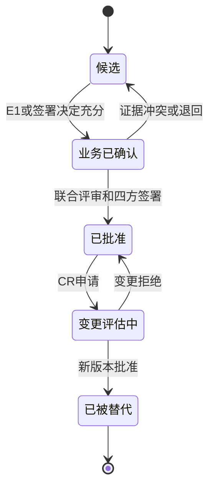

# CNAS LIMS 正式业务基线准备包

> 基线编号：BL-BIZ-1.0  
> 文档版本：0.1  
> 当前状态：阻塞，未批准  
> 基线对象：通用产品能力 + 真实试点实验室实例化  
> 禁止用途：当前版本不得作为开发、采购验收或 CNAS 符合性声明依据

## 1. 基线目标

正式业务基线用于把候选 SRS 中的标准主题、通用能力和推导流程，转换为由试点实验室实际制度、表单、案例和签署决定支撑的业务事实。通用产品能力与试点实例参数分别管理：通用层描述可配置能力，实例层决定实际组织、场所、专业范围、角色、流程、字段、状态和控制参数。

## 2. 当前准入状态

| 门禁 | 正式要求 | 当前结果 | 结论 |
| --- | --- | --- | --- |
| E1 证据 | 六类最低证据包完成核验 | 0 个有效 E1 证据 | 阻塞 |
| P0 TBD | 24 项 P0 直接或整体依赖 TBD 全部关闭 | 24 项待确认 | 阻塞 |
| 全部 TBD | 25 项决定关闭或批准不适用 | 25 项待确认 | 阻塞开发基线 |
| P0 推测 | P0 不含未批准 `[推测]` | `RULE-008` 未批准 | 阻塞 |
| 专业适用性 | 专业领域及 `CNAS-CL01-Axxx` 适用性确认 | 专业领域未提供 | 阻塞 |
| P0 追踪 | 129 条 P0 均有 E1/决定到测试的闭环 | 只有候选 E2/E3/E4 追踪 | 阻塞 |
| 联合签署 | 四个责任角色全部签署 | 无签署 | 阻塞 |

## 3. 业务基线组成

`BL-BIZ-1.0` 批准时必须冻结以下对象及 SHA-256：

1. SRS、详细需求目录、追踪矩阵和证据台账的批准版本。
2. E1 证据接收台账及所有被引用证据的哈希清单。
3. 25 项 TBD 决策记录及其批准状态。
4. 组织/场所/岗位/角色/授权签字人和职责分离矩阵。
5. 检测、校准和共享质量核心的流程、状态与例外规则。
6. 委托、物品链、原始记录、报告/证书、质量事件和档案的字段/表单目录。
7. 专业领域、认可范围、标识、分包和超范围业务控制。
8. 保存期限、接口边界、运维指标、消息和报表口径。
9. 独立测试、审查、问题关闭和联合签署记录。

原计划按旧台账标签统计为 17 项 P0 TBD；需求集合复核发现 7 项原标 P1 的 TBD 被 P0 需求直接引用，因此正式业务基线按 24 项执行，不能以旧计数降低门禁。

## 4. P0 证据覆盖门禁

| 业务域 | 候选追踪 | 最低 E1 证据 | 关闭条件 |
| --- | --- | --- | --- |
| 组织、用户和权限 | RTM-001 | 组织图、岗位、账号规则、授权与兼岗制度 | 角色、数据范围、SOD 和失效规则获批 |
| 客户、委托与合同 | RTM-002 | 委托/合同程序、评审表单、变更和撤单案例 | 正常、紧急、拒绝、变更和撤单规则获批 |
| 检测样品与抽样 | RTM-003/023 | 接收、交接、留样/处置制度及适用的抽样资料 | 唯一标识、异常、处置和抽样适用性获批 |
| 被校对象与校准 | RTM-004/006 | 对象交接、校准方法、测量点、不确定度和溯源资料 | 实验室/现场校准规则与证书链获批 |
| 任务、记录与计算 | RTM-005/007 | 任务、原始记录、复核、更正、公式和异常案例 | 版本、更正、退回、重测和资源门禁获批 |
| 报告与证书 | RTM-008 | 模板、编制/审核/批准/发布/更正/召回制度及案例 | 字段、角色、签名、标识和处置规则获批 |
| 人员、方法和设备 | RTM-009~011 | 能力授权、方法确认、设备校准/核查/维修制度 | 授权范围、方法版本和设备失效处理获批 |
| 环境、物料和供应商 | RTM-012~014 | 环境监测、库存批次、采购验收和供方制度 | 阈值、失控、追溯、分包和外部服务规则获批 |
| 质量与认可 | RTM-015~017 | QC/PT、投诉、不符合、内审、管理评审和认可资料 | 暂停、影响评价、整改验证和恢复规则获批 |
| 文件、档案与平台控制 | RTM-018~022 | 文件记录、保存期、安全、接口和运维制度 | 版本、审计、签名、保留和连续性规则获批 |

129 条 P0 必须逐条引用具体证据位置或签署决策，不接受只关联整个文件或整个业务域。

## 5. `RULE-008` 专项决定

当前候选规则为“强制资源失效且没有批准例外时默认阻断”。该规则仍标记为 `[推测][待确认]`，不得自动进入正式 P0 基线。

业务方必须在 `DEC-TBD-011` 中选择并批准以下一种处理：

- 按实际制度批准默认阻断，并列明可例外放行的资源、节点、角色、期限和补偿控制。
- 根据实际制度改写为分级阻断、审批放行或提醒规则。
- 删除不适用的推测内容，同时补充等效的结果有效性控制。

决定必须关联 E1 制度、受控表单和至少一个资源失效案例。

## 6. 需求状态转换

禁止从“候选”直接进入“已批准”或“开发完成”。

## 7. 联合批准记录

| 签署角色 | 姓名/身份 | 签署结论 | 签署时间 | 签署证据 | 当前状态 |
| --- | --- | --- | --- | --- | --- |
| 实验室负责人 | `[待确认]` | `[待签署]` | `[待签署]` | `[待提供]` | 未签署 |
| 质量负责人 | `[待确认]` | `[待签署]` | `[待签署]` | `[待提供]` | 未签署 |
| 技术负责人 | `[待确认]` | `[待签署]` | `[待签署]` | `[待提供]` | 未签署 |
| 项目负责人 | `[待确认]` | `[待签署]` | `[待签署]` | `[待提供]` | 未签署 |

任一角色未签署、附条件签署但条件未关闭，或签署证据无法验证时，基线状态保持“阻塞，未批准”。

## 8. 基线清单与版本

| 项目 | 批准版本 | SHA-256 | 批准状态 |
| --- | --- | --- | --- |
| SRS | `[待生成]` | `[批准前计算]` | 未批准 |
| 详细需求目录 | `[待生成]` | `[批准前计算]` | 未批准 |
| 追踪矩阵 | `[待生成]` | `[批准前计算]` | 未批准 |
| E1 证据台账 | `[待生成]` | `[批准前计算]` | 未批准 |
| TBD 决策工作簿 | `[待生成]` | `[批准前计算]` | 未批准 |
| 独立核验记录 | `[待生成]` | `[批准前计算]` | 未批准 |

## 9. 变更控制

批准后所有修改使用 `CR-BIZ-YYYY-NNN`：记录原因、发起人、受影响证据/需求/流程/测试、风险、实施版本、批准人和回退方案。批准文件不得原位覆盖；新版本批准后，旧版本转为“已被替代”并保持可追溯。

## 10. 当前结论

业务基线结构已准备，但正式条件尚未满足。收到 E1 资料后，应先登记和核验，再关闭决策、更新需求、执行业务走查和独立审查，最后进行四方签署。
