# CNAS LIMS 系统模块功能和流程说明

> 文档编号：CNAS-LIMS-GUIDE-001  
> 版本：0.1  
> 当前状态：候选说明，未批准  
> 适用范围：ISO/IEC 17025 检测实验室与校准实验室  
> 编制日期：2026-07-28

## 1. 文档目的与使用边界

本文面向实验室业务方、产品、开发和测试团队，说明候选 CNAS LIMS 的模块边界、模块协作关系与核心流程。它用于业务走查、范围确认和后续原型校准，不是开发授权、技术设计、数据库设计或符合性声明。

本文仅整理以下候选资料中的已有内容：

| 来源 | 用途 |
| --- | --- |
| [候选 SRS](../requirements/cnas-lims-srs.md) | 系统范围、角色、候选流程、状态和业务对象 |
| [详细需求目录](../requirements/cnas-lims-requirement-catalog.md) | 原子功能、业务规则、非功能、接口和报表需求 |
| [开发就绪规格](./cnas-lims-development-readiness-spec.md) | 模块入口、权限、字段、异常、审计和验收约束 |
| [业务基线准备包](./cnas-lims-business-baseline.md) | E1 证据、TBD 决策和联合签署门禁 |
| [发布需求清单](./cnas-lims-release-manifest.md) | 首期及后续阶段的候选范围处置 |

### 1.1 状态标记

| 标记 | 说明 |
| --- | --- |
| 已列入候选需求 | 已在候选 SRS 或需求目录中定义，仍须 E1 证据和业务决定确认 |
| `[待确认]` | 当前缺少试点实验室制度、表单、案例或签署决策，不得由项目组自行假定 |
| `[推测]` | 根据候选业务逻辑形成的建议，不得直接作为 P0 批准需求 |
| `[最佳实践建议]` | 用于后续评审的行业建议，不等同于实验室既有制度或强制条款 |

### 1.2 统一范围口径

- 共享质量核心服务于检测与校准两类业务，不将两类业务的对象、方法、结果和报告/证书混为同一业务实体。
- 检测链管理样品、检测任务、原始记录、检测结果和检测报告；实验室是否承担抽样由 `TBD-003` 决定。
- 校准链管理被校对象、校准任务、测量条件、测量数据、不确定度、计量溯源和校准证书。
- 医学检验、ISO 15189、患者诊疗和病理专属流程不在本说明范围内。
- 当前 E1 业务证据为零、25 项 `TBD-*` 均未关闭，因此本文全部功能均保持候选状态。

## 2. 系统总体功能结构

### 2.1 图的用途

展示共享治理、共享质量、检测链、校准链和交付闭环之间的层级关系，帮助确认系统范围，避免以原型页面反推业务需求。

### 2.2 Mermaid 源码

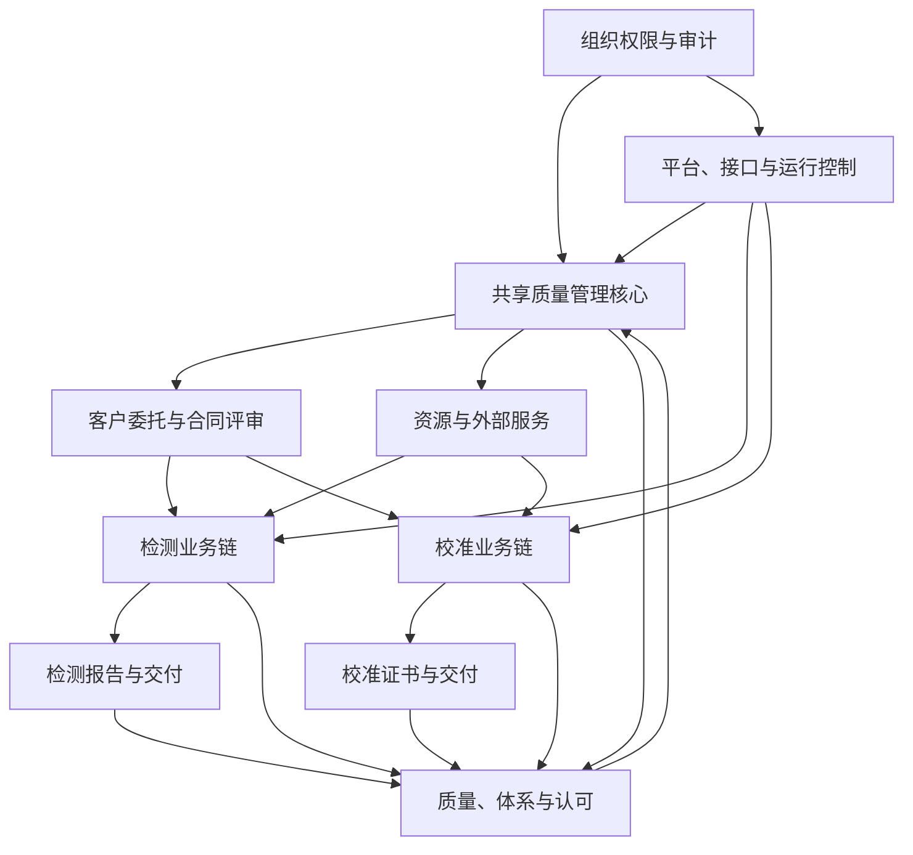

### 2.3 关键说明

- “共享质量管理核心”包含人员、方法、设备、环境、物料、供应商、文件、质量控制、不符合、内审、管理评审和认可活动。
- 报告与证书均引用受控的任务、结果、资源、范围和批准证据；发布后发现问题只能走更正、撤回或召回，不得覆盖原版本。
- 平台、接口和运行控制是横向能力，负责工作流、审计、数据完整性、签名、消息、报表、恢复和外部交互，不替代业务审批。

### 2.4 待确认问题

- `[待确认]` 试点实验室的组织层级、场所、专业领域、认可范围和实际兼岗情况。
- `[待确认]` 抽样、客户门户、ERP/OA/财务、仪器、物联网、电子签名和消息平台的实际启用范围。

## 3. 模块功能说明

### 3.1 模块总表

| 编号 | 业务域与模块 | 适用范围 | 核心功能说明 | 主要角色 | 对应开发规格 |
| --- | --- | --- | --- | --- | --- |
| M01 | 组织、用户、角色、权限与审计 | 共享 | 维护组织、场所、岗位、账号、角色、授权、数据范围及权限复核；记录关键操作审计。 | 系统管理员、实验室/质量/技术负责人、审计员 | `DRS-ORG`、`DRS-SECURITY` |
| M02 | 客户、委托与合同评审 | 共享 | 管理客户、委托、合同评审、变更、撤单和受理结论；评审业务能力、方法、资源、期限、分包和特殊要求。 | 受理人员、技术评审人员、业务批准角色 `[待确认]` | `DRS-CONTRACT` |
| M03 | 检测样品与条件抽样 | 仅检测 | 管理样品接收、唯一标识、位置、交接、分样、留样、归还、销毁及接收异常；抽样仅在经确认适用时启用。 | 样品管理员、检测员、抽样人员 | `DRS-SAMPLE` |
| M04 | 被校对象管理 | 仅校准 | 管理被校对象接收、标识核对、附件与状态、保管、交接、现场确认和交付回执。 | 被校对象管理员、校准员 | `DRS-CALOBJ` |
| M05 | 检测与校准任务 | 分别适用 | 按检测项目或校准点拆分任务，校验人员、方法、设备、环境和物料，完成分配、领取、执行、复核和状态控制。 | 任务管理员、检测员、校准员、复核人 | `DRS-TASK` |
| M06 | 原始记录、计算与结果 | 分别适用 | 使用受控模板采集数据，保留原始值、条件、计算、附件、签名和更正链；检测结果与校准测量数据分别管理。 | 执行人、复核人、方法管理员 | `DRS-RECORD` |
| M07 | 报告、证书与交付 | 分别适用 | 编制、审核、批准、签名、发布、送达、回执、更正、撤回和召回检测报告或校准证书。 | 编制人、审核人、授权签字人、发布人 | `DRS-REPORT` |
| M08 | 人员、培训、能力与授权 | 共享 | 维护人员档案、岗位能力要求、培训实践、能力确认、技术授权、监督复评及暂停/撤销。 | 人员管理员、技术负责人、质量负责人 | `DRS-PERSON` |
| M09 | 方法、标准、不确定度与计量溯源 | 共享，校准侧重点更高 | 管理方法和标准版本、验证/确认、适用范围；校准侧管理不确定度和计量溯源证据。 | 方法管理员、技术负责人、校准员 | `DRS-METHOD-EQUIP` |
| M10 | 设备、设施环境与物料 | 共享 | 管理设备验收、校准/检定、维护、期间核查、停用和报废；管理环境监测、报警、试剂/标准物质/耗材批次、库存和追溯。 | 设备/环境管理员、物料管理员、执行人 | `DRS-METHOD-EQUIP`、`DRS-ENV-MATERIAL` |
| M11 | 供应商、采购、外部服务与分包 | 共享 | 管理供方准入、采购、验收、评价、外部服务和分包结果接收验证。 | 供应商管理员、采购人员、验收人员、质量角色 | `DRS-SUPPLIER` |
| M12 | 质量控制、PT/比对、投诉与不符合 | 共享 | 管理 QC 计划与数据、能力验证/实验室间比对、投诉申诉、立即控制、影响评价、CAPA、风险和改进。 | 质量负责人、技术负责人、责任部门、验证人 | `DRS-QUALITY` |
| M13 | 文件、记录与档案 | 共享 | 管理文件分类、编制、审核、批准、发布、分发、知悉、评审、修订、作废、归档、借阅和销毁。 | 文件管理员、审核/批准人、档案管理员 | `DRS-DOC` |
| M14 | 内审、管理评审与认可 | 共享 | 管理内审方案、独立性、取证、发现、管理评审措施、认可范围版本、评审问题和整改证据。 | 内审员、质量负责人、实验室负责人、认可负责人 | `DRS-QUALITY` |
| M15 | 工作流、配置、检索、报表与预警 | 共享 | 提供待办、流程实例、受控配置、检索、受控导出、业务/质量/资源/安全报表、预警确认与升级。 | 全部流程角色、管理者、审计员 | `DRS-PLATFORM`、`DRS-REPORTING` |
| M16 | 接口、数据完整性与运行连续性 | 共享 | 约束 ERP/OA、仪器、物联网、扫码、CA/签名、消息和门户接口；处理事务、幂等、并发、文件完整性、备份恢复和监控。 | 数据所有者、接口负责人、运维、安全管理员 | `DRS-INTERFACE`、`DRS-DATA`、`DRS-NFR` |

### 3.2 横向控制功能

下列能力不单独替代业务模块，而是作用于所有受控对象和流程：

| 控制 | 功能说明 | 适用对象 |
| --- | --- | --- |
| 权限与职责分离 | 同时校验功能权限、法人、场所、客户、专业、对象归属、流程状态、技术授权、签字授权、密级和临时授权有效期。 | 全部模块 |
| 版本与状态 | 已批准、已发布或已归档对象不可回到可编辑草稿；更正和替代形成新版本。 | 文件、记录、结果、报告/证书、授权、方法等 |
| 审计追踪 | 对新增、修改、作废、审批、签名、发布、导出、权限、配置、接口补偿和恢复留痕。 | 全部关键操作 |
| 电子签名 | 签名绑定签名人、目的、对象版本、内容摘要、可信时间和验签状态；签名失败不得完成受控操作。 | 审批、批准、发布及其他待业务确认节点 |
| 并发与幂等 | 拒绝过期版本提交；重复请求不产生第二个有效对象或重复流水。 | 全部状态变更和接口操作 |
| 预警与阻断 | 授权失效、设备停用、方法无效、超范围签发、签名失败等候选阻断事件必须与业务状态门禁一致。 | 任务、报告/证书、资源、质量活动 |

### 3.3 模块关系图

#### 图的用途

展示对象主链及模块依赖，供业务走查、需求拆分和后续测试范围识别使用。

#### Mermaid 源码

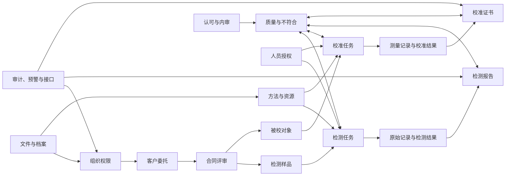

#### 待确认问题

- `[待确认]` 任务资源校验的实际强制项、例外放行角色、期限和补偿控制。
- `[待确认]` 供应商、采购、分包、环境监测和物料批次与任务之间的实际关联粒度。

## 4. 核心流程说明

### 4.1 通用流程控制要求

所有候选流程应使用相同的控制原则：

1. 每次状态变化记录对象、前后状态、操作人、时间、理由和关联证据。
2. 非终态对象取消、拒绝、撤回、作废和销毁均为受控状态，不等同于物理删除。
3. 权限不足、资源失效、非法状态、数据缺失、重复请求、并发修改、网络中断及接口失败均须有明确拒绝、恢复或人工处置路径。
4. 执行人与本人复核、CAPA 实施人与有效性验证人、内审员与被审活动、系统管理与业务签名的职责冲突应受控；小型实验室兼岗例外为 `[待确认]`。
5. 流程中的审批层级、时限、具体表单字段、签名节点和消息渠道均须以 E1 证据或签署决策实例化。

### P01 客户委托到任务受理

**用途与适用模块：** 说明 M02 如何将客户需求转为检测或校准业务任务；适用于检测和校准。

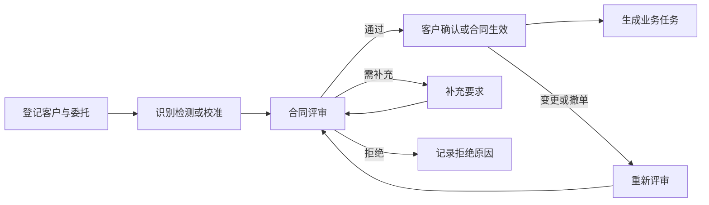

**关键说明：** 候选评审要素包括能力范围、方法、资源、交付期限、分包、判定规则和客户特殊要求。紧急受理不得静默绕过评审。

**待确认：** 合同生效方式、评审批准角色、紧急受理规则、变更影响在途任务的处置规则。

### P02 检测样品接收到处置

**用途与适用模块：** 说明 M03 的物品链和异常处置；仅适用于检测业务。

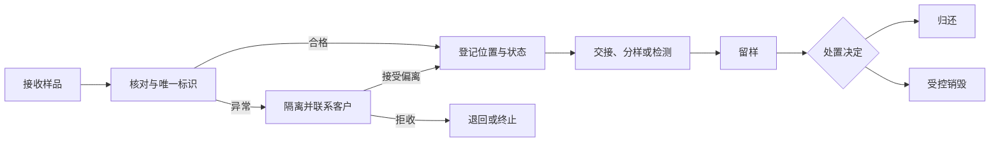

**关键说明：** 样品应从接收至归还或销毁全程可追溯。错收、重复登记、标签损坏、数量不足、污染、丢失和超期是候选异常清单。

**待确认：** 接收准则、偏离接受条件、留样期限、销毁审批和执行的职责分离、抽样是否适用。

### P03 被校对象接收到交付

**用途与适用模块：** 说明 M04 的被校对象保管和交接；仅适用于校准业务。

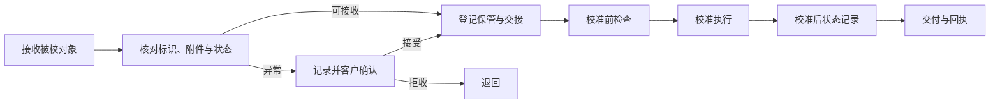

**关键说明：** 现场校准不发生实物入库，但候选规则要求记录地点、对象确认、现场条件、交接责任和离场状态。

**待确认：** 现场与实验室校准的具体差异字段、对象异常放行条件、交付回执形式。

### P04 检测/校准任务到结果审核

**用途与适用模块：** 说明 M05、M06 如何控制资源准入、原始记录、计算和复核；检测与校准使用独立任务和结果对象。

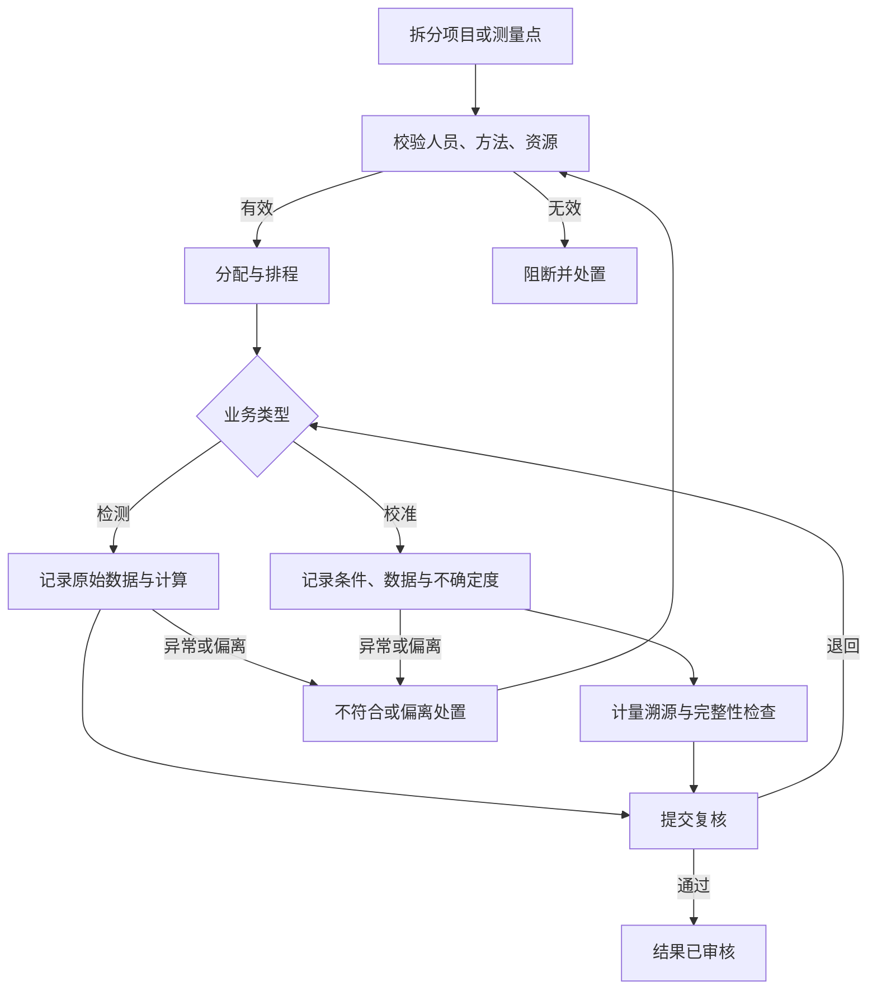

**关键说明：** 任务开始前校验有效人员授权、方法版本和必要资源；复核退回不覆盖原记录版本。检测侧关注检测项目和结果，校准侧额外关注测量条件、不确定度和计量溯源。

**待确认：** 强制资源清单、可用/停用判定、复核层级、重测/复测规则、资源失效是否默认阻断（`RULE-008`）。

### P05 原始记录到报告/证书发布

**用途与适用模块：** 说明 M06、M07 的结果交付闭环；分别适用于检测报告和校准证书。

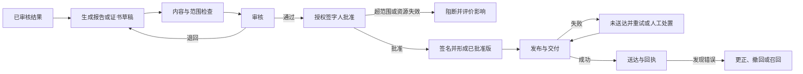

**关键说明：** 报告/证书只引用已审核结果和任务执行时有效的受控快照。发布版本不可覆盖；更正应关联原版本、说明变更、重新审核批准并保存通知证据。超范围、授权失效或签名失败不得批准或发布。

**待确认：** 模板字段、审核与批准可否兼岗、电子签名节点、发布渠道、回执、召回范围及客户通知规则。

### P06 人员培训到岗位授权

**用途与适用模块：** 说明 M08 如何将培训和能力证据转为受范围限制的技术授权；适用于共享资源管理。

**关键说明：** 授权需关联人员、项目、方法、角色、场所、生效/到期和状态。任务领取及授权签发应校验授权是否有效。

**待确认：** 能力评价证据、复评周期、授权批准角色、暂停/恢复规则及失效对在途和已发布结果的影响评价。

### P07 设备、环境与物料资源控制

**用途与适用模块：** 说明 M09、M10、M11 如何为任务提供合格资源，并将资源失效回流至业务和质量流程。

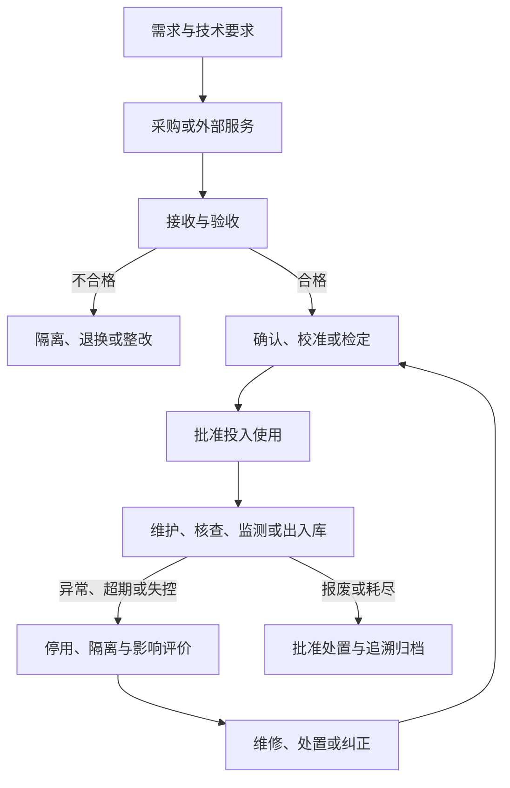

**关键说明：** 设备状态、环境报警、物料批次和供应商/分包结果均可能影响任务有效性；候选规则要求状态变化不可删除，并能识别受影响任务。物料以批次管理有效期、验收、库存、状态和消耗追溯。

**待确认：** 设备计量要求、环境阈值与失控处置、物料放行和库存调整规则、采购/验收/评价职责分离、分包结果核验规则。

### P08 文件编制到作废与记录归档

**用途与适用模块：** 说明 M13 对体系文件、外来文件及业务记录的受控生命周期；适用于共享体系管理。

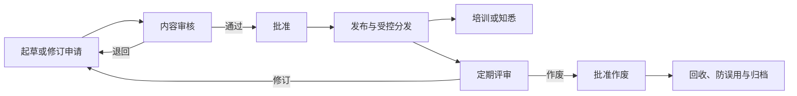

**关键说明：** 已批准、已发布或已归档对象不允许回到可编辑草稿。记录保存期、借阅、法律冻结和销毁需保持证据链；作废不等同于物理销毁。

**待确认：** 文件分类、评审周期、分发/知悉方式、保密等级、记录保存期限、销毁审批和冻结规则。

### P09 不符合、内审与管理评审改进闭环

**用途与适用模块：** 说明 M12、M14 将业务异常、内审发现及管理决定转化为可验证的改进闭环；适用于共享质量管理。

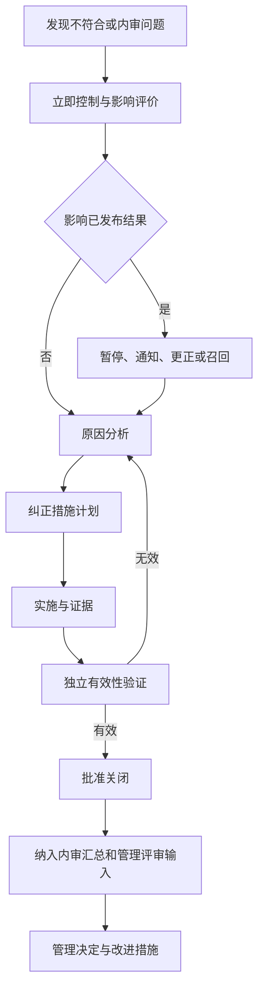

**关键说明：** 不符合关闭前应完成立即控制和影响评价；实施人不得独立验证本人措施。内审员不得审核本人承担的活动。管理评审的输入、决定、责任、期限和效果验证应受控。

**待确认：** 事件分级、升级时限、影响已发布结果的判定、根因方法、有效性验证标准和管理评审频次。

### P10 QC/PT 与认可评审整改

**用途与适用模块：** 说明 M12、M14 处理能力验证、实验室间比对、认可活动和外部评审问题；适用于共享质量与认可管理。

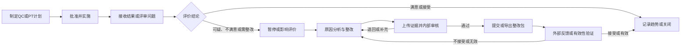

**关键说明：** PT/比对的范围和风险用于制定计划；结果可疑或不满意时需关联影响评价和纠正措施。认可问题整改应保留问题、责任、期限、证据、内部审核和外部反馈关系。

**待确认：** PT/QC 覆盖规则、满意度判定、认可活动类型、整改包格式、外部提交渠道及关闭标准。

### P11 外部接口失败与恢复

**用途与适用模块：** 说明 M16 对仪器、物联网、签名、消息等外部依赖的候选恢复原则；适用于所有启用接口的模块。

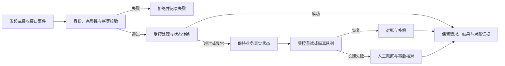

**关键说明：** 接口失败不应静默覆盖受控记录，也不应将“消息发送失败”误判为业务失败。仪器与物联网候选要求保留原始载荷、转换结果、失败原因和补偿记录；签名失败不得批准或发布。

**待确认：** 各接口的数据主责、触发时点、字段、协议、超时、重试、对账、补偿、人工兜底和监控阈值。

## 5. 核心状态与闭环索引

### 5.1 关键对象状态摘要

| 对象 | 候选主状态 | 主要控制点 |
| --- | --- | --- |
| 委托 | 草稿、待评审、已接受、变更评审中、已取消 | 评审通过前不得生成有效业务任务；变更和撤单保留历史。 |
| 检测样品 | 待接收、已接收、在库、检测中、检测完成、已归还、已销毁 | 唯一标识、位置和交接可追溯；异常样品进入隔离。 |
| 被校对象 | 待接收、已接收、校准中、校准完成、已交付 | 对象异常、附件和交付回执受控。 |
| 任务 | 待分配、已分配、执行中、待复核、已完成 | 资源和授权校验；退回保留版本；禁止本人复核的候选规则。 |
| 报告/证书 | 草稿、待审核、待批准、已批准、发布中、已发布、发布失败、已被替代、已撤回、已召回 | 已发布版本不可覆盖；签发和发布受范围、授权和签名控制。 |
| 人员授权 | 草稿、有效、暂停、撤销、过期 | 授权范围与有效期控制任务执行和签发。 |
| 设备 | 待验收、可用、停用、维修/确认中、报废 | 失效影响评价后才能恢复可用。 |
| 不符合项 | 已登记、分析中、整改中、待验证、已关闭 | 立即控制、影响评价和独立有效性验证是关闭前置。 |

### 5.2 关键业务闭环

| 闭环 | 起点 | 终点 | 保留的候选证据 |
| --- | --- | --- | --- |
| 委托交付闭环 | 客户委托 | 报告/证书送达、回执及必要的更正/召回 | 委托、评审、任务、记录、结果、签名、发布、回执 |
| 资源能力闭环 | 人员/方法/设备/环境/物料状态 | 任务准入、失效处置与影响评价 | 授权、版本、证书、监测、批次、状态历史、影响评价 |
| 质量改进闭环 | 发现、投诉、QC/PT、内审或评审问题 | 有效性验证和关闭 | 问题、立即控制、原因、措施、验证、关闭、管理评审输入 |
| 文件记录闭环 | 文件/记录编制或形成 | 受控发布、归档、保存、销毁或冻结 | 版本、审批、分发、知悉、借阅、销毁/冻结记录 |
| 认可整改闭环 | 认可活动或评审问题 | 整改证据经确认并更新相关范围/状态 | 问题、责任、期限、证据、内部审核、外部反馈 |

## 6. 阶段与基线使用说明

### 6.1 候选阶段范围

- 候选发布清单将 129 条 P0 需求列为第一阶段最小合规闭环；31 条 P1 和 1 条 P2 为后续候选范围。
- 模块不等于完整首期功能。例如，M15 中流程实例、受控配置、全局检索和消息能力存在后续阶段条目；实际应以逐条发布清单为准。
- M16 中具体接口协议、性能、可用性、容量、RPO/RTO 和运行环境仍需业务与技术基线共同确认。

### 6.2 进入正式基线前必须补齐的内容

| 事项 | 当前状态 | 影响范围 |
| --- | --- | --- |
| E1 受控业务证据 | 未提供 | 所有业务流程、字段、表单、角色和保存期不能实例化 |
| 25 项 TBD 决策 | 未关闭 | 其中 24 项直接或整体阻断 P0 业务基线 |
| `RULE-008` 资源失效规则 | `[推测][待确认]` | 任务准入、报告/证书批准和例外放行不能定稿 |
| 专业领域应用说明 | 未确认 | 适用的 `CNAS-CL01-Axxx` 文件及专业字段不能定稿 |
| 四方联合签署 | 未完成 | `BL-BIZ-1.0` 和 `BL-DEV-1.0` 均不得批准 |

### 6.3 后续使用方式

1. 由质量、技术、实验室和项目负责人基于 E1 资料走查本文模块和流程。
2. 将每个 `[待确认]` 关联到 `TBD-*` 决策、实际制度/表单位置、责任人和批准记录。
3. 批准 `BL-BIZ-1.0` 后，按发布清单和开发就绪规格生成页面、字段、权限、接口及验收用例的开发包。
4. 原型只能在业务基线批准后校准，并反向引用批准的需求编号；原型不构成业务事实来源。

## 7. 文档依据与待确认清单

### 7.1 已引用的候选功能点

- 组织权限、客户委托、检测样品、被校对象、任务、记录、报告/证书、人员、方法设备、环境物料、供应商、质量、文件、内审管理评审、认可、平台和接口：见 [详细需求目录](../requirements/cnas-lims-requirement-catalog.md)。
- 角色、职责分离、核心流程、状态、实体、接口、预警和分期：见 [候选 SRS](../requirements/cnas-lims-srs.md)。
- 开发入口、数据范围、字段、异常、审计、签名与接口恢复：见 [开发就绪规格](./cnas-lims-development-readiness-spec.md)。

### 7.2 需要业务方优先确认的问题

1. 检测、校准的认可范围、场所、专业领域、组织岗位、授权签字人和兼岗补偿控制。
2. 委托评审、样品/对象异常接收、任务资源准入、复核与报告/证书审批的实际制度和表单。
3. 原始记录更正、电子签名、可信时间、审计、保存期限、物理销毁和法律冻结规则。
4. 人员授权、设备/环境/物料失效、例外放行及对在途和已发布结果的影响评价规则。
5. QC/PT、内审、管理评审、认可整改的评价、升级、验证和关闭规则。
6. 外部系统、仪器、物联网、扫码、签名、消息的台账、数据主责、实际接口和故障恢复边界。
7. 并发用户量、年业务量、附件增长、性能、可用性、RPO/RTO、浏览器及国产化环境目标。

## 8. 文档维护

本文随候选 SRS 和业务基线更新而更新。批准后任何模块、流程、状态、字段、权限或接口边界调整均应通过 `CR-BIZ-*` 变更记录追溯，不得原位覆盖已批准版本。
