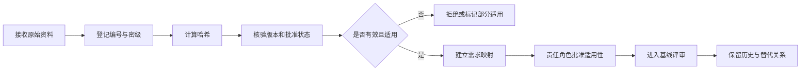

# CNAS LIMS E1 证据接收与核验台账

> 文档编号：CNAS-LIMS-E1-REG-001  
> 版本：0.1  
> 状态：空台账，等待实际资料  
> 正式基线引用条件：核验状态为“有效”，且适用性已经相应责任角色批准

## 1. 证据登记

| 证据编号 | 类别 | 文件名称/路径 | 文件版本 | 文件批准人 | 生效日期 | SHA-256 | 密级 | 适用业务域 | 关联需求/决定 | 核验状态 | 替代/被替代关系 |
| --- | --- | --- | --- | --- | --- | --- | --- | --- | --- | --- | --- |
| `[待分配]` | `[待确认]` | `[待提供]` | `[待确认]` | `[待确认]` | `[待确认]` | `[接收后计算]` | `[待确认]` | `[待确认]` | `[待分析]` | 未接收 | 无 |

核验状态枚举：`未接收`、`待核验`、`有效`、`部分适用`、`失效`、`作废`、`被替代`、`拒绝接收`。

## 2. 最低证据包门禁

| 证据包 | 最低要求 | 业务核验角色 | 完成标准 | 当前状态 | 阻塞对象 |
| --- | --- | --- | --- | --- | --- |
| `E1-PKG-ORG` 组织与认可 | 法人/场所、组织图、岗位、授权签字人、认可证书、能力范围 | 实验室负责人、质量负责人 | 文件有效且范围、场所和授权关系无冲突 | 缺失 | `TBD-001/009/012`、权限和报告签发 |
| `E1-PKG-QMS` 体系文件 | 有效文件目录、质量手册、程序文件、SOP/作业指导书 | 质量负责人 | P0 业务域均有制度依据或签署决定 | 缺失 | `TBD-002`、全部 P0 流程 |
| `E1-PKG-FORM` 受控表单 | 委托、评审、物品链、原始记录、报告/证书、异常整改表单 | 质量负责人、技术负责人 | 字段、编号、签名、版本和归档规则可核对 | 缺失 | `TBD-004~010/014/018` |
| `E1-PKG-CASE` 代表案例 | 三类检测、两类校准及关键异常案例 | 技术负责人、业务负责人 | 正常、异常、撤回、更正和恢复分支可走查 | 缺失 | `TBD-003~008/011/013/015` |
| `E1-PKG-INT` 接口资料 | 系统/仪器、数据主责、协议、网络、负责人、故障历史 | 信息化负责人 | 每个拟接接口可确定边界和失败恢复 | 缺失 | `TBD-017/021`、全部 `INT-*` |
| `E1-PKG-OPS` 容量与运维 | 用户、并发、业务量、附件、保存期、服务时段、RPO/RTO | 信息化负责人、项目负责人 | NFR 指标可形成单值验收目标 | 缺失 | `TBD-018~020/024/025` |

## 3. 单份证据核验清单

| 检查项 | 通过条件 | 结果 |
| --- | --- | --- |
| 来源真实性 | 来源部门、文件所有者和取得方式可追责 | `[待核验]` |
| 版本与有效性 | 版本、生效日期、作废/替代状态明确 | `[待核验]` |
| 批准状态 | 批准人和批准记录存在且可核对 | `[待核验]` |
| 内容完整性 | 文件可读取，页数/附件/签章完整 | `[待核验]` |
| 哈希 | SHA-256 已计算并与登记值一致 | `[待核验]` |
| 适用性 | 明确适用于检测、校准、共享能力、场所和专业领域 | `[待核验]` |
| 保密与脱敏 | 密级、访问范围和脱敏处理符合批准要求 | `[待核验]` |
| 需求影响 | 已关联受影响的 FR/RULE/NFR/INT/RPT、流程和测试 | `[待核验]` |

## 4. 证据到需求映射

| 映射编号 | 证据编号 | 证据位置 | 业务结论 | 关联需求 | 控制措施 | 保留记录 | 冲突/差距 | 批准状态 |
| --- | --- | --- | --- | --- | --- | --- | --- | --- |
| `[待分配]` | `[待提供]` | `[章节/表单字段/案例步骤]` | `[待确认]` | `[待分析]` | `[待分析]` | `[待分析]` | `[待分析]` | 未批准 |

## 5. 接收与变更流程

任何证据更新都必须重新计算哈希、重新执行影响分析，并通过 `CR-*` 变更记录更新基线引用。
