# CNAS 实验室信息管理系统需求规格说明书

> 文档编号：CNAS-LIMS-SRS-001  
> 版本：0.9  
> 状态：候选基线，禁止直接作为开发或验收批准依据  
> 适用范围：ISO/IEC 17025 检测与校准实验室  
> 编制日期：2026-07-28

## 1. 文档控制

### 1.1 状态声明

本文件已完成需求结构、候选流程、控制规则和验收表达重构，但项目尚未提供现行质量手册、程序文件、受控表单、代表案例、组织授权和接口台账。所有标准驱动需求均需通过业务证据门禁和联合评审后，才能转为正式基线。

现有页面地图和原型冻结为非权威参考，不得用于反推流程、字段、权限或状态。

### 1.2 标记和状态

| 标记 | 含义 |
| --- | --- |
| `[范围决策]` | 用户已明确批准的本期边界 |
| `[文档需求]` | 来自 D01/D02，可复用但需确认 17025 适用性 |
| `[标准要求]` | 来自已核验标准主题或 CNAS 文件，业务实现仍需确认 |
| `[推测]` | 基于业务逻辑推导，不得直接进入正式 P0 基线 |
| `[最佳实践建议]` | 行业通行控制，不等同于标准强制要求 |
| `[待确认]` | 缺少业务证据或决策，关联 `TBD-*` |

需求状态依次为：`候选 → 业务已确认 → 已批准 → 已作废`。任何需求不得从“候选”直接进入开发完成状态。

### 1.3 配套文件

- [详细需求目录](./cnas-lims-requirement-catalog.md)
- [证据与待确认台账](./cnas-lims-evidence-register.md)
- [需求追踪与验收矩阵](./cnas-lims-traceability-matrix.md)
- [E1 业务证据接收台账](../evidence/e1/evidence-intake-register.md)
- [正式业务基线准备包](../baseline/cnas-lims-business-baseline.md)
- [TBD 决策工作簿](../baseline/cnas-lims-tbd-decision-workbook.md)
- [开发基线准备包](../baseline/cnas-lims-development-baseline.md)
- [发布需求清单](../baseline/cnas-lims-release-manifest.md)
- [开发就绪规格](../baseline/cnas-lims-development-readiness-spec.md)
- [原需求框架](../analysis/cnas-lims-requirements-framework.md)
- [需求审查报告](../reviews/CNAS-REQ-001-requirements-review.md)

## 2. 项目背景与建设目标

### 2.1 背景

D01/D02 反映了实验室文件、记录、人员、设备、物料、环境、内审和改进信息化需求，但主要面向 ISO 15189/病理场景，不能覆盖 ISO/IEC 17025 的完整委托、检测、校准和报告/证书链。本项目需要以检测与校准实验室的结果可追溯性为核心，建立候选需求基线。

### 2.2 业务目标

| 编号 | 目标 | 成功指标 |
| --- | --- | --- |
| BR-001 | 每份检测报告可追溯到有效委托、样品、方法、人员、设备、环境、原始记录和批准证据 | P0 追踪链完整率 100%；实际基线与目标值见 TBD-025 |
| BR-002 | 每份校准证书可追溯到被校对象、校准方法、参考设备、环境、测量数据、不确定度、计量溯源和批准证据 | P0 追踪链完整率 100%；实际基线与目标值见 TBD-025 |
| BR-003 | 资源或能力失效时可阻断、评价影响、追回应对并保留证据 | 受控失效事件均形成处置记录；阻断规则见 TBD-011 |
| BR-004 | 关键记录、签名和发布结果不存在无痕修改 | 关键变更审计覆盖率 100%，历史版本可复现 |
| BR-005 | CNAS 认可活动、质量控制和改进活动可形成闭环证据包 | 计划、执行、发现、措施、验证和关闭关系完整 |

### 2.3 非目标

- `[范围决策]` 不覆盖医学检验、ISO 15189、患者诊疗和病理专属流程。
- 不替代 ERP 财务核算、CA 证书签发、专业仪器控制软件或 CNAS 官方申报系统。
- 当前阶段不决定编程语言、数据库、中间件、部署架构或具体接口协议。
- 未批准的客户门户、移动端、供应商门户和 AI 能力不进入 P0/P1 基线。

## 3. 参考资料与适用标准

适用文件、版本核验和哈希见证据台账。当前采用以下引用口径：

- ISO/IEC 17025:2017、GB/T 27025-2019 和 CNAS-CL01:2018 作为通用要求主题主线。
- CNAS-RL01、RL02、R01、R02、R03 用于认可生命周期、能力验证、标识、公正保密及申诉投诉控制。
- CNAS-GL011、GL012 仅作实施指南，不转写为新增强制要求。
- CNAS-EL-03 和 AL01 用于认可范围、人员、场所、设备和申请材料结构。
- 专业领域应用说明在认可领域明确后纳入，当前标记为 `[待确认]`。

## 4. 系统范围与边界

### 4.1 业务边界

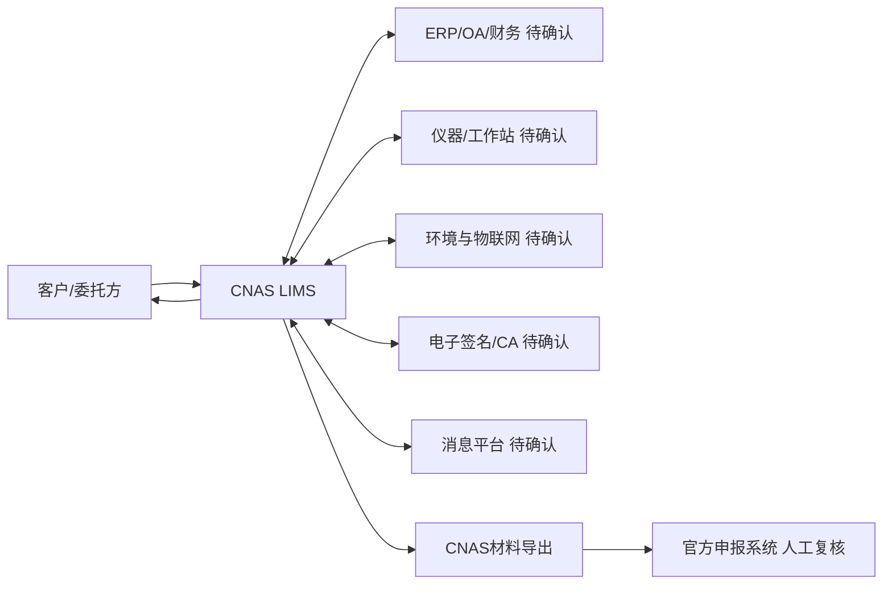

### 4.2 领域分层

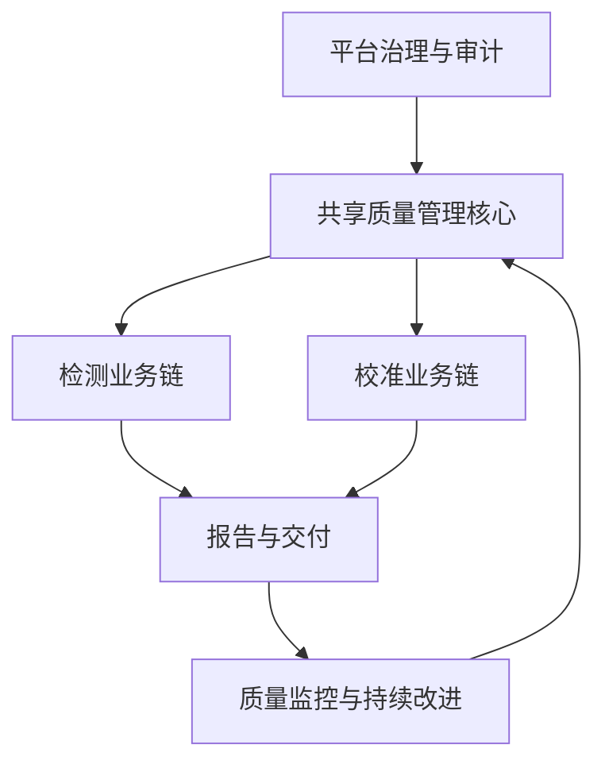

共享质量核心包括组织权限、人员能力、方法标准、设备、设施环境、标准物质/试剂耗材、供应商与外部服务、文件记录、不符合、风险、内审、管理评审、能力验证和认可管理。

检测业务包括客户委托、合同评审、检测样品、检测任务、原始记录、检测结果、结果复核和检测报告。实验室承担抽样时，条件启用抽样计划与记录控制；是否适用由 `TBD-003` 确认，在确认前不得把抽样执行标记为已确认业务功能。

校准业务包括客户委托、合同评审、被校对象、现场/实验室校准任务、参考设备、环境与测量条件、测量数据、不确定度、计量溯源和校准证书。

## 5. 业务架构与功能地图

| 业务域 | 一级模块 | 主要对象 | 适用范围 |
| --- | --- | --- | --- |
| 治理 | 组织、用户、角色、权限、审计 | 法人、场所、组织、岗位、账号、授权 | 共享 |
| 业务受理 | 客户、委托、合同评审 | 客户、联系人、委托、合同、评审 | 共享，评审要素按业务变体 |
| 检测执行 | 样品、条件抽样、检测任务、原始记录、结果 | 样品、抽样计划/记录、分样、检测项目、检测批次 | 仅检测；抽样是否适用待 `TBD-003` 确认 |
| 校准执行 | 被校对象、校准任务、测量和不确定度 | 被校对象、校准点、测量数据、模型 | 仅校准 |
| 报告交付 | 报告/证书、审核、批准、发布、更正 | 报告、证书、签名、交付回执 | 检测与校准分别配置模板和规则 |
| 资源 | 人员、方法、设备、环境、物料 | 能力、授权、标准、设备、监测、批次 | 共享 |
| 外部资源 | 供应商、采购、分包、外部服务 | 供方、评价、采购、验收、分包 | 共享 |
| 质量 | QC、PT/比对、不符合、CAPA、风险 | 质控计划、发现、措施、验证 | 共享 |
| 体系 | 文件、记录、内审、管理评审 | 文件版本、档案、审核、评审 | 共享 |
| 认可 | 能力范围、评审、扩项、整改 | 认可项目、范围版本、评审问题 | 共享 |
| 平台 | 工作流、消息、报表、接口、配置 | 待办、预警、指标、接口运行 | 共享 |

## 6. 用户角色与权限

### 6.1 角色矩阵

下表是候选职责模型；实际岗位、兼岗和数据范围必须通过 TBD-001、TBD-009、TBD-012 确认。

| 角色 | 主要操作 | 默认数据范围 | 禁止或受限操作 |
| --- | --- | --- | --- |
| 实验室负责人 | 资源决策、管理评审、重大风险和基线批准 | 获授权法人/场所 | 不因职务自动获得业务数据修改权 |
| 质量负责人 | 体系文件、内审、CAPA、认可与质量监督 | 获授权体系和场所 | 不得独立验证并关闭本人实施的措施 |
| 技术负责人 | 方法、人员能力、技术监督和技术规则批准 | 获授权专业领域/场所 | 不得批准超出技术范围的结果 |
| 授权签字人 | 批准并签发报告/证书 | 授权项目、方法、场所和有效期内 | 超范围、过期、暂停时禁止签发 |
| 业务受理人员 | 客户、委托、合同资料和变更 | 法人/客户范围 | 不得修改已批准技术结果 |
| 样品管理员 | 样品接收、交接、存储、归还和销毁 | 场所/库区 | 销毁需受控批准，不得修改结果 |
| 被校对象管理员 | 被校对象接收、交接、标识和交付 | 场所/库区 | 不得修改测量数据和证书结论 |
| 检测员 | 领取检测任务、填写记录和提交结果 | 本人授权项目和任务 | 不得审核或批准本人结果，兼岗例外待确认 |
| 校准员 | 执行校准、填写测量记录和提交数据 | 本人授权项目、场所和任务 | 不得审核或批准本人证书，兼岗例外待确认 |
| 结果复核/技术审核人员 | 复核记录、计算、方法和结果 | 获授权专业范围 | 原则上不得复核本人执行工作 |
| 设备/环境管理员 | 设备和监测计划、状态及处置 | 场所/设备组 | 状态变更必须留痕，不得绕过影响评价 |
| 物料管理员 | 入库、验收、出库、盘点和状态 | 仓库/场所 | 不得无审批释放不合格批次 |
| 供应商/采购管理员 | 准入、采购、验收和评价 | 法人/品类 | 申请、审批、验收同人组合待确认 |
| 文件/档案管理员 | 文件分发、归档、借阅和销毁执行 | 组织/密级 | 不得替代业务批准人修改受控内容 |
| 内审员 | 执行审核、记录发现 | 获分配审核范围 | 不得审核本人承担的活动 |
| 系统管理员 | 账号、配置、运行和接口维护 | 技术管理范围 | 不得冒用业务身份签名或直接改业务记录 |
| 审计员 | 查询审计证据并导出受控审计包 | 获授权审计范围 | 默认只读，不得删除或修改审计日志 |
| 客户外部用户 | 提交委托、查进度、收取结果 `[待确认]` | 仅绑定客户组织 | 不得访问其他客户、内部意见和受限记录 |

### 6.2 权限维度

权限判定至少同时检查：功能操作、组织/法人、场所、客户、专业领域、业务对象归属、流程状态、人员技术授权、签字授权、数据密级和临时授权有效期。

### 6.3 职责分离

| 控制编号 | 受控组合 | 候选规则 |
| --- | --- | --- |
| SOD-001 | 执行与结果复核 | 默认不同人；小型实验室例外和补偿复核见 TBD-012 |
| SOD-002 | 报告编制、审核与授权签发 | 签发人必须具备有效授权；前置角色是否可兼任见 TBD-008 |
| SOD-003 | CAPA 实施与有效性验证 | 默认不同人，至少由未实施措施者验证 |
| SOD-004 | 内审员与被审核活动 | 禁止审核本人承担的活动 |
| SOD-005 | 采购、验收与供应商评价 | 禁止组合及补偿控制见 TBD-012 |
| SOD-006 | 系统管理与业务签名 | 系统管理员不得生成、替代或删除业务签名 |

## 7. 核心业务流程

所有流程图是候选目标流程。每条流程的审批层级、时限、允许撤回点和例外放行需由 E1 证据确认。

### 7.1 客户委托到任务受理

参与角色：客户、业务受理人员、技术评审人员、质量/合同批准角色 `[待确认]`。

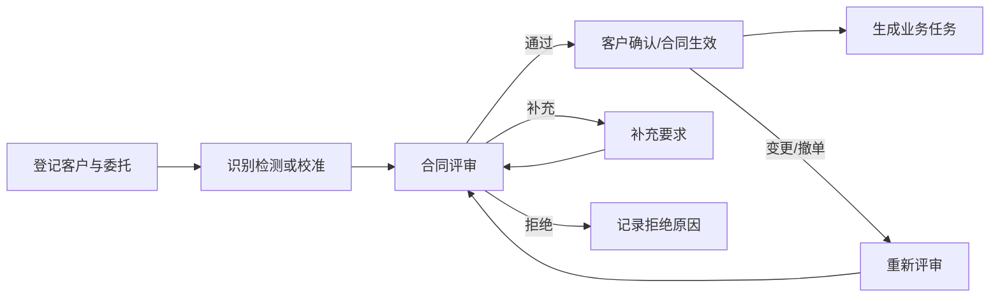

关键规则：评审至少考虑能力范围、方法、资源、交付期限、分包、判定规则和客户特殊要求；紧急受理不得静默绕过评审。

### 7.2 检测样品接收到处置

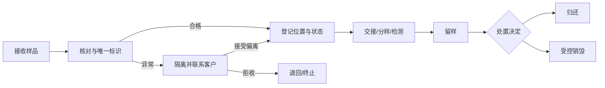

异常至少覆盖错收、重复登记、标签损坏、数量不足、污染、丢失和超期。

### 7.3 被校对象接收到交付

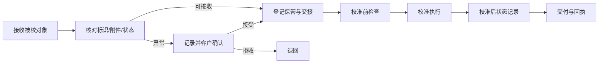

现场校准时不发生实物入库，但必须记录地点、对象确认、现场条件、交接责任和离场状态。

### 7.4 检测任务分配到结果审核

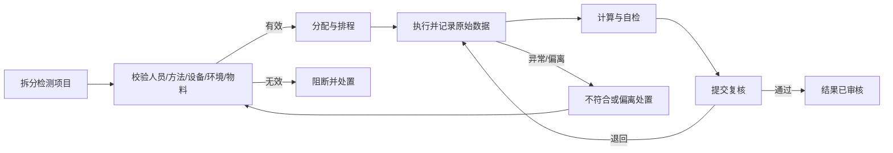

### 7.5 校准任务分配到技术审核

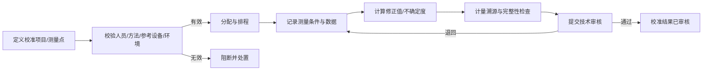

### 7.6 原始记录到报告/证书发布

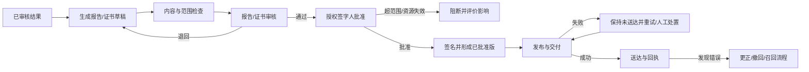

发布版本不可覆盖；更正必须引用原版本、说明变更、重新审核批准并保留通知证据。

#### 7.6.1 报告/证书候选字段控制清单

下表是依据 CL01 7.8 主题形成的候选控制清单，不替代受控标准正文。字段的必填、条件适用、展示名称和顺序均受 `TBD-008`、`TBD-014` 及 E1 表单证据约束；未完成适用性核验时，系统应列出缺口，不得自行省略或伪造值。

| 字段组 | 检测报告 | 校准证书 | 验收规则 |
| --- | --- | --- | --- |
| 文件识别 | 标题、唯一文号、版本、页码/完整结束标识 | 标题、唯一文号、版本、页码/完整结束标识 | 文号和版本唯一，缺少完整性标识保持草稿 |
| 机构与客户 | 实验室名称/地址/活动地点、客户名称及必要联系信息 | 实验室名称/地址/活动地点、客户名称及必要联系信息 | 与执行场所和委托快照一致 |
| 对象识别 | 样品描述、唯一标识、接收状态、接收日期、检测日期 | 被校对象名称、型号、序列号/唯一标识、校准日期 | 与受控对象快照一致，不允许自由覆盖 |
| 技术依据 | 方法及版本、偏离/增加/删减说明 | 校准方法及版本、偏离说明 | 只引用任务执行时有效版本，偏离按批准结论披露 |
| 结果 | 检测结果、单位及适用的判定/声明 | 测量结果、单位、测量不确定度及计量溯源相关声明 | 只引用已审核结果版本，数值和单位可回溯 |
| 条件信息 | 对结果有效性必要的环境/条件信息 `[条件适用]` | 对测量结果有影响的环境和测量条件 | 条件适用时缺失即阻断提交审核 |
| 认可与外部结果 | 认可范围/标识、非认可项、分包或外部结果标识 `[条件适用]` | 认可范围/标识、非认可项、分包或外部结果标识 `[条件适用]` | 与同一认可范围和供方审核版本一致 |
| 特殊声明 | 符合性声明及决策规则、意见解释依据、抽样信息 `[条件适用]` | 符合性声明及决策规则、调整前后结果、复校间隔建议仅在约定时展示 `[条件适用]` | 仅在合同、方法和批准规则适用时出现 |
| 批准发布 | 审核/批准人身份、授权范围、批准日期、发布日期及签名证据 | 审核/批准人身份、授权范围、批准日期、发布日期及签名证据 | 批准与发布分离；授权或签名无效不得发布 |

### 7.7 人员培训到岗位授权

### 7.8 设备采购到报废

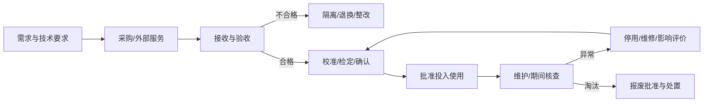

### 7.9 文件编制到作废

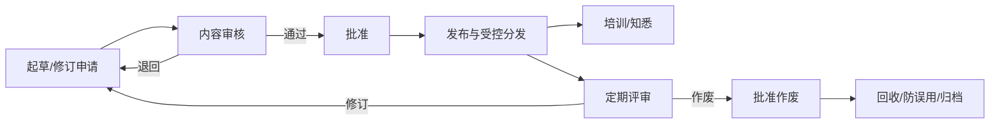

### 7.10 不符合项发现到整改关闭

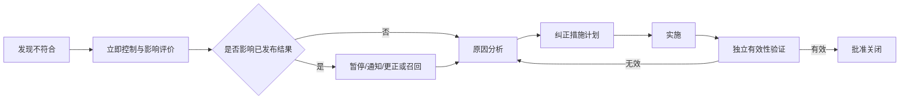

### 7.11 内审到整改验证

### 7.12 管理评审到改进闭环

### 7.13 能力验证计划到结果评价

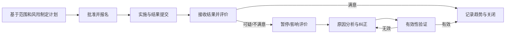

### 7.14 CNAS 评审问题到整改完成

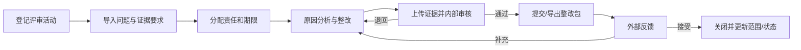

## 8. 状态与业务规则

### 8.1 通用状态规则

1. 每次转换必须记录对象、前后状态、事件、操作人、时间、理由和关联证据。
2. 已批准、已发布、已归档对象不得回到可编辑草稿；更正通过新版本或纠正记录完成。
3. 撤回、取消、作废、拒绝和销毁均为受控业务状态，不等同于物理删除。
4. 并发修改必须拒绝过期版本提交并提示重新加载；不得静默覆盖。
5. 重复请求使用业务幂等标识识别；重复操作不得生成第二份业务事实。

### 8.2 关键对象状态表

| 对象 | 当前状态 | 操作/条件 | 下一状态 | 异常或禁止 |
| --- | --- | --- | --- | --- |
| 委托 | 草稿 | 提交且必填完整 | 待评审 | 重复提交保持同一委托 |
| 委托 | 待评审 | 评审通过 | 已接受 | 能力或资源不满足则不得通过 |
| 委托 | 已接受 | 客户变更 | 变更评审中 | 在途任务按影响评价冻结或继续 `[待确认]` |
| 委托 | 任意非终态 | 批准撤单 | 已取消 | 保留原因和已产生成本/记录 |
| 检测样品 | 待接收 | 核对合格并唯一标识 | 已接收 | 异常进入隔离，不直接入库 |
| 检测样品 | 已接收 | 分配位置 | 在库 | 位置和交接必须可追溯 |
| 检测样品 | 在库 | 领取并交接 | 检测中 | 无任务或无权限禁止领取 |
| 检测样品 | 检测完成 | 批准归还/销毁 | 已归还/已销毁 | 销毁不可逆且需审批 |
| 被校对象 | 待接收 | 核对合格 | 已接收 | 损坏或附件缺失进入异常确认 |
| 被校对象 | 已接收 | 校准前检查通过 | 校准中 | 状态不适宜不得开始 |
| 被校对象 | 校准完成 | 交付并取得回执 | 已交付 | 交付异常保持待交付 |
| 任务 | 待分配 | 资源校验通过并分配 | 已分配 | 任一强制资源无效则阻断 |
| 任务 | 已分配 | 执行人领取 | 执行中 | 授权失效禁止领取 |
| 任务 | 执行中 | 提交完整记录 | 待复核 | 缺失、越界或异常数据不得提交 |
| 任务 | 待复核 | 退回并说明原因 | 执行中 | 保留退回前版本 |
| 任务 | 待复核 | 复核通过 | 已完成 | 自审规则见 SOD-001 |
| 报告/证书 | 草稿 | 内容完整并提交 | 待审核 | 必须引用已审核结果 |
| 报告/证书 | 待审核 | 审核通过 | 待批准 | 退回产生新草稿版本 |
| 报告/证书 | 待批准 | 授权有效、签名成功并批准 | 已批准 | 超范围、暂停或签名失败禁止批准 |
| 报告/证书 | 已批准 | 发起受控发布 | 发布中 | 发布请求使用同一文号、版本和请求标识 |
| 报告/证书 | 发布中 | 渠道确认成功 | 已发布 | 保存渠道、接收方、时间和回执 |
| 报告/证书 | 发布中 | 超时或渠道失败 | 发布失败 | 不得误标已送达，不生成第二发布版本 |
| 报告/证书 | 发布失败 | 批准策略允许重试或人工交付 | 发布中 | 重试保持同一文号和版本并保留每次尝试 |
| 报告/证书 | 已发布 | 批准更正并发布新版 | 已被替代 | 原版本保持可检索并关联有效新版 |
| 报告/证书 | 已发布 | 批准撤回 | 已撤回 | 停止作为有效版本交付并通知已知接收方 |
| 报告/证书 | 已发布 | 批准召回 | 已召回 | 记录召回范围、接收方响应和后续有效版本 `[待确认]` |
| 人员授权 | 草稿 | 能力证据充分并批准 | 有效 | 生效日期前不得使用 |
| 人员授权 | 有效 | 到期/离岗/不胜任 | 暂停/撤销/过期 | 影响在途和已发布结果需评价 |
| 设备 | 待验收 | 验收与适用性确认通过 | 可用 | 证书或确认不满足则隔离 |
| 设备 | 可用 | 故障/超期/核查失败 | 停用 | 自动识别受影响任务 |
| 设备 | 停用 | 维修后确认通过 | 可用 | 未确认不得恢复 |
| 不符合项 | 已登记 | 完成立即控制和影响评价 | 分析中 | 重大影响必须升级 |
| 不符合项 | 整改中 | 措施实施完成 | 待验证 | 实施人不得独立验证本人措施 |
| 不符合项 | 待验证 | 验证有效 | 已关闭 | 无效则返回分析中 |

### 8.3 控制级别

| 级别 | 行为 | 使用条件 |
| --- | --- | --- |
| 阻断 | 禁止继续并生成异常待办 | 明确会导致无效授权、无效资源、证据缺失或超范围签发的规则 |
| 审批放行 | 暂停，授权角色记录理由、风险、范围和期限后继续 | 制度允许的例外；具体清单见 TBD-011 |
| 提醒 | 允许继续但记录已读/处置 | 不直接影响结果有效性的临期或管理提示 |

## 9. 数据需求与核心实体

### 9.1 领域关系

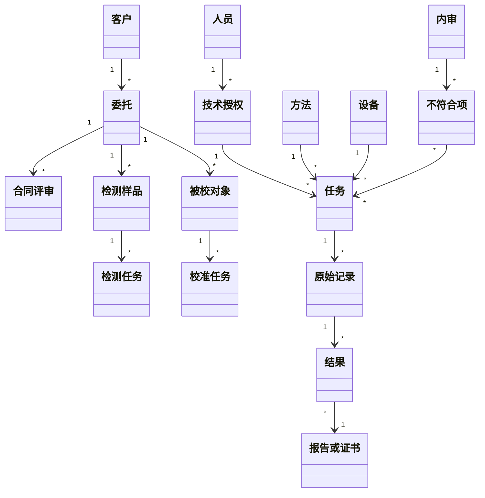

### 9.2 核心实体最小业务字段

| 实体 | 业务主键/唯一性 | 关键字段 | 版本与生命周期 |
| --- | --- | --- | --- |
| 客户 | 客户编码；跨法人唯一性 `[待确认]` | 名称、统一标识、联系人、保密级别、状态 | 启用、暂停、停用；保留历史名称 |
| 委托 | 委托编号，禁止重复 | 客户、类型、要求、日期、状态、版本 | 变更生成评审版本 |
| 合同评审 | 委托+评审版本 | 能力、方法、资源、期限、分包、判定规则、结论 | 不覆盖历史结论 |
| 检测样品 | 样品唯一标识 | 来源、描述、数量、状态、位置、接收异常 | 接收至归还/销毁，全程交接 |
| 抽样计划/记录 | 抽样任务+版本 `[条件适用]` | 方法、位置、日期时间、抽样人、样本标识、环境条件、偏离 | 仅在实验室承担抽样时启用；计划和现场记录版本可追溯 |
| 被校对象 | 业务唯一标识 | 名称、型号、序列号、附件、状态、位置 | 接收至交付；现场对象保留确认记录 |
| 任务 | 任务编号 | 类型、项目、方法、执行人、资源快照、状态 | 拆分/合并关系和退回版本可追溯 |
| 原始记录 | 记录编号+版本 | 原始值、单位、条件、计算、附件、签名 | 追加式更正，禁止覆盖原值 |
| 结果 | 任务+项目+结果版本 | 值、单位、不确定度、判定、状态 | 审核后冻结；更正形成新版本 |
| 报告/证书 | 文号+版本 | 客户、对象、结果、范围、声明、签名、发布日期 | 已发布版本不可覆盖；更正/撤回有关联 |
| 人员授权 | 人员+授权范围+版本 | 项目、方法、角色、场所、生效/到期、状态 | 暂停、恢复、撤销保留原因和影响评价 |
| 方法 | 方法编码+版本 | 名称、来源、适用范围、有效期、验证/确认状态 | 在途任务版本切换规则 `[待确认]` |
| 设备 | 设备唯一标识 | 型号、序列号、位置、状态、计量要求、证书 | 状态历史、维修和影响评价不可删除 |
| 物料批次 | 物料+批号+包装标识 | 供应商、有效期、验收、库存、状态 | 批次级冻结、召回和消耗追踪 |
| 不符合项 | 不符合编号 | 来源、描述、影响、措施、责任、期限、验证 | 关闭后重开需批准并留痕 |

### 9.3 数据完整性

- 原始值、导入文件、计算输入、公式版本、计算结果和人工更正必须可关联。
- 更正记录至少保存更正前值、更正后值、原因、人员、时间、签名和审批关系。
- 关键时间使用统一可信时间源；离线或时钟异常的处理见 `[待确认]`。
- 附件保存文件名、类型、大小、校验值、上传人、上传时间和关联对象版本。
- 业务删除默认实现为作废/失效；物理销毁仅适用于保存期到期且经审批的数据处置。
- 审计日志与业务操作权限分离，系统管理员不得清除业务审计证据。

## 10. 接口与集成边界

| 接口对象 | 候选数据 | 主责与失败原则 |
| --- | --- | --- |
| ERP/OA/财务 | 客户、合同、采购、供应商、结算状态 | 主数据源见 TBD-017；失败不静默覆盖已受控记录 |
| 仪器/工作站 | 任务、原始文件、结果、单位、时间和设备标识 | 保留原始载荷和对账状态；重复上传幂等 |
| 环境/物联网 | 监测点、读数、时间、设备状态和报警 | 断连可见，补传可识别，失控触发影响评价 |
| 扫码设备 | 样品、物品、设备和物料标识 | 扫码只是输入方式，仍执行权限和状态校验 |
| 电子签名/CA | 身份、证书、签名、验签和时间戳 | 失败不得发布；签后变更使原签名状态可判定 |
| 消息平台 | 待办、预警、通知和送达结果 | 消息失败不等同于业务失败，必须重试和升级 |
| 客户门户 | 委托、进度、报告和回执 `[待确认]` | 外部账号绑定客户组织并严格隔离 |

每个正式接口契约必须定义数据所有权、触发时点、字段、版本、幂等键、认证授权、超时、重试、顺序、对账、补偿、人工兜底和验收样例。

## 11. 非功能与安全要求

### 11.1 数据与安全基线

- 默认拒绝、最小权限、定期复核、离岗停用和临时授权到期收回。
- 登录失败、会话、特权账号、敏感导出、文件上传、接口调用和配置变更均需受控；详细要求见需求目录。
- 报告、证书、原始记录、客户资料和人员数据按密级控制查看、导出、打印和分享。
- 文件上传必须校验类型、大小、内容安全和关联权限；恶意或不合规文件不得进入受控档案。
- 敏感数据在传输和静态存储中必须按批准的安全策略加密；具体算法、产品和密钥承载方式在技术设计阶段选择，但不得取消加密、降级阻断和例外审批要求。
- 密钥、证书和接口秘密必须覆盖生成、存储、分发、轮换、吊销和应急恢复，不得写入普通业务日志；具体参数受 TBD-010/TBD-017 阻塞。
- 关键审计、电子签名和接口防重放必须使用批准的可信时间源；时间漂移或同步失败的阈值及阻断范围受 TBD-010/TBD-020 阻塞。
- 外部接口必须认证、授权、校验完整性并防止重放；每个接口还需定义所有权、时序、超时、重试、幂等、对账、补偿、恢复和人工兜底。

### 11.2 待量化指标

| 主题 | 候选目标 | 正式验收前置 |
| --- | --- | --- |
| 性能 | `[最佳实践建议][待确认]` 常用操作 P95 不高于 2 秒，复杂报表异步完成 | TBD-019 定义操作、并发、数据量、网络和计时点 |
| 可用性 | `[最佳实践建议][待确认]` 核心服务年度 99.5%-99.9% | TBD-020 选择单值、服务时段和排除项 |
| 备份恢复 | `[最佳实践建议][待确认]` RPO 不高于 24 小时、RTO 不高于 4 小时 | TBD-020 结合业务连续性批准 |
| 容量 | 按用户、委托、样品/对象、记录、附件和审计日志增长验证 | TBD-019 提供三年预测 |
| 保存期 | 可按记录类别和法律冻结状态受控配置 | TBD-018 提供期限和销毁规则 |
| 兼容性 | 在批准的浏览器、终端和国产化环境通过核心流程验收 | TBD-024 提供环境清单 |

## 12. 报表、消息与预警

### 12.1 报表类别

- 业务：委托量、在途任务、周期、逾期、检测/校准产能和交付情况。
- 质量：不符合、CAPA、投诉、质控、PT/比对、复测/重测和结果更正。
- 资源：人员授权、设备状态、计量到期、环境失控、库存和供应商绩效。
- 体系：文件评审、培训、内审、管理评审、风险和认可整改。
- 审计：关键变更、签名、发布、导出、权限和接口异常。

每个指标必须定义分子、分母、时间范围、排除项、数据源、刷新时间、数据权限和责任人，详见 TBD-022。

### 12.2 预警类别

| 级别 | 示例 | 要求 |
| --- | --- | --- |
| 阻断 | 授权失效、方法无效、设备停用、超范围签发、签名失败 | 阻止动作并生成处置待办 |
| 高 | 环境失控、PT 不满意、已发布结果可能受影响、接口长期失败 | 限时响应、逐级升级、记录确认 |
| 中 | 设备/授权/物料临期、任务逾期、CAPA 将超期 | 提醒责任人并跟踪处置 |
| 低 | 常规计划和信息通知 | 可配置订阅和汇总 |

## 13. 实施分期建议

### 13.1 最小合规闭环

第一阶段不能只实现受理、任务和报告。最小闭环必须同时具备：组织权限、人员授权、方法版本、设备有效性、必要环境控制、物品链、原始记录、报告/证书控制、审计追踪、不符合与影响评价、必要质控/PT 状态以及受控文件记录。

| 阶段 | 进入条件 | 建议范围 | 退出条件 |
| --- | --- | --- | --- |
| 阶段 0 需求基线 | S2 证据齐全 | 需求确认、追踪、原型校准 | 联合批准，P0 无未接受阻断项 |
| 阶段 1 最小闭环 | 需求和流程批准 | 共享控制+检测/校准主链+报告/证书+范围内任务所必需的 QC/PT 状态、执行门禁和异常处置 | 代表业务、资源失效、必要 QC/PT 异常和报告召回端到端验收通过 |
| 阶段 2 质量深化 | 阶段 1 稳定 | 扩大 QC/PT 覆盖和趋势分析，深化供应商、内审、管理评审与认可管理；不得把阶段1必要控制延后到本阶段 | 扩展质量闭环和证据包验收通过 |
| 阶段 3 集成优化 | 接口台账批准 | 仪器、ERP/OA、物联、签名和消息 | 对账、降级、恢复和安全验收通过 |
| 阶段 4 扩展 | 独立价值与风险评审通过 | 门户、移动、智能排程或辅助分析 | 独立规格和验证通过 |

## 14. 验收与追踪规则

1. 每条 P0/P1 需求必须关联来源、业务要求、控制措施、保留记录和验收场景。
2. 验收条件使用 Given/When/Then 或等价原子表达，不能使用“方便、友好、及时、智能”等不可测词。
3. 正常、权限拒绝、非法状态、重复提交、并发修改、网络中断、接口失败、数据缺失、更正和恢复均进入测试范围。
4. P0 需求不得包含未批准的 `[推测]`；P0 `[待确认]` 关闭前不得签署正式基线。
5. SRS 批准后，原型、开发 Spec、测试用例和发布说明必须反向引用需求编号。

## 15. 风险与基线批准

### 15.1 当前阻断

- S2 实际业务证据门禁未通过。
- 认可领域、组织和场所未明确。
- 报告/证书职责、电子签名、记录更正、保存期和资源失效放行规则未批准。
- 容量、接口、运维和成功指标没有实际基线。

### 15.2 联合批准条件

正式版本至少满足：

- E1 证据覆盖所有 P0 业务域。
- P0 对来源、记录和验收场景的双向追踪率为 100%。
- P0 不含未批准 `[推测]`，P0 待确认项全部关闭或书面接受风险。
- 阻断审查问题为零，高风险问题关闭或书面接受。
- 实验室负责人、质量负责人、技术负责人和项目负责人完成联合签署。

当前结论：本文件为可开展业务走查和详细评审的候选基线，不是已批准开发基线。

正式化准备包已经建立，但当前有效 E1 证据数、已关闭 TBD 数和四方签署数均为 0。具体接收、决策、发布范围和开发准入规则见本文件 1.3 所列基线工作包；这些准备产物不得用于绕过本节批准条件。
