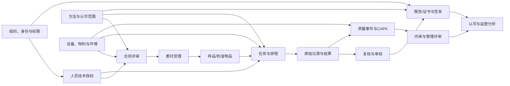

# CNAS-REQ-001 需求框架全面审查报告

## 审查信息

| 项目 | 内容 |
| --- | --- |
| 审查对象 | `docs/analysis/cnas-lims-requirements-framework.md` |
| 文档版本 | 2026-07-27 需求框架初稿 |
| 审查日期 | 2026-07-28 |
| 审查视角 | 产品、业务架构、软件架构、测试、运维、信息安全、项目管理、AI Coding |
| 审查边界 | 审查需求质量和开发就绪度，不进行技术选型、数据库设计或代码实现 |
| 结论等级 | **不建议批准为设计、开发或测试基线；可保留为需求调研框架** |

> 审查假设：用户提示中的“待审查需求文档”指本线程已形成的上述框架文档。若实际审查对象另有其文，应重新执行审查，本文结论不能直接套用。

## A. 最终审查结论

### 1. 总体评价

文档在模块覆盖、标准线索、风险意识和后续编写规则方面具有较好的框架价值，能够作为需求调研目录和访谈提纲。但其标题容易让使用者误认为已经形成“需求规格说明书”，实际仍处于范围发现阶段：文档中有 84 个 `[待确认]`、5 个 `[推测]`、23 个 `[最佳实践建议]`，没有一条正式 `FR-*` 或 `NFR-*` 需求，也没有逐条验收标准。

从第一性原理看，实验室信息系统的首要目标不是“覆盖更多模块”，而是保证检测/校准活动在正确的委托、样品/物品、方法、人员授权、设备和环境条件下执行，并形成不可抵赖、可复核、可追溯的结果和报告证据。当前文档描述了这个方向，但尚未定义足以让系统执行、测试和审计的规则。

**开发就绪度结论：不就绪。** 在阻断问题关闭前直接进入原型固化、Spec 生成或 AI 编码，将把大量业务假设提前写入页面、状态机和代码，后续极易造成返工。

### 2. 严重问题（必须修改）

| 编号 | 等级 | 问题 | 证据 | 影响 | 必须采取的措施 |
| --- | --- | --- | --- | --- | --- |
| R-001 | 阻断 | 文档是框架而非可执行 SRS，但名称和范围可能被下游误用 | 源文档 L3、L675-L677、L776 明确详细需求尚未展开 | 开发、测试和验收没有稳定输入；原型或代码只能依赖猜测 | 增加“禁止进入开发”门禁；逐条形成 `FR-*`、`NFR-*`、业务规则、状态和验收标准后再基线化 |
| R-002 | 阻断 | 实验室类型、认可制度、检测领域、多场所和病理扩展范围未冻结 | L33-L34、L195-L198、L255-L258、Q-001 | 业务对象、标准适用性、流程、权限、报告和接口均可能整体变化 | 先批准项目范围声明和适用标准清单，再拆分详细需求 |
| R-003 | 阻断 | 17025 核心业务链主要来自标准推导，缺少实际制度、表单和历史案例验证 | L22、L92-L98、L102-L105、L182-L190 | 需求可能合规方向正确但不符合实际工作，导致线上绕行和线下补单 | 对 3-5 类代表性业务做现场走查，建立“现行流程/目标流程/制度依据/例外案例”四联表 |
| R-004 | 阻断 | 文档同时声明覆盖校准实验室，但主流程和术语几乎全部按“样品检测”建模 | L4、L217 与 L380-L405、L467 对比 | 校准物品、现场校准、校准证书、测量不确定度、参考设备等流程可能被错误压入检测模型 | 确认是否覆盖校准；若覆盖，单独建模校准业务变体和共享/差异规则 |
| R-005 | 阻断 | 报告签发、电子签名、原始记录更正、删除、审计日志和认可标识的关键规则仍未确定 | L207、L251、L456、L517-L520、Q-006/Q-007 | 可能产生无痕修改、超范围签发、错误标识、证据链失效等合规风险 | 先形成数据完整性与报告控制专项规格，并由业务、质量、信息安全共同批准 |
| R-006 | 高 | 第一阶段称为“业务与合规主链”，但把环境、PT/质控、不符合/CAPA、供应商等有效性依赖放到第二阶段 | L617-L619 与 L205、L219-L221、L316-L320 对比 | 第一阶段可能能出报告但不能充分证明结果有效，形成错误合规预期 | 以最小合规闭环重新切片；必要的环境、资源状态、异常控制和报告召回能力必须随主链上线 |
| R-007 | 高 | 角色表不是权限矩阵，操作权限、数据范围和职责冲突没有落到角色级 | L331-L376 | 易出现跨客户/场所访问、自审自批、管理员越权和临时授权失控 | 建立角色 × 操作 × 数据范围 × 流程节点 × 技术授权矩阵，列出禁止组合和补偿控制 |
| R-008 | 高 | 十二条流程只列状态名称，没有状态定义、转换条件、守卫规则、撤销和并发规则 | L398-L415 | 开发无法实现一致状态机，测试无法覆盖合法/非法转换 | 为每个核心对象建立状态字典和转换表，明确进入、退出、权限、事件、超时和审计 |
| R-009 | 高 | 核心实体只有名称和关系，没有业务主键、关键字段、唯一性、版本、归属和生命周期规则 | L461-L511 | 数据模型会由开发人员自行解释，后期迁移、去重、追溯和报表口径高风险 | 形成业务数据字典和主数据责任矩阵，不必先做数据库设计 |
| R-010 | 高 | 非功能指标大多是建议范围，缺少测量环境、业务负载和验收口径 | L522-L531、L538-L542 | 性能、可用性、恢复和兼容性无法签约和验收 | 基于容量基线定义单值目标、统计窗口、排除项、测试数据量和验收方法 |
| R-011 | 高 | 认证、会话、特权账号、加密、文件上传、密钥、可信时间和外部用户安全未形成要求 | L515-L534 仅有原则性描述 | 客户资料、原始数据、报告和签名可能泄露、篡改或被冒用 | 增加独立安全需求章节和威胁模型，覆盖所有信任边界与拒绝路径 |
| R-012 | 高 | 接口只有对象和原则，没有接口契约、数据所有权、时序、可用性和降级策略 | L583-L609 | 仪器、ERP、物联、CA 或消息失败会阻塞主流程或产生重复/错配数据 | 每个接口建立可测试契约和故障矩阵，明确主数据源、幂等、对账、超时、补偿和人工兜底 |

### 3. 中等问题（建议优化）

| 编号 | 问题 | 风险 | 建议 |
| --- | --- | --- | --- |
| R-013 | 建设目标只有方向，没有现状基线、目标值、期限和责任人 | 无法判断系统是否产生业务价值 | 为每个目标定义基线、目标、统计口径、责任人和观察周期 |
| R-014 | “客户、委托、合同”“不符合、风险、CAPA”“文件、记录、档案”等边界重叠 | 重复建设、对象多源维护、流程互相调用 | 定义领域边界、主对象归属和跨域事件 |
| R-015 | 代码表、编号、模板、工作流、权限、报表、保存期均要求可配置 | 配置平台成本和验证成本可能超过业务系统本身 | 区分必须配置、只允许受控参数化、必须固化三类能力 |
| R-016 | 客户门户、移动端、多站点、智能分析和 AI 同时保留在路线图 | 范围蔓延，延迟核心闭环 | 每项建立独立业务价值、用户、风险和进入条件；未批准前不进入产品 Backlog |
| R-017 | 原始记录“删除”权限和“不得物理覆盖”之间缺少统一数据处置语义 | 开发可能实现物理删除或不可恢复作废 | 统一定义更正、作废、撤回、删除、匿名化、销毁和法律冻结 |
| R-018 | 需求来源只到标准主题和文档页段，缺少原始资料版本快照及决策记录 | 后续标准更新或链接变化时无法证明依据 | 建立来源基线、访问日期、文件版本/哈希和变更影响评估 |
| R-019 | 报表指标已有名称但无业务口径 | 同名指标在各部门结果不同 | 建立指标字典，定义分子、分母、时间范围、排除项、数据源和责任人 |
| R-020 | 项目分期没有工作量、依赖、退出标准和回退策略 | 阶段看似清晰，实际无法排期和验收 | 每阶段定义范围基线、依赖、DoR、DoD、试点、切换和稳定期指标 |
| R-021 | 历史数据迁移只列方向，没有数据质量分级与证据策略 | 旧数据导入后真实性和可解释性不确定 | 按主数据、业务数据、证据文件、审计数据分类制定迁移和只读保留策略 |
| R-022 | 文档自评“已覆盖 CNAS 要求”，但领域应用说明、详细需求和逐条追踪尚未完成 | 管理层可能误判合规完成度 | 将结论改为“已建立通用主题清单，完整性尚未验证”，待追踪矩阵通过后再声明覆盖 |

### 4. 轻微问题

| 编号 | 问题 | 建议 |
| --- | --- | --- |
| R-023 | 第 15 章下的子标题误写为“14.1” | 将源文档 L779 改为“15.1” |
| R-024 | “样品”“检测或校准物品”“样本”可能混用 | 建立术语表并按适用业务统一界面和需求用词 |
| R-025 | 厂商公开资料未记录访问日期和证据快照 | 补充调研日期，并保持其非规范性来源定位 |
| R-026 | `P0/P1` 这种双重优先级无法直接排期 | 每条正式需求只能有一个当前优先级，变更需留决策记录 |

### 5. 缺失信息清单

- 项目发起背景、当前痛点的事实数据、预算约束和上线窗口。
- 实验室类型、检测/校准领域、认可状态、法人和多场所边界。
- 现行质量手册、程序文件、作业指导书、表单及其版本。
- 代表性委托、样品/物品、原始记录、报告/证书和异常案例。
- 业务量、峰值并发、附件增长、仪器数量和接口调用量。
- 用户组织、岗位、兼岗、授权签字人和外部用户管理方式。
- 样品/物品、任务、报告、方法、设备等编码与唯一性规则。
- 状态定义、流程时限、退回/撤回/取消/重开规则和人工兜底。
- 测量不确定度、判定规则、自动计算、舍入和单位转换规则。
- 数据分类分级、保存期限、法律冻结、销毁和客户保密要求。
- 身份认证、账号生命周期、会话、电子签名、特权运维和可信时间要求。
- 每个外部系统、仪器、协议、数据所有权、可用性和失败补偿。
- 业务连续性、手工应急、停机窗口、恢复演练和灾难恢复要求。
- 报表指标定义、业务成功指标和项目验收组织。

### 6. 需要向需求方确认的问题（按优先级排序）

| 优先级 | 编号 | 确认问题 | 不确认的后果 |
| --- | --- | --- | --- |
| P0 | C-001 | 本期只覆盖检测实验室，还是同时覆盖校准、医学或其他体系？ | 无法确定核心对象、流程和标准 |
| P0 | C-002 | 实际认可领域、认可状态、法人、多场所和扩项计划是什么？ | 适用规则、权限、能力范围和报告均不确定 |
| P0 | C-003 | 哪些现行制度、表单和实际案例是需求唯一业务依据，谁有最终解释权？ | 标准推导可能替代真实业务 |
| P0 | C-004 | 委托、合同评审、样品/物品、任务、记录、报告的正式流程和例外是什么？ | 主链无法形成可执行规格 |
| P0 | C-005 | 报告编制、审核、批准、授权签字、发布、更正、撤回和召回如何分工？ | 报告控制和认可标识存在高风险 |
| P0 | C-006 | 原始记录允许哪些更正、作废和补录？是否允许任何形式的物理删除？ | 数据完整性无法设计 |
| P0 | C-007 | 电子签名采用何种身份保证，哪些节点必须签名，签后变更如何处理？ | 签名可能只有界面效果而无证据效力 |
| P0 | C-008 | 人员授权、方法、设备、环境或物料失效时，哪些操作必须阻断，哪些可审批放行？ | 系统无法正确控制无效检测活动 |
| P0 | C-009 | 小型实验室允许哪些兼岗？哪些职责组合绝对禁止？ | 权限矩阵和工作流无法冻结 |
| P0 | C-010 | 第一阶段的“最小合规闭环”究竟包含哪些质量与资源控制？ | 分期可能上线不完整合规链 |
| P1 | C-011 | 各类数据和附件保存多久，何时冻结、销毁或匿名化？ | 存储、归档和合规成本无法评估 |
| P1 | C-012 | 现有系统、仪器、网络区域、接口协议和数据主责方分别是什么？ | 集成计划和安全边界无法确定 |
| P1 | C-013 | 年业务量、峰值并发、报告时效和可接受停机/丢数上限是什么？ | 非功能需求不能验收 |
| P1 | C-014 | 客户门户、移动端、供应商门户和 AI 能力是否有批准的用户价值与预算？ | 容易发生范围蔓延 |
| P1 | C-015 | 系统成功的 3-5 个核心指标及上线后观察周期是什么？ | 无法评价项目收益 |

### 7. 修改后的需求文档建议结构

1. 文档控制、审批记录和适用范围声明
2. 项目背景、现状痛点、业务价值和成功指标
3. 参考资料、适用标准、来源基线和追踪规则
4. 现行流程、目标流程、差距和业务约束
5. 系统范围、排除项、外部边界和分期范围
6. 术语表、领域边界和核心业务对象
7. 用户画像、角色职责、权限矩阵和职责分离
8. 端到端业务流程、泳道、异常和人工兜底
9. 详细功能需求 `FR-*`
10. 业务规则、计算规则、状态机和时限规则
11. 数据字段、主数据、版本、审计、保存和迁移要求
12. 接口契约、仪器集成和失败补偿
13. 安全、电子签名、非功能、运维和业务连续性需求
14. 报表、指标、消息和预警需求
15. 验收标准、测试策略和需求追踪矩阵
16. 实施分期、切换、培训、上线和项目验收
17. 风险、决策记录、问题清单和附录表单映射

## B. 十二维分项审查

## 8. 需求目标审查

| 检查项 | 结果 | 问题 | 建议 |
| --- | --- | --- | --- |
| 业务背景 | 部分满足 | 说明了 15189 资料与 17025 目标的差异，但没有实验室现状、业务规模和项目触发原因 | 补充现状事实、主要痛点、造成的损失或风险 |
| 解决的问题 | 部分满足 | 目标覆盖追溯、资源校验和认可，但没有按用户任务和优先级定义问题 | 建立“用户-场景-痛点-影响-目标能力”映射 |
| 目标用户 | 不满足 | 有 17 类建议角色，但没有用户画像、人数、工作环境和高频任务 | 明确内部/外部用户、工作台、移动/离线需求和能力差异 |
| 业务价值 | 部分满足 | 价值以合规和效率方向表达，没有经济、质量或时效基线 | 定义报告周期、差错、逾期、审计准备时间等指标 |
| 成功指标 | 不满足 | 报表指标不等于项目成功指标，没有目标值、责任人和观察期 | 设置 3-5 个可衡量结果指标并建立基线 |
| 为功能而功能 | 存在风险 | 客户门户、移动端、驾驶舱、多站点、AI 等缺少已验证用户价值 | 未通过业务价值评审的能力不进入正式范围 |

**第一性原理建议**：项目目标应改写为“在不降低数据完整性和职责分离的前提下，使每份报告/证书均可追溯到有效委托、物品、方法、人员、设备、环境、原始记录和批准证据，并在异常时可及时阻断、评价影响和追回应对”。效率和智能化只能建立在该目标之上。

## 9. 需求完整性审查

### 9.1 正常流程缺失点

- 委托前的客户准入、报价版本、合同生效和客户确认凭证。
- 一个委托包含多个样品/物品、多个项目、多个方法和分批交付时的拆分/合并规则。
- 抽样由实验室负责和客户送样两种模式的责任边界。
- 检测/校准任务的批处理、平行样、质控样、复测和重测关系。
- 报告分批签发、部分项目取消、分包结果合并和交付回执。
- 校准业务的现场作业、参考设备、证书和不确定度链路。
- 任务完成后原始记录、附件和仪器文件的归档确认。
- 标准/方法版本切换对在途任务的适用规则。
- 客户投诉/申诉、供应商准入/采购/分包、环境失控和库存异常的独立流程。
- 方法查新、验证/确认、偏离审批和生效切换的完整流程。

### 9.2 异常流程缺失点

- 合同评审完成后客户变更、撤单或追加项目。
- 样品/物品错收、重复登记、标签损坏、丢失、污染、数量不足和超期。
- 人员授权、方法、设备、环境或物料在任务执行中途失效。
- 仪器断网、重复上传、单位不一致、结果覆盖和原始文件损坏。
- 复核/审核退回后的修改范围、重签和历史版本保留。
- 已发布报告更正、撤回、召回后的客户通知和认可标识处理。
- 并发审批、重复点击、超时重试和操作人离岗。
- 外部接口长期不可用时的手工受控录入和事后对账。
- 备份失败、恢复失败、时钟漂移和审计日志异常。

### 9.3 边界流程缺失点

- CRM/ERP/OA 与本系统对客户、合同、采购和供应商数据的唯一主责。
- 仪器工作站与本系统对原始数据、计算结果和更正的责任。
- CA/电子签名平台与本系统对身份、时间戳和验签结果的责任。
- 客户门户外部账号的创建、组织绑定、授权、停用和数据隔离。
- CNAS 材料导出与官方申报之间的人工复核责任。
- 历史系统退役后的只读查询、证据出具和数据修复权限。
- 系统停机期间纸质/离线业务的回补、审核和防重复规则。

### 9.4 角色矩阵审查

> 下表反映当前文档可确认程度，不是批准后的权限设计。

流程章节出现的“任务管理员、培训管理员、认可管理员、质量/合同评审人、验证人、批准关闭人”等参与者没有在角色章节定义；反过来，部分建议角色也没有映射到具体流程节点。这会导致权限设计时临时新增角色或把多项职责集中给管理员。

| 角色 | 操作权限 | 数据范围 | 风险 |
| --- | --- | --- | --- |
| 最高管理者/实验室主任 | 仅描述资源、决策和管理评审；具体操作未定义 | 文档未明确 | 可能默认拥有全系统权限并越过职责分离 |
| 质量负责人 | 内审、风险、不符合、改进方向明确 | 场所、部门和专业范围未定义 | 可能同时发起、验证和关闭 CAPA |
| 技术负责人 | 方法、能力、技术监督方向明确 | 专业领域和场所未定义 | 可能超专业范围批准 |
| 授权签字人 | 签发报告/证书 | 项目、参数、方法、场所、有效期待确认 | 超范围或授权失效后签发 |
| 业务受理人员 | 客户、委托、合同 | 客户和法人范围未定义 | 跨客户访问、擅自变更合同或任务 |
| 样品管理员 | 接收、交接、存储和处置 | 库区、场所和客户范围未定义 | 错领、错交、越权销毁 |
| 检测员/校准员 | 执行任务、填记录和结果 | 技术授权模型提出但未落表 | 超授权执行、修改他人记录 |
| 复核/审核人员 | 复核记录、计算和结果 | 领域、部门及是否可审核本人工作未定义 | 自审、跨专业审核 |
| 报告编制/审核人员 | 编制和审核方向明确 | 客户、报告类型和场所未定义 | 修改已审核结果、绕过授权签字人 |
| 资源管理员 | 设备、物料状态与记录 | 设备/仓库/场所范围未定义 | 无审批修改有效状态，影响在途任务 |
| 文件/档案管理员 | 版本、分发、归档和销毁 | 文件密级和组织范围未定义 | 查看保密资料、提前销毁证据 |
| 内审员 | 审核和记录发现 | 审核计划范围内，细节未定义 | 审核自己工作或访问无关客户数据 |
| 采购/供应商管理员 | 准入、采购、验收、评价 | 法人和品类范围未定义 | 同人申请、审批、验收和评价 |
| 系统管理员 | 配置、接口、运维方向 | 原则上不应访问业务明文，但未定义 | 特权账号改数据、删日志或冒用签名 |
| 客户/外部用户 | 委托、查进度、收报告 | 应限本组织，但绑定和委托授权未定义 | 跨客户数据泄露和报告误领 |

## 10. 需求清晰度审查

当前文档没有原子功能需求，无法做到“逐条需求”审查。以下列出最容易产生多种实现解释的代表性原文。

### C-01 实时关联

**需求原文**：
“将人员、方法、设备、环境、标准物质和供应商能力状态与检测任务实时关联。”

**问题**：未定义“实时”的延迟、数据源、离线状态、缓存过期和校验时点。

**风险**：不同模块可能按创建任务、开始执行、提交结果或签发报告中的任一时点校验，导致失效资源仍被使用。

**建议修改**：明确每类资源在任务创建、领取、开始、提交和报告签发时的校验规则、最大状态延迟及接口不可用时的处理，具体值标记 `[待确认]`。

### C-02 提高效率

**需求原文**：
“通过自动采集、自动计算、预警和统计提高效率。”

**问题**：没有目标用户、基线、目标值和统计周期。

**风险**：任何自动化都可被宣称满足，无法验收实际业务收益。

**建议修改**：按具体场景定义指标，例如录入耗时、人工转抄次数、报告周转时间和逾期率，基线及目标值均由业务方确认。

### C-03 系统负责阻断

**需求原文**：
“系统负责执行校验、阻断、提醒和留痕。”

**问题**：未区分哪些规则阻断、哪些只提醒、谁可放行、放行后如何评价风险。

**风险**：过度阻断会迫使用户绕系统，过少阻断会削弱合规控制。

**建议修改**：建立控制规则表，字段至少包括触发条件、控制级别、放行角色、理由、有效期、影响范围和审计事件。

### C-04 常用操作响应稳定

**需求原文**：
“常用查询、保存、待办响应稳定；95% 常用操作不高于 2 秒。”

**问题**：“常用操作”、起止计时点、并发、数据量、网络和统计窗口未定义。

**风险**：供应商和测试团队可使用不同环境得出相反结论。

**建议修改**：列出交易清单，定义服务端/端到端计时、P95/P99、并发用户、基础数据量、附件大小和测试环境。

### C-05 年度可用性范围

**需求原文**：
“年度可用性 99.5%-99.9%，计划停机另计。”

**问题**：这是区间建议，不是需求；没有工作时段、不可用定义和计划停机上限。

**风险**：99.5% 与 99.9% 的成本差异明显，合同和架构无法决策。

**建议修改**：由业务方确定单一目标、统计周期、核心服务范围、不可用判定、排除项和赔付/处置机制。

### C-06 全面可配置

**需求原文**：
“代码表、编号、模板、工作流、预警、权限、报表和保存期可按受控流程配置。”

**问题**：配置边界、版本兼容、在途数据处理和回滚条件未定义。

**风险**：形成高成本低代码平台，配置变更可能改变历史记录解释。

**建议修改**：逐项确定配置责任、可变范围、生效时点、在途实例策略、版本、验证和回滚；不需要变化的规则直接固化。

### C-07 不破坏受控记录

**需求原文**：
“外部系统删除或更正数据时，不得破坏本系统已形成的受控记录和历史快照。”

**问题**：“破坏”没有可验证定义，也未说明冲突数据如何展示和对账。

**风险**：接口覆盖、静默忽略或重复生成都可能被认为符合该描述。

**建议修改**：定义外部删除/更正事件的接收、拒绝、冻结、差异标识、人工处理、重放和审计规则。

### C-08 智能化扩展

**需求原文**：
“智能排程、异常检测、辅助报告检查、知识检索等。”

**问题**：没有用户决策、输入数据、容错、解释性、人工复核和禁止用途。

**风险**：AI 可能生成错误排程或报告建议，且责任无法追溯。

**建议修改**：每项 AI 能力单独立项，定义仅建议/可执行边界、模型输入输出、人工确认、评测集、最低指标、降级和审计要求。

## 11. 功能设计审查

### 11.1 功能边界

| 类型 | 审查发现 | 建议 |
| --- | --- | --- |
| 范围不清 | LIMS、QMS、CRM、采购、门户、认可管理和分析平台同时出现 | 先冻结系统责任边界和外部系统主责 |
| 遗漏功能 | 缺少校准业务变体、应急离线、账号生命周期、报告召回、配置验证 | 按端到端业务和横切控制补齐 |
| 过度设计 | 全面可配置、客户门户、移动端、多站点、AI 在价值未确认时进入路线图 | 将其移入候选能力池，单独批准 |
| 应拆分复杂功能 | 原始记录与结果、报告与签名、不符合/风险/CAPA、文件/记录/档案 | 分成有独立状态、责任和审计的子域 |

### 11.2 功能依赖图

### 11.3 前置条件与后置影响

- 合同评审前置依赖：客户要求、能力范围、方法、人员/设备资源、分包和交付能力均有有效版本。
- 任务开始前置依赖：委托已受理、物品状态可用、执行人授权有效、方法和资源满足条件。
- 结果提交后置影响：锁定执行快照，触发复核，禁止无理由覆盖原始数据。
- 资源失效后置影响：定位受影响在途/历史任务，触发影响评价，必要时暂停报告。
- 报告签发前置依赖：任务完成、结果已审核、签字授权和认可范围匹配、标识适用。
- 报告更正后置影响：旧版不可继续作为当前版本，客户通知、下载状态和审计链需更新。
- CAPA 关闭后置影响：验证证据归档，并将趋势和有效性输入内审/管理评审。

以上关系在原文中只有原则描述，尚未成为可执行规则。

## 12. 业务规则审查

### 12.1 核心规则缺失

- 编号生成、唯一性、重号、重打标签和跨年度规则。
- 合同评审通过、退回、拒绝、变更和重新评审条件。
- 样品/物品可接受性、数量不足、状态偏离和客户确认规则。
- 人员授权、设备、环境和物料有效性的校验时点与放行条件。
- 自动计算公式、单位换算、有效数字、舍入、异常值和版本验证规则。
- 结果复核、审核、重测、复测和采用结果的判定规则。
- 报告模板、授权签字、认可标识、更正、撤回和召回规则。
- 不符合、偏离、投诉、风险和 CAPA 之间的分类及转化规则。
- 数据更正、作废、删除、恢复、归档、冻结和销毁规则。
- 并发编辑、重复提交、超时和接口重复消息处理规则。

### 12.2 状态流转表

> 下表用于指出源文档必须补充的状态守卫，不代表状态已经批准。

| 当前状态 | 操作 | 条件 | 下一状态 | 异常情况 |
| --- | --- | --- | --- | --- |
| 委托草稿 | 提交评审 | 必填项、客户要求和附件完整性 `[待确认]` | 待评审 | 重复提交、合同版本冲突 |
| 待评审 | 通过 | 能力、方法、资源、期限、分包和判定规则均满足 `[待确认]` | 已受理 | 部分项目可受理、需客户澄清 |
| 待评审 | 退回/拒绝 | 退回与拒绝的判定及权限 `[待确认]` | 评审退回/已拒绝 | 退回后客户变更、重新评审 |
| 待接收 | 接收 | 唯一标识、数量、状态和保存条件满足 `[待确认]` | 已接收 | 重复登记、标识不清、破损 |
| 异常待确认 | 接受/拒收 | 客户或授权人员确认及风险评价 `[待确认]` | 已接收/已拒收 | 超时未确认、部分接收 |
| 待执行 | 开始任务 | 人员、方法、设备、环境、物料和样品状态有效 `[待确认]` | 执行中 | 接口不可用、资源刚失效 |
| 执行中 | 暂停 | 暂停原因和影响控制 `[待确认]` | 暂停 | 部分步骤已完成、数据需冻结 |
| 执行中 | 提交记录 | 步骤、原始数据、计算和附件完整 `[待确认]` | 待复核 | 重复提交、并发修改 |
| 待复核 | 退回 | 退回范围、修改权限和重签规则 `[待确认]` | 退回 | 仅部分结果不合格 |
| 待复核/待审核 | 通过 | 复核与审核清单、职责分离 `[待确认]` | 已审核 | 审核人授权到期、自审 |
| 待签发 | 签发 | 结果、模板、签字授权、能力范围和标识均有效 `[待确认]` | 已签发 | 并发签发、CA 超时 |
| 已签发 | 更正/撤回 | 触发条件、审批、客户通知和版本规则 `[待确认]` | 已更正/已撤回 | 客户已下载、外部系统已使用 |
| 设备在用 | 停用/维修 | 故障、超期或校准不合格事件 `[待确认]` | 停用/维修 | 需追溯影响历史结果 |
| 人员已授权 | 暂停/到期/撤销 | 资格、岗位、监督或日期事件 `[待确认]` | 暂停/到期/撤销 | 在途任务如何处置 |
| 文件有效 | 发起修订 | 修订权限、影响分析和版本策略 `[待确认]` | 修订中 | 在途任务引用旧版 |
| CAPA 待验证 | 验证 | 验证标准、独立性和证据充分 `[待确认]` | 已关闭/验证不通过 | 重复发生、影响扩大 |
| 评审整改已提交 | CNAS 退回 | 退回意见和时限 `[待确认]` | 退回补充 | 逾期或影响认可状态 |

## 13. 数据设计审查

### 13.1 数据缺口结论

文档已识别核心对象和追溯关系，但没有业务字段和不变量，尚不足以支持领域模型、接口数据字典或迁移映射。数据冗余不是当前最主要问题，更大的风险是同一概念在客户、委托、任务、报告和认可范围中被多次复制但没有快照与主数据规则。

### 13.2 核心实体

> “关键字段”是审查建议的最低业务信息类别，具体字段和值域均需业务方确认。

| 实体 | 用途 | 关键字段 | 生命周期 |
| --- | --- | --- | --- |
| 客户 | 标识委托方和数据隔离主体 | 客户编号、法律名称、状态、保密级别、联系人、所属法人 | 待审核、有效、暂停、注销；历史不可丢失 |
| 委托/合同 | 固化客户要求和受理依据 | 委托编号、版本、客户、项目、期限、判定规则、分包、评审结论 | 草稿、评审、受理、变更、取消、完成 |
| 样品/校准物品 | 形成物品唯一追踪链 | 唯一编号、来源、类型、数量、状态、位置、接收条件、处置要求 | 待接收、接收、流转、使用、留存、归还/销毁 |
| 检测/校准任务 | 组织技术执行 | 任务编号、委托、物品、项目参数、方法版本、计划、责任人、状态 | 创建、分配、执行、复核、审核、完成/取消 |
| 原始记录 | 保存执行事实和原始证据 | 模板版本、执行人、时间、步骤、原始值、设备、物料、环境、附件 | 草稿、提交、退回、确认、归档、受控更正 |
| 结果 | 保存计算和判定输出 | 原始记录、参数、数值/文本、单位、公式版本、不确定度、判定、版本 | 计算、复核、审核、采用、作废/更正 |
| 报告/证书 | 对外发布结果 | 报告号、版本、客户、结果快照、模板、签字、标识、发布时间 | 草稿、审核、批准、签发、更正、撤回 |
| 方法/标准 | 控制技术依据 | 编号、名称、版本、适用范围、有效期、验证确认、偏离规则 | 草稿、审核、有效、修订、废止 |
| 人员技术授权 | 限定可执行和签发范围 | 人员、项目参数、方法、设备、场所、权限类型、有效期、批准人 | 申请、评价、有效、暂停、到期、撤销 |
| 设备/标准物质 | 证明资源可用性和溯源 | 唯一编号、型号/批次、状态、位置、证书、有效期、限制条件 | 验收、可用、限用、停用、维修/核查、报废 |
| 环境记录 | 证明任务环境条件 | 区域、监测点、时间、值、单位、限值、设备、报警状态 | 采集、校验、正常/异常、处置、归档 |
| 不符合/CAPA | 控制问题和改进闭环 | 来源、分类、影响、根因、措施、责任人、时限、验证和关联对象 | 登记、评价、措施、验证、关闭、重开 |
| 认可范围 | 控制认可项目和标识适用性 | 法人、场所、领域、对象、项目参数、方法、限制、有效期、状态 | 申请、评审、有效、变更、暂停、缩小、撤销 |
| 审计事件 | 证明关键行为 | 主体、时间、对象、动作、前后值、原因、来源、关联签名 | 只追加、归档、按规则保存；不得业务修改 |

### 13.3 必须明确的数据控制

- 主数据责任人、审批人和发布机制。
- 唯一性、版本、快照和在途实例引用规则。
- 原始数据与派生数据、外部数据与人工数据的来源标识。
- 更正前后值、作废、恢复和删除语义。
- 审计日志完整性、可信时间、保存期和查询权限。
- 附件校验值、格式、大小、病毒扫描和长期可读性。
- 历史迁移数据的质量等级、来源和不可追溯标记。

## 14. 权限与安全审查

### 14.1 资产与信任边界

- 关键资产：客户和合同信息、样品/物品链、原始数据、计算规则、结果、报告、人员授权、认可范围、电子签名和审计日志。
- 外部边界：客户门户、ERP/OA/财务、仪器工作站、物联网设备、CA、消息平台、CNAS 材料导出和历史系统。
- 高权限边界：系统管理员、接口重放、数据修复、配置发布、权限授予、备份恢复和审计查询。
- 主要攻击/失败能力：外部账号越权、内部人员超范围访问、接口伪造或重放、恶意文件上传、特权账号篡改、凭据泄露和日志删除。

### 14.2 安全风险列表

| 风险 | 影响 | 严重程度 | 建议 |
| --- | --- | --- | --- |
| 登录认证方式未定义 | 账号冒用、弱口令和离职账号继续访问 | 高 | 定义统一身份源、密码/MFA/SSO、锁定、找回、离职停用和会话策略 |
| 数据隔离只停留在维度列表 | 客户、法人、场所或专业数据越权 | 高 | 服务端强制数据范围，增加水平/垂直越权测试 |
| 系统管理员特权控制不足 | 修改业务数据、删除日志或冒用签名 | 严重 | 特权分离、双人审批、操作留痕、独立审计和紧急账号控制 |
| 审计日志不可篡改性未定义 | 无法证明记录真实完整 | 严重 | 只追加、完整性校验、可信时间、独立存储/权限和定期验证 |
| 敏感数据保护不足 | 客户机密、个人信息和报告泄露 | 高 | 数据分类、传输/静态保护、脱敏、水印、导出审批和泄露监控 |
| 文件上传没有安全要求 | 恶意文件、宏、路径逃逸或存储耗尽 | 高 | 类型/大小白名单、内容检测、病毒扫描、隔离存储、安全下载头和配额 |
| 接口身份与密钥管理未定义 | 仪器或外部系统伪造数据 | 高 | 双向身份、密钥轮换、最小权限、签名/校验、防重放和安全日志 |
| 客户门户账号边界未定义 | 跨客户访问、报告误领 | 高 | 外部身份生命周期、组织绑定、委托级授权、下载审计和敏感链接失效 |
| 电子签名仅描述界面属性 | 签名可否认或签后内容变化 | 严重 | 明确身份再认证、签名目的、内容摘要、可信时间、验签和变更失效 |
| 备份安全未定义 | 备份泄露、篡改或无法恢复 | 高 | 加密、访问隔离、不可变副本、恢复演练、备份审计和销毁 |
| 日志可能记录敏感信息或凭据 | 二次泄露和合规风险 | 中 | 日志字段白名单、敏感值屏蔽、错误响应最小化和访问审计 |
| 拒绝路径测试缺失 | 越权、注入、重放和路径逃逸上线后才暴露 | 高 | 将拒绝路径和安全负例纳入自动化验收 |

**审批状态**：以上安全控制均未在需求中获得业务和信息安全批准。  
**残余风险**：在数据密级、外部访问、电子签名效力和运维责任未确认前，无法给出可接受残余风险结论。

## 15. 异常场景审查

| 异常场景 | 当前需求处理 | 缺失方案 | 建议 |
| --- | --- | --- | --- |
| 用户重复操作 | 接口原则提到幂等，页面操作未定义 | 重复委托、接收、提交、签发的识别键和反馈 | 为高风险命令定义幂等键、重复窗口和已处理结果返回 |
| 网络中断 | 提到接口重试和离线场景待确认 | 表单保存、仪器上传、签名和消息中断后的恢复 | 定义本地草稿、断点续传、重试上限、状态查询和人工对账 |
| 数据错误 | 提到格式、范围、单位校验 | 语义冲突、错误发现时点和已下游使用后的处理 | 分层校验并定义拒绝、隔离、纠正和影响追溯 |
| 数据缺失 | 流程表只列“缺失”异常 | 必填规则、允许暂存、补录权限和时限 | 按状态定义完整性校验和受控补录 |
| 权限不足 | 提出最小权限 | 用户提示、申请权限、紧急处理和审计 | 默认拒绝，返回不泄密错误，提供受控申请而非临时绕过 |
| 并发操作 | 未描述 | 乐观锁/版本冲突、重复审批和后写覆盖 | 定义对象版本、冲突提示、重新加载和不可覆盖原则 |
| 操作撤销 | 部分流程列撤回待确认 | 允许撤回的状态、后置影响和审批记录 | 建立撤回矩阵；已产生外部影响的操作不得简单回滚 |
| 删除恢复 | “删除”和“不得物理覆盖”并存 | 软删除、作废、恢复、销毁和法律冻结 | 统一数据处置语义，高风险记录禁止普通删除 |
| 系统异常 | 只列日志监控和容灾方向 | 事务一致性、任务卡死、消息积压、手工应急 | 定义失败原子性、补偿任务、告警、运行手册和业务连续性流程 |
| 第三方接口失败 | 提到重试、对账 | 各接口超时、降级、熔断、死信和人工兜底 | 每个接口建立故障矩阵和可恢复状态机 |
| 时钟不一致 | 未描述 | 签名、审计、仪器和物联数据时间顺序失真 | 定义统一时区、可信时钟、漂移监控和来源时间/接收时间 |
| 恢复后数据不一致 | 提到恢复演练 | 数据库、附件、审计和外部接口恢复点不一致 | 恢复验收必须校验跨存储一致性和待补偿业务 |

## 16. 测试可验证性审查

### 16.1 结论

- 当前没有原子需求及正式验收标准，不能建立需求覆盖率或通过/失败判定。
- 十二条流程可以用于设计测试场景目录，但不能作为测试用例预期结果。
- 建议范围指标不能直接写入合同或性能验收。
- 安全、权限、审计、数据更正、接口失败和恢复演练应成为自动化/专项测试重点。

### 16.2 建议需求验收标准

> 以下是可测试写法示例，业务值和具体角色仍需确认。

| 需求 | 验收条件 | 测试方式 |
| --- | --- | --- |
| 技术授权校验 | 未授权、已过期、被暂停的人员无法开始受限任务；拒绝事件记录对象、原因和人员 | 权限矩阵自动化、状态边界测试、审计核对 |
| 资源有效性 | 设备/方法/物料失效时按批准规则阻断或有理由放行，且能定位受影响任务 | 状态组合测试、时间边界测试、影响追溯测试 |
| 样品唯一性 | 重复扫描或重复提交不生成第二个有效样品记录，并返回原处理结果 | 幂等和并发测试 |
| 原始记录更正 | 更正后仍可查询原值、新值、原因、时间、人员、签名和版本关系 | 功能测试、审计数据比对、数据库只读核查 |
| 自动计算 | 对批准测试集的计算、单位转换、舍入和版本结果全部符合预期 | 参数化自动化测试、金样对比 |
| 报告签发 | 任务未完成、结果未审核、签字授权不匹配或认可范围不适用时不能签发 | 决策表测试、负向权限测试 |
| 报告更正/撤回 | 旧版明确标识非当前版本，客户访问状态、通知和审计链按规则更新 | 端到端测试、通知失败补偿测试 |
| 数据隔离 | 任一客户/场所用户均不能通过列表、搜索、导出、URL 或接口访问越权数据 | API/UI 越权自动化、导出测试 |
| 接口幂等 | 同一外部消息重复发送不会重复创建业务对象，失败重试后对账一致 | 契约测试、故障注入、重放测试 |
| 文件上传安全 | 非法类型、超限文件和安全检测失败文件被拒绝且不对外可访问 | 安全负例、恶意样本隔离测试 |
| 审计完整性 | 普通用户和系统管理员均不能通过业务功能修改/删除审计事件，完整性校验可发现篡改 | 权限测试、篡改演练、日志校验 |
| 备份恢复 | 在批准 RPO/RTO 内恢复数据库、附件、配置和审计日志，并通过业务链一致性核对 | 定期恢复演练、数据校验脚本、业务抽样 |
| 性能 | 在明确数据量和并发下，各交易满足批准的 P95/P99 和错误率 | 负载、容量和稳定性测试 |

### 16.3 自动化测试优先级

1. 状态机合法/非法转换和业务不变量。
2. 角色、数据范围、技术授权和职责分离。
3. 原始记录更正、报告版本和审计追踪。
4. 公式、单位、舍入和判定规则。
5. 接口契约、幂等、重试、对账和故障注入。
6. 客户隔离、文件上传、鉴权和拒绝路径。
7. 核心业务冒烟、回归、性能和恢复演练。

## 17. 技术实现风险审查

| 问题 | 影响 | 概率 | 建议方案 |
| --- | --- | --- | --- |
| 试图用同一模型覆盖检测与校准 | 状态、字段和报告规则复杂化 | 高 | 先识别共享内核与业务变体，避免强行统一 |
| 全面可配置工作流 | 开发、验证、升级和排障成本高 | 高 | 只参数化稳定变化点，受控发布配置版本 |
| 多维权限叠加 | 查询性能和授权解释复杂 | 高 | 建立统一授权决策模型和可解释拒绝原因 |
| 原始文件和附件持续增长 | 存储、备份、恢复和检索压力 | 高 | 先做容量模型、分层存储、完整性校验和生命周期策略 |
| 仪器接口高度异构 | 大量定制适配和数据质量问题 | 高 | 建立标准接入契约、适配层和设备认证测试包 |
| 报告模板与电子签名耦合 | 模板变更可能导致签名失效 | 中高 | 固化签名内容摘要、模板版本和签后不可变快照 |
| 状态联动导致级联阻断 | 单个资源失效影响大量在途业务 | 中高 | 定义影响范围、异步评价、人工审批和恢复策略 |
| 审计只追加带来数据量增长 | 查询和长期保存成本上升 | 高 | 独立容量、分区/归档、完整性校验和只读查询策略 |
| 外部系统最终一致性 | 重复、乱序、延迟和状态冲突 | 高 | 幂等、版本、事件时间、对账和补偿机制 |
| 历史迁移数据质量差 | 新系统追溯链被污染 | 高 | 分级迁移、来源标识、校验报告和旧系统只读保留 |
| 过早生成页面/代码 | 假设固化，后续范围确认引发大返工 | 高 | 先通过需求 DoR，再生成 Spec、原型和任务 |
| 非功能目标后置 | 上线前才发现容量、兼容或恢复不达标 | 中高 | 在第一阶段前完成容量、安全和恢复基线 |

没有发现必然“技术不可行”的功能，但当前范围组合会带来较高复杂度和维护成本。技术可行不等于当前需求可实施。

## 18. AI Coding 适配性审查

### 18.1 适配结论

当前文档适合让 AI 辅助生成访谈问题、需求模板、风险清单和 Spec 草稿，不适合直接生成生产代码。模块名称清晰，但领域边界、业务不变量、状态机、权限、字段和验收标准不清，AI 很容易用通用 LIMS 常识补齐空白，造成与实际制度不一致的“合理幻觉”。

### 18.2 容易产生 AI 幻觉的区域

- 将 ISO 15189 病理流程误映射为 ISO/IEC 17025 检测/校准流程。
- 编造标准条款原文、领域应用说明、保存期限或电子签名法律结论。
- 自行决定状态、审批层级、角色兼任和数据权限。
- 自动补充数据库字段、接口协议、仪器格式和计算公式。
- 把最佳实践或厂商功能误写成已批准需求。
- 为 AI 异常检测或报告检查虚构准确率和责任边界。

### 18.3 推荐拆分任务

1. `SPEC-00` 范围、术语、适用标准和决策台账。
2. `SPEC-01` 组织、身份、角色、数据范围和技术授权。
3. `SPEC-02` 客户、委托和合同评审。
4. `SPEC-03` 样品/校准物品全生命周期。
5. `SPEC-04` 任务、排程、原始记录、计算和结果审核。
6. `SPEC-05` 报告/证书、授权签字、电子签名和版本控制。
7. `SPEC-06` 人员、方法、设备、物料和环境资源。
8. `SPEC-07` 质控、PT、不符合、CAPA、内审和管理评审。
9. `SPEC-08` 认可范围、评审活动和整改证据。
10. `SPEC-09` 数据完整性、安全、审计、接口、迁移和非功能。

每个 Spec 必须包含边界、输入输出、角色矩阵、状态机、业务规则、异常、审计事件、验收标准和来源追踪，才能继续拆成开发 Task。

### 18.4 推荐补充文档

- 项目范围与适用标准决策记录。
- 业务术语表和领域边界图。
- 现行/目标流程及真实异常案例库。
- 角色权限和职责分离矩阵。
- 核心对象状态机与业务不变量清单。
- 业务数据字典、指标字典和审计事件目录。
- 公式、单位、舍入、判定规则和金样数据集。
- 接口目录、契约、错误码和故障补偿矩阵。
- 安全威胁模型、数据分类和特权操作目录。
- 需求追踪矩阵、验收标准和测试策略。

### 18.5 推荐开发顺序

1. 先关闭 R-001 至 R-012，冻结范围和最小合规闭环。
2. 完成共享基础：术语、组织权限、审计、主数据版本和技术授权。
3. 纵向打通一类代表性业务的委托到报告，不先横向铺满模块。
4. 同步加入该业务必需的资源有效性、异常控制和数据完整性。
5. 通过端到端验收后，再复制到其他业务类型和仪器接口。
6. 稳定后扩展质量管理、认可管理、门户和运营分析。
7. AI 能力最后单独立项，必须有评测集、人工复核和可关闭机制。

## 19. 最终评分

> 评分以“能否作为设计、开发、测试和验收基线”为标准，而不是评价其作为调研框架的价值。

| 维度 | 评分（满分 10） | 说明 |
| --- | --- | --- |
| 目标清晰度 | 5.0 | 方向明确，但背景、用户、基线和成功指标不足 |
| 需求完整性 | 4.0 | 模块覆盖广，但详细功能、规则、异常和校准变体缺失 |
| 业务合理性 | 6.0 | 合规主线合理，但实际业务尚未验证，分期存在依赖问题 |
| 技术可实现性 | 6.0 | 原则上可行，但全面配置、多维权限、集成和数据量风险较高 |
| 测试可验证性 | 3.0 | 没有正式 FR/NFR 和逐条验收标准 |
| AI 开发友好度 | 3.5 | 可辅助生成 Spec，不适合直接编码，幻觉风险高 |

**综合评分：4.6/10。** 作为需求调研框架可继续使用；作为开发就绪 SRS 必须完成阻断项整改并重新审查。
